# Statistiques univariées (2). Distributions statistiques

Les distributions statistiques découlent des lois de probabilité. Elles ne concernent que les **variables quantitatives** ou, éventuellement, les **variables semi-quantitatives**.

Pour trouver un modèle décrivant un ensemble de données, il est nécessaire de connaître parfaitement les lois statistiques les plus utilisées. Le choix de la loi est lié :

1. à la nature du phénomène étudié afin de choisir entre loi discrète et loi continue ;

2. à la forme de la distribution empirique (même s'est possible de la tester comme cela sera expliqué au chapitre concernant les statistiques inférentielles) ;

3. à la connaissance et à l’interprétation des principales caractéristiques de l'ensemble de données : espérance, médiane, variance, écart type, coefficients d'asymétrie et de dissymétrie, *etc*. ;

4. au nombre de paramètres des lois, une loi dépendant de plusieurs paramètres pouvant s'adapter plus facilement à une distribution.

Pour B. V. Gnedenko[^1] et A. N. Kolmogorov, « l'action collective régularise tout » [^2]. Cette citation illustre le fait que, dans certaine situation bien précise, on finit par obtenir une loi de probabilité qui l'est tout autant.

## Tutoriels

- [Traitement, analyse et modélisation avec Pascal et Léa : les lois de probabilité](https://www.youtube.com/watch?v=E4EdnaP-iCg&list=PLWwpP-YNkDjY09oWMOmj2C9VpQY60eB0E)

## Les distributions statistiques des variables discrètes

Les lois discrètes sont utilisées pour modéliser :

1. les résultats des jeux de hasard ;

2. les sondages d'opinion ;

3. les phénomènes biologiques ;

4. les processus aléatoires tels que les files d'attente, l'évolution de l'état de matériels.

La fonction de répartition est une fonction en escalier, constante sur tout intervalle $\left[ x_i, x_{i + 1} \right[$, admettant en chaque point $x_i$ un saut égal à $p_{i + 1} = \Pr \left( X = x_{i + 1} \right)$.

Les moments d'une variable aléatoire discrète sont la moyenne et la variance.

$\mathbb{E} \left( X \right) = \sum_{i = 1}^{n} x_i p_i$

$\mathbb{V} \left( X \right) = \left( \sum_{i = 1}^{n} p_i x_{i}^{2} \right)  - \left[ \mathbb{E} \left( X \right) \right]^2$

### Loi de Dirac

La loi de Dirac[^3] au point $a$ de $\mathbb{R}$ est la loi de probabilité ${\delta}_a$, définie sur $\mathbb{R}$ par :

$\left\lbrace  \begin{array}{lc} {\delta}_a \left( x \right)  = 1 & \textrm{si } x = a \\  {\delta}_a \left( x \right)  = 0 & \textrm{si } x \neq a \end{array} \right.$

> [!NOTE]
> Il s'agit de la loi la plus simple, associée à un phénomène déterministe $X$ dont le résultat de toute expérience est égale à $a$.

L’espérance vaut :

$\mathbb{E} \left( X \right) = a$

La variance vaut :

$\mathbb{V} \left( X \right) = 0$

Soit $A$ un ensemble de $n$ nombres réels distincts $a_i$ et $n$ nombres réels $p_i$ tels que :

$\left\lbrace  \begin{array}{l} 0 \leq p_i \leq 1 \\  \sum_{i =1}^{n} p_i = 1 \end{array} \right.$

La combinaison linéaire $\sum_{i = 1}^{n} p_i {\delta}_{a_i}$ définit une loi de probabilité associée à une variable aléatoire discrète $X$ telle que tout indice $i$ :

$\Pr \left( X = a_i \right) = p_i$

> [!NOTE]
> Si, pour toutes les valeurs d'indice $i$, $p_i = \frac{1}{n}$, c'est-à-dire que les probabilités sont équiprobables, alors la loi de la variable aléatoire $X$ est la **loi de probabilité uniforme sur A**.

> [!NOTE]
> Pour toutes les variables discrètes, la densité de probabilité est composée d'une fonction de Dirac.

### Loi uniforme discrète

La loi uniforme sur $\left[ 1, n \right]$ est la loi de probabilité d'une variable aléatoire $X$ prenant chaque valeur de l'ensemble $\left\lbrace 1, 2, \ldots{}, n \right\rbrace$ avec la même probabilité :

$\Pr \left( X = k \right) =\frac{1}{n} \textrm{ compris entre } 1 \textrm{ et } n$

Plus généralement, soit $\Omega$ un ensemble fini de cardinal $n$. La **loi de probabilité équidistribuée** (ou loi uniforme) sur $\Omega$ est la loi définie sur $\Omega$ par la probabilité :

$\forall\omega \in \Omega, \Pr \left( A \right) = \frac{1}{n}$

Pour toute partie finie $A$, on a :

$\Pr \left( A \right) = \frac{\mathrm{card} A}{\mathrm{card} \Omega}$

Tous les événements $\left( X = k\right)$ sont **équiprobables**.

L'espérance vaut :

$\mathbb{E} \left( X \right) = \frac{1}{n} \sum_{k = 1}^{n} k = \frac{n + 1}{2}$

La variance vaut :

$\mathbb{V} \left( X \right) = \frac{1}{n} \sum_{k = 1}^{n} k^2 - \left( \frac{n + 1}{2}\right)^2 = \frac{n^2 - 1}{12}$

Les domaines d'utilisation sont :

- des jeux de pile ou face ;

- des jeux de dé non pipé ;

- des jeux de cartes ;

- des loteries ;

- des sondages.

### Loi de Bernoulli et variable de Bernoulli

La loi de J. Bernoulli[^4] correspond à la **loi d'une variable aléatoire indicatrice**. On suppose que l'on joue **une fois** à pile ou face. La règle du jeu est que l'on gagne 1 € lorsqu'on obtient « pile », et 0 € lorsqu'on obtient « face ». On note $W$ le gain.

$W$  est une **variable de Bernoulli**. Par convention, on définit un « succès » (ici pile) et un « échec » (ici face), soit une épreuve de J. Bernoulli. $W$ peut ainsi prendre deux valeurs, soit 1 en cas de « succès », soit 0 en cas d'« échec ». De fait,

$\Pr \left( W = 1 \right) = p \textrm{ et } \Pr \left( W = 0 \right) = 1 - p$

On dit que loi de $W$ est la loi de Bernoulli de paramètre $p$ avec $0 \leq p \leq 1$. On la note $\mathcal{B} \left( p \right)$.

$\Pr \left( W = 0 \right) + \Pr \left( W = 1 \right) = 1$

En appliquant la formule générale vue précédemment, l'espérance vaut :

$\mathbb{E} \left( W \right) = \sum_{i = 1}^{2} p_i w_i = 1 \times p + 0 \times \left( 1 - p \right) = p$

> [!NOTE]
> $\mathbb{E} \left( W \right) = \mathbb{E} \left( W^2 \right) = p$.

En appliquant la formule générale vue précédemment, la variance vaut :

$\mathbb{V} \left( W \right) = \sum_{i = 1}^{2} \left[ p_i \left( w_i - \mathbb{E} \left( W \right) \right)^2 \right] = p \times \left( 1 - p \right)^2 + \left( 1 - p \right) \left( 0 - p \right)^2 = p \left( 1 - p \right)$

### Loi binomiale ou loi des tirages avec remise

La loi binomiale concerne un **tirage non exhaustif avec remise** entre deux cas possibles, par exemple, une urne contenant des boules rouges et des boules noires. Quelle est la probabilité de piocher une boule rouge ? Il n'existe que deux choix possibles, donc il s'agit d'une variable de J. Bernoulli. Ainsi, on suppose que l'on tire $n$ fois une boule avec les mêmes règles que la loi de J. Bernoulli. Les tirages successifs sont supposés être **indépendants**. On dit que l'on réalise $n$ épreuves indépendantes de « succès » et d'« échecs ». De ce cadre, il s'agit d'une **loi des épreuves répétées d'un tirage avec remise** ; on appellera la variable aléatoire, **variable binomiale** $K$. Il s'agit d'une épreuve de J. Bernoulli, puisque les épreuves sont répétées et indépendantes à partir d'une même expérience.

Le gain cumulé $K$ correspond à la somme des variables aléatoires de Bernoulli $W_i$ de paramètre $p$ avec $i = \left\lbrace 1, 2, \ldots{} n \right\rbrace$.

$K = W_1 + W_2 + \ldots{} + W_n$

Les boules rouges sont l'épreuve à succès. On pose la variable aléatoire $K$ correspondant le nombre de boules rouges, $k$ les réalisations possibles de la variable aléatoire $K$, et $p$ la proportion de boules rouges, et $n$ le nombre de tirages total.

Pour tout $0 \leq k \leq n$, $K = k$ si et seulement si on observe $k$ réalisations parmi les $W_i$ prenant la valeur 1,tandis que l'on observe $n - k$ autres de valeur 0. Il existe ainsi $\left( \begin{array}{c} n \\ k \end{array} \right) = \frac{n!}{k!\left( n - k \right)! }$ façons d'obtenir $W_i$ valant 1. La probabilité dépend par conséquent du nombre de tirages total, c'est-à-de la taille de l'échantillon, de la population. On note $p$ la probabilité de tirer une boule rouge qui dépend de $\varpi$, et $\left( 1 - p \right)$ la probabilité de tirer une boule noire. Bien entendu, la probabilité de réalisation d'un événement doit être constante. En combinant les deux variables, la probabilité $\Pr \left( K = k \right)$ vaut :

$\Pr \left( K = k \right) = \left( \begin{array}{c} n \\ k \end{array} \right) p^k \left( 1 - p \right)^{n - k}$

avec $0 \leq k \leq n$. $p^k$ représente la probabilité de n'avoir aucun succès, tandis que $\left( 1 - p \right)^{n - k}$ représente la probabilité d'avoir **au moins** un succès. On note la loi binomiale $\mathcal{B} \left( n, p \right)$

La loi de la variable aléatoire $K$ suit une loi binomiale $\beta$ de paramètre $n$ et $p$, notée $K \sim {\mathcal{B}} \left( n, p \right)$.

Si $n$ et $p$ sont constants, la fonction $P \left( {*}^k \right)$ est une distribution de probabilité discrète (Tab. 1)

|  |  |  |  |  |  | 
| :-: | :-: | :-: | :-: | :-: | :-: |
| $k$ | 0 | 1 | 2 | ... | $n$ |
 | $P \left( k \right)$ | $\left( 1 - p \right)^k$ | $\left( \begin{array}{c} n\ p \end{array} \right) \left( 1 - p \right)^{n -1} p$ | $\left( \begin{array}{c} n\ p \end{array} \right) \left( 1 - p \right)^{n -2} p^2$ | ... | $p^n$ |
 
**Tableau 1. Loi de probabilité de la variable aléatoire binomiale avec $n$ et $p$ constants**

La distribution binomiale correspond aux termes successifs du développement du binôme de I. Newton. On appelle également cette distribution, distribution de Bernoulli.

En appliquant la formule générale vue précédemment, l'espérance vaut :

$\mathbb{E} \left( K = k \right) = \sum_{k = 0}^{n} k \left( \begin{array}{c} n \\ k \end{array} \right) p^k \left( 1 - p \right)^{n - k} = np$

En appliquant la formule générale vue précédemment, la variance vaut :

$\mathbb{V} \left( K = k \right) = \left[ \sum_{k = 0}^{n} k^2 \left[ \left( \begin{array}{c} n \\ k \end{array} \right) p^k \left( 1 - p \right)^{n - k} \right] \right] - n^2 p^2 = np \left( 1 - p \right)$

Le coefficient d'asymétrie vaut :

${\gamma}_1 = \frac{1 - 2p}{\sqrt{np \left( 1 - p \right)}}$

Le coefficient d'aplatissement vaut :

${\gamma}_2 = \frac{1 - 6p}{np \left( 1 - p \right)} + 3$

Les domaines d'utilisation sont tous les phénomènes ne pouvant prendre que deux états s'excluant mutuellement, c'est-à-dire incompatibles :

- bonne pièce *vs*. pièce défectueuse ;

- fonctionnement *vs*. défaillance ;

- pile *vs*. face ;

- succès *vs*. échec

**Propriété importante.** La somme de $n$ variables aléatoires binomiales indépendantes $X$ et $Y$ et de même paramètre $p$ est une variable aléatoire binomiale.

$\left. \begin{array}{c} X \sim {\mathcal{B}} \left( n_1, p \right) \\ Y \sim {\mathcal{B}} \left( n_2, p \right) \end{array} \right\rbrace \left( X + Y \right) \sim {\mathcal{B}} \left( n_1 + n_2, p \right)$

Pour finir, lorsque $n \rightarrow \infty$ et $p \rightarrow 0$, $\lambda = n p$, on obtient la loi de Poisson.

### Loi de Poisson

Une loi binomiale converge souvent vers une loi de S. D. Poisson[^5] lorsque le nombre de boules est grand $\left( n \rightarrow +\infty \right)$, lorsque la proportion est faible $\left( p \rightarrow 0 \right)$, et lorsque le produit $\lambda = np$ est fini et positif avec $\lambda \in \mathbb{N}$.

$p = \frac{\lambda}{n}$

Pour tout $k \geq 0$, la probabilité $\Pr \left( X = k \right)$ vaut :

$\Pr \left( X = k \right) = \left( 1 - \frac{\lambda}{n} \right)^{-k} \frac{\left( n - k + 1 \right) \times \ldots{} \times n}{n^k} \left( 1 - \frac{\lambda}{n} \right)^{n} \frac{{\lambda}^k}{k!}$

Lorsque $n \rightarrow +\infty$, les deux premiers facteurs tendent vers 1, tandis que le troisième converge vers $e^{-\lambda}$. Dans ce cas, la variable binomiale disparaît.

$\Pr \left( X = k \right) = e^{-\lambda} \frac{{\lambda}^k}{k!}$

avec $k \in \mathbb{N}$ et $\lambda$ une **constante quelconque**. La variable aléatoire $X$ suit une loi de S. D. Poisson de paramètre $\lambda$, notée $X \sim \mathcal{P} \left( \lambda \right)$. Elle sert d'approximation de la loi binomiale $\mathcal{B} \left( n, p \right)$. La distribution de S. D. Poisson est **infiniment dénombrable**.

> [!NOTE]
> On a $\sum_{k = 1}^{n} \frac{{\lambda}^k}{k} = e^{\lambda}$ ce qui implique que $\sum_{k = 1}^{n} \Pr \left( X = k \right) = 1$.

La moyenne et la variance sont confondues.

$\mathbb{E} \left( X \right) = \mathbb{V} \left( X \right) = \lambda$

**Propriété importante.** La somme de deux variables aléatoires de Poisson, indépendantes et de paramètres $X \sim \mathcal{P} \left( {\lambda}_1 \right)$ et $Y \sim \mathcal{P} \left( {\lambda}_2 \right)$, est une variable aléatoire de Poisson de paramètre $\left( X + Y \right) \sim \mathcal{P} \left( {\lambda}_1 + {\lambda}_2 \right)$.

La loi de S. D. Poisson correspond à la **loi des événements rares** (ou la loi des petites probabilités). Le domaine d'utilisation est la réalisation d'événements peu probables dans une succession d'épreuves très nombreuses (au moins 50). Elle permet d'obtenir une approximation de la loi de distribution binomiale pour $k$ petit, pourvu que $\lambda = np$, et que $p$ soit petit.

### Loi géométrique

On répète la **même épreuve** de J. Bernoulli, les répétitions étant **indépendantes** les unes des autres jusqu'à l'**obtention du premier** succès.

Au jeu de pile ou face, on fixe une probabilité $p$ de gagner à chaque coup. On définit une variable aléatoire $X \in {\mathbb{N}}^{*}$ comme étant le nombre d'essais qu'il faut jouer pour obtenir un « pile ». Sa loi est une loi géométrique de paramètre $p$, notée $X \sim \mathcal{G} \left( p \right)$, dont la probabilité $\Pr \left( X = k \right)$ vaut :

$\Pr \left( X = k \right) = p \left( 1 - p \right)^{k - 1}$

avec $k \in \mathbb{N}^{*}$. La loi géométrique de la loi de la variable $X$ correspond à la « loi du nombre d'essais nécessaires » pour qu'un événement de probabilité $p$ apparaisse pour la première fois, les hypothèses étant les mêmes que pour la loi binomiale, en particulier, la probabilité $p$ reste constante au cours des essais. La loi précédente se lit : « il y a eu $k - 1$ échecs avant d'obtenir le $k$-ième essai ».

On note $R_i$ l'événement« succès à la $i$-ième épreuve \fg{. L'événement $\left\lbrace X = k \right\rbrace$ peut s'écrire :

$\left\lbrace X = k \right\rbrace = \left( \cap_{i = 1}^{n - 1} \left( R_i \right)^c \right) \cap R_k$

Par indépendance des épreuves, on obtient facilement l'expression de $\Pr \left( X = k \right)$.

$\sum_{k = 1}^{+\infty} \Pr \left( X = k \right) = p \sum_{k = 1}^{+\infty} \left( 1 - p \right)^{k - 1} = p \sum_{l = 0}^{+\infty} \left( 1 - p \right)^{l} = p \frac{1}{1 - \left( 1 - p \right)} = 1$

L'espérance de la loi géométrique vaut :

$\mathbb{E} \left( X \right) = \frac{1}{p}$

La variance de la loi géométrique vaut :

$\mathbb{V} \left( X \right) = \frac{1 - p}{p^2}$

Le coefficient d'asymétrie vaut :

${\gamma}_1 = \frac{2 - p}{\sqrt{1 - p}}$

Le coefficient d'aplatissement vaut :

${\gamma}_2 = \frac{\left( p - 3 \right)^2 -3}{1 - p} + 3$

### Loi binomiale négative

On généralise l'exemple précédent et dans le même jeu de pile ou face. On désigne par la variable aléatoire $X$ cette fois le nombre de coups qu'il faut jouer pour obtenir une fois pile. $X$ prend alors ses valeurs dans les entiers plus grands ou égaux à $m$, sa loi correspond à la loi binomiale négative de paramètres $m$ et $p$.

$\forall k \geq m, \Pr \left( X = k \right) = \mathrm{C}_{k - 1}^{m - 1} p^m \left( 1 - p \right)^{k - m}$

En effet, on note la variable aléatoire $Y_i$ si et seulement si le i-ième coup donne pile :

$\left\lbrace X = k \right\rbrace = \left\lbrace Y_1 + \ldots{} + Y_{k - 1} = m - 1 \right\rbrace \cap \left\lbrace Y_m = 1 \right\rbrace$

L'espérance vaut :

$\mathbb{E} \left( X \right) = m \frac{1 - p}{p}$

La variance vaut :

$\mathbb{V} \left( X \right) = m \frac{1 - p}{p} \frac{1}{p}$

Le coefficient d'asymétrie vaut :

${\gamma}_1 = \frac{\frac{1 - p}{p} + \frac{1}{p}}{\sqrt{m \frac{1 - p}{p} \frac{1}{p}}}$

Le coefficient d'aplatissement vaut :

${\gamma}_2 = \frac{1 + 6 \frac{1 - p}{p} \frac{1}{p}}{m \frac{1 - p}{p} \frac{1}{p}} + 3$

### Loi hypergéométrique ou loi du tirage exhaustif

La loi hypergéométrique concerne un **tirage sans remise**, c'est-à-dire pour lequel les proportions changent à chaque tirage. Soit une urne contenant $N$ boules de deux couleurs différentes. On note $m$ le nombre de boules blanches et $N - m$ le nombre de boules noires. On tire $n$ boules. Avec remise, la variable aléatoire $X$ représentant les boules blanches suit une loi binomiale de type $X \sim \beta \left( n, \frac{m}{N} \right)$. Sans remise, la loi de $X$ une loi hypergéométrique de paramètre $N$, $m$ et $n$, notée $H \left( N, m, n \right)$. La probabilité $\Pr \left( X = k \right)$ vaut :

$\Pr \left( X = k \right) = \frac{\mathrm{C}_{m}^{k} \mathrm{C}_{N - m}^{m - k}}{\mathrm{C}_{N}^{n}}$

avec $m = Np$. Il s'agit d'un tirage équiprobable sans remise (ou tirage exhaustif). Les valeurs extrêmes sont : $\min k = \max \left\lbrace 0, n - N \left( 1 - p \right) \right\rbrace$ et $\max k = \min \left\lbrace N, Np \right\rbrace$. Le quotient $\frac{n}{N}$ est appelé **taux de sondage**.

L'espérance vaut :

$\mathbb{E} \left( X \right) = \frac{nm}{N}$

Soit $X_1$ la variable aléatoire du premier individu, on a alors :

$\left. \begin{array}{c} \Pr \left( X_1 = 1 \right) = p \\ \Pr \left( X_1 = 0 \right) = 1 - p \end{array} \right\rbrace \Rightarrow \left\lbrace \begin{array}{c} \mathbb{E} \left( X_1 \right) = p \\ \mathbb{V} \left( X_1 \right) = p \left( 1 - p \right) \end{array} \right.$

Soit $X_2$ la variable aléatoire du premier individu, on a alors :

$\left. \begin{array}{c} \Pr \left( X_2 = 1 \right) = p \\ \Pr \left( X_2 = 0 \right) = 1 - p \end{array} \right\rbrace \Rightarrow \left\lbrace \begin{array}{c} \mathbb{E} \left( X_2 \right) = p \\ \mathbb{V} \left( X_2 \right) = p \left( 1 - p \right) \end{array} \right.$

Pour $X_i$, $\mathbb{E} \left( X \right) = \sum_{i = 1}^{n} X_i = np$

La variance vaut :

$\mathbb{V} \left( X \right) = \frac{nm}{N} \left( 1 - \frac{n}{N} \right) \left( \frac{N - n}{N - 1} \right)$

ou

$\mathbb{V} \left( X \right) = \frac{N - n}{N - 1} np \left( 1 - p \right)$

$\frac{N - n}{N - 1}$ est appelé le **facteur d'exhaustivité**. Les variables aléatoires $X_i$ sont des variables aléatoires de Bernoulli non indépendantes. Le facteur d’exhaustivité tend vers 1 si $N$ est grand devant $n$, et la variance de la variable $X$ tend alors vers la variance d'une variable suivant la loi binomiale $\beta \left( n, p \right)$.

Les contrôles de qualité dans lesquels on retire de la population étudiée les éléments défaillants. sont l'un des domaines d'utilisation de la loi hypergéométrique 

### Loi multinominale

**Il s'agit d'une généralisation de la loi binomiale**. Soit un univers $\Omega = \left\lbrace 1, 2, \ldots{}, n \right\rbrace$  muni d'une probabilité. On tire $n$ fois de suite un élément de $\Omega$ avec la probabilité $p_i = 1, 2, \ldots{}, n$. Quelle est la probabilité d'obtenir $\sum_{i = 1}^{n} = 1$ le nombre 1, $k_1$ fois le nombre 2, $k_2$ fois, sur une suite d'un **tirage équiprobable et indépendant** de $n$ éléments ? Il s'agit d'un tirage avec remise.

Si l'univers d'une certaine expérience soit partitionné, c'est-à-dire, soient $s$ événements $A_1$, $A_2$, \ldots{}, $A_s$, s'excluant mutuellement, ayant pour probabilités respectives $p_1$, $p_2$, \ldots{}, $p_s$, ce qui signifie que $p_1 + p_2 + \ldots{} + p_s = 1$, on a alors le théorème suivant.

**Théorème.** Pour $n$ épreuves répétée la probabilité pour que $A_1$ se produise $k_1$ fois, que $A_2$ se produise $k_2$ fois, \ldots{}, et que $A_s$ se produise $k_s$ fois est égale à :

$\frac{n!}{{k_1}! {k_2}! \ldots{} {k_s}!} {p_1}^{k_1} {p_2}^{k_2} \ldots{} {p_s}^{k_s}$

avec $k_1 + k_2 + \ldots{} + k_s = n$.

Ces nombres forment ce que l'on appelle la **loi de distribution multinomiale**, car ils sont précisément les termes du développement de $\left( p_1 + p_2 + \ldots{} + p_s \right)^n$.

> [!NOTE]
> Si $s = 2$, on retrouve la loi de distribution binomiale.

Si l'on prend un ensemble d'événements ayant plusieurs issues, alors les différentes combinaisons de suites que l'on peut obtenir en prenant $k_1$ éléments choisis parmi $n$ est :

$\left( \begin{array}{c} n \\ p \end{array} \right) = \frac{n!}{p! \left( n - p \right)!}$

Par conséquent, il y a :

$\left( \begin{array}{c} n \\ k_1 \end{array} \right) = \frac{n!}{{k_1}! \left( n - k_1 \right)!}$

façons différentes d'obtenir $k_1$ fois un premier événement. De même avec $k_2$,

$\left( \begin{array}{c} n \\ k_2 \end{array} \right) = \frac{n!}{{k_2}! \left( n - k_2 \right)!}$

façons différentes d'obtenir $k_1$ fois un deuxième événement. 

Par récurrence, on a $\frac{n!}{\prod_{i = 1}^{n} {k_i}!}$ combinaisons de sortir $k_i$ fois quelques événements dans l'ordre donné.

La probabilité $p$ recherchée vaut :

$p = \frac{n!}{\prod_{i = 1}^{n} {k_i}!} \prod_{i = 1}^{n} {p_k}! = \Pr \left( k_1, k_2, \ldots{}, k_n \right)$

$\frac{n!}{\prod_{i = 1}^{n} {k_i}!}$ correspond au nombre de partitions d'un échantillon de taille $n$ en sous populations d'effectifs $k_i$.

Soit $X_i$ la variable aléatoire représentant le nombre d'individus de type $i$ dans l'échantillon. Par définition, le vecteur $X = \left\lbrace X_1, X_2, \ldots{}, X_i \right\rbrace$ est un vecteur aléatoire suivant une loi multinomiale de paramètres $\left( n, p_1, \ldots{}, p_k \right)$, notée $M \left( n, p_1, \ldots{}, p_k \right)$.

- **Propriété 1.** La loi marginale de $X_i$ est une loi binomiale $\beta \left( n, p \right)$. Un élément tiré est :

    - soit du type $i$ avec la probabilité $p_i$ ;

    - soit de n'importe quel autre type avec la probabilité $\left( 1 - p_i \right)$.

Le nombre d'individus du type $i$ dans l'échantillon suit alors la loi binomiale $\beta \left( n, p_i \right)$ :

    - $\mathbb{E} \left( X_i \right) = n p_i$ ;

    - $\mathbb{V} \left( X_i \right) = n p_i \left( 1 - p_i \right)$.

 - **Propriété 2.** Soient deux variables $X_i$ et $X_k$ deux variables dépendantes, Le couple $\left( X_i, X_k \right)$ suit une loi multinominale de dimension 3. Un élément tiré est :

    - soit du type $i$ avec une probabilité $p_i$ ;

    - soit du type $k$ avec une probabilité $p_k$ ;

    - soit de n'importe quel autre type avec une probabilité $1 - p_i - p_k$.

- **Propriété 3.** Soient deux variables $X_i$ et $X_k$ deux variables dépendantes, $\mathbb{E} \left( X_i X_k \right) = n \left( n - 1 \right) p_i p_k$.

- **Propriété 4.** Soient deux variables $X_i$ et $X_k$ deux variables dépendantes, $\mathrm{cov} \left( X_i X_k \right) = \mathbb{E} \left( X_i X_k \right) - \mathbb{E} \left( X_i \right) \mathbb{E} \left( X_k \right) = - n p_i p_k$.
 
###### Exercice type

On jette 8 fois un dé bien équilibré. La probabilité $p$ d'obtenir 5 et 6 deux fois, chacun des autres résultats une fois est :

$p = \frac{8!}{2! 2! 1! 1! 1! 1!} \left( \frac{1}{6} \right)^2 \left( \frac{1}{6} \right)^2 \left( \frac{1}{6} \right) \left( \frac{1}{6} \right) \left( \frac{1}{6} \right) \left( \frac{1}{6} \right) = \frac{35}{5832} \approx 0,006$

avec $n = 8$, $k_1 = 2$, $k_2 = 2$, $k_3 = 1$, $k_4 = 1$, $k_5 = 1$ et $k_6 = 1$.

### Loi de Pascal

La loi de Pascal de la variable $Z$ recherche la « loi du nombre d'essais nécessaires » pour obtenir exactement $k$ fois un événement de probabilité $p$, les hypothèses étant les mêmes que celles de la loi binomiale. La probabilité $p$ est constante au cours des essais.

$\Pr \left( Z = z \right) = p \mathrm{C}_{z - 1}^{k - 1} p^{k - 1} \left( 1 - p \right)^{z - k}$

$z \geq k$ et $z \in \mathbb{N}^{*}$. Cette loi se lit « on a obtenu un succès à l'essai numéro $z$ de probabilité $p$ et $k - 1$ succès au cours de $z - 1$ essais précédents ».

L'espérance vaut :

$\mathbb{E} \left( X \right) = \frac{k}{p}$

La variance vaut :

$\mathbb{V} \left( X \right) = \frac{k \left( 1 - p \right)}{p^2}$

Le coefficient d'asymétrie vaut :

${\gamma}_1 = \frac{2 - p}{\sqrt{k \left( 1 - p \right)}}$

Le coefficient d'aplatissement vaut :

${\gamma}_2 = \frac{p^2 + 6 \left( 1 - p \right)}{k \left( 1 - p \right)} + 3$

### Lois de Zipf et de Zipf-Mandelbrot

Dans les années 1930, G. K. Zipf[^6] observa que la fréquence d'utilisation d'un mot dans un texte volumineux était inversement proportionnelle à son rang. Par exemple, si le mot le plus fréquent apparaît 1 000 fois dans un texte (rang 1), les mots se classant aux deuxième et troisième rangs en ce qui concerne leur fréquence apparaîtront respectivement $\frac{1000}{2} = 500$ fois et $\frac{1000}{3} = 500$ fois. Dans ce cadre, on suppose que les événements ne sont pas équiprobables.

Selon G. K. Zipf, si $n$ correspond au énième mot le plus fréquent dans un texte, il doit alors avoir une fréquence $f \left( n \right) = \frac{K}{n}$ avec $K$ un constante indépendante de $n$.

B. Mandelbrot[^7] a proposé une généralisation de la loi de G. K. Zipf. La fréquence du mot ayant le énième rang vaut dans ce cas $f \left( n \right) = \frac{K}{\left( a + bn \right)^c}$ avec $a$, $b$, $c$ et $K$ des constantes.

Étant donné la distribution des fréquences, il est parfois difficile de dire s'il s'agit d'une distribution de Zipf, car d'autres distributions y ressemblent beaucoup comme la loi log-normale. Il existe une astuce pour vérifier s'il s'agit bel et bien d'une distribution de Zipf. Lorsque $n$ est grand, on peut calculer la somme des fréquences si elle est proche de la constante d'Euler[^8]-Mascheroni[^9] ($\gamma = 0,5772156649$[^10]).

$\sum_{k = 1}^{n} \frac{1}{k} \approx \gamma + \ln n + \frac{1}{2} n^{-1} - \frac{1}{12} n^{-2} + \frac{1}{120} n^{-4} + \ldots = 1$

Cette somme est l'équivalent d'une somme de probabilité, donc elle vaut un. À partir de là, il est possible de contraindre la valeur des constantes.

En géographie, cette loi se rencontre dans les lois rang-taille confrontant, au sein d'un territoire, le nombre d'habitants d'une ville avec son rang.

## Les distributions statistiques des variables continues

La fonction de répartition de la variable aléatoire $X$ est définie par :

$F \left( a \right) = \Pr \left( X < a \right) = \int_{-\infty}^{a} f \left( x \right) \mathrm{d} x$

Pour toutes les valeurs $a$ et $b$ appartenant à $\mathbb{R}$, on a la relation :

$\Pr \left( a \leq X \leq b \right) = F \left( b \right) - F \left( a \right)$

On en déduit :

$\left\lbrace \begin{array}{l} \Pr \left( X = x \right) = 0 \\ \Pr \left( x \leq X \leq x + \mathrm{d} x \right) = f \left( x \right) \mathrm{d} x \end{array} \right.$

La densité de probabilité $\rho$ d'une variable continue, c'est-à-dire sa fonction de répartition, vaut :

$\rho \left( x \right) = \lim_{\Delta x \rightarrow 0 } \frac{\Pr \left( x < X < x + \Delta x \right) }{\Delta x}$

Les moments de la variable aléatoire continue $X$ sont :

- l'espérance mathématique valant : $\mathbb{E} \left( X \right) =\int x f \left( x \right) \mathrm{d} x$ ;

- la variance valant : $\mathbb{V} \left( X \right) = \mathbb{E} \left( X^2 \right) - \left( \mathbb{E} \left( X \right)\right)^2 = \left( \int x^2 f \left( x \right) \mathrm{d} x \right) - \left( \int x f \left( x \right) \mathrm{d} x \right)^2$.

Il est important de comprendre que l'espérance et la variance n'existent que si les intégrales sont définies.

### Loi de Poisson continue

Il existe une très grande quantité de fonctions mathématiques qui décrivent le comportement d'observations d'**événements aléatoires, indépendants et identiquement distribués**. Pour certains événements forts rares, la probabilité $\Pr$ est très faible, et tend vers zéro. Toutefois, la valeur moyenne $np$ tend vers une valeur fixe lorsque $n$ tend vers l'infini. Soit une distribution binomiale de moyenne $\mu = np$ que l'on suppose finie lorsque $n$ tend vers l'infini.

La probabilité de $k$ réussites lors de $n$ épreuves vaut :

$\Pr \left( k \right) = \left( \begin{array}{c} n \\ k \end{array} \right) p^k \left( 1 - p \right) ^{n - k}$

En posant $p = \frac{m}{n}$, cette expression peut s'écrire :

$\Pr \left( k \right) = \left( \begin{array}{c} n \\ k \end{array} \right) \left( \frac{m}{k} \right)^k \left( 1 - \frac{m}{n} \right) ^{n - k}$

En regroupant les termes, on peut mettre la valeur de $\Pr \left( k \right)$ sous la forme :

$\Pr \left( k \right) = \underbrace{\frac{m^k}{k!}}_{\textrm{1er facteur}} \underbrace{\left( 1 - \frac{m}{n} \right)^n}_{\textrm{2e facteur}} \underbrace{\frac{n!}{\left( n - k \right)! n^k \left( 1 - \frac{m}{n} \right)^k}}_{\textrm{3e facteur}}$

Lorsque $n$ tend vers l'infini, le deuxième facteur du produit a pour limite $e^{-\mu}$. Pour le troisième facteur, puisque l'on s'intéresse aux petites valeurs de $k$, c'est-à-dire la probabilité de réussite est très faible), sa limite pour $n$ tendant vers l'infini vaut 1. On obtient la **loi de distribution de Poisson**.

$\Pr \left( k \right) = \frac{{\mu}^k}{k!} e^{-{\mu}}$

Cette distribution est fondamentale, car elle décrit beaucoup de processus dont la probabilité est petite et constante. Elle est souvent utilisée dans la « *queuing theory* » (temps d'attente), test d'acceptabilité et fiabilité, et contrôles statistiques de qualité. La distribution de Poisson donne la probabilité de trouver un nombre donné d'événements en fonction d'une variable donnée, si les événements sont indépendants, et ont un taux de répétition (correspondant à une probabilité) constant (c'est-à-dire équiprobable).

L'espérance de la fonction de distribution de Poisson est :

$\mu = \mathbb{E} \left( k \right) = \sum_{k = 0}^{+\infty} k \Pr \left( k \right) = \sum_{k = 0}^{+\infty} k \frac{{\mu}^k}{k!} e^{-{\mu}} = {\mu} e^{-{\mu}} \sum_{k = 0}^{+\infty} \frac{{\mu}^{k - 1}}{\left( k - 1 \right)!} = {\mu} e^{-{\mu}} e^{{\mu}} = \mu$

La variance de la fonction de distribution de Poisson est donnée par :

$\begin{array}{l} \mathbb{V} \left( k \right) = \sum_{k = 0}^{+\infty} \left( k - \mu \right)^2 \Pr \left( k \right) \\ \mathbb{V} \left( k \right) = \sum_{k = 0}^{+\infty} \left( k - \mu \right)^2 \frac{{\mu}^k}{k!} e^{-{\mu}} \\ \mathbb{V} \left( k \right) = \sum_{k = 0}^{+\infty} \left[ k^2 \frac{{\mu}^k}{k!} e^{-{\mu}} - 2k{\mu} \frac{{\mu}^k}{k!} e^{-{\mu}} + {\mu}^2 \frac{{\mu}^k}{k!} e^{-{\mu}} \right]  \end{array}$

après quelques calculs, on trouve :

$\mathbb{V} \left( k \right) = \mu$

Pour la distribution de Poisson, on a le cas particulier dans lequel :

$\mathbb{E} \left( k \right) = \mathbb{V} \left( k \right) = {\sigma}^2$

donc :

${\sigma} = \pm \sqrt{\mu}$

Les lois de distribution statistiques sont établies en supposant la réalisation d'un nombre infini de mesures. Il est évident que l'on ne peut en effectuer qu'un nombre fini $N$. 

- En théorie :

$\begin{array}{l} \Pr \left( k \right) = \frac{{\mu}^k}{k!} e^{-{\mu}} \\ \mathbb{E} \left( k \right) = \mu \\ \mathbb{V} \left( k \right) = {\sigma}^2 \\ {\Pr}_{\textrm{théorique}} \left( k \right) = \frac{{\mu}^k}{k!} \\ {\mu}_{\textrm{théorique}} = \sum_{k = 0}^{+\infty} k {\Pr}_{\textrm{théorique}} \left( k \right) = \mu \\ {\sigma}_{\textrm{théorique}}^2 = \sum_{k = 0}^{+\infty} \left( k - {\mu}_{\textrm{théorique}} \right)^2 {\Pr}_{\textrm{théorique}} \left( k \right) = {\mu}_{\textrm{théorique}}  \end{array}$

- En pratique :

$\begin{array}{l} {\Pr}_{\textrm{expérimentale}} \left( k \right) = \frac{N_k}{N} \\ {\mu}_{\textrm{expérimentale}} = \sum_{k = 0}^{+\infty} k {\Pr}_{\textrm{expérimentale}} \left( k \right) = \frac{1}{N} \sum_{k = 0}^{+\infty} k N_k \\ {\sigma}_{\textrm{expérimental}}^2 = \sum_{k = 0}^{+\infty} \left( k - {\mu}_{\textrm{expérimentale}} \right)^2 {\Pr}_{\textrm{expérimentale}} \left( k \right) \approx {\mu}_{\textrm{expérimentale}} \approx {\mu}_{\textrm{théorique}} \end{array}$

Dit autrement, à chaque fois qu'une mesure est opérée, il s'ensuit une incertitude sur le résultat unique obtenu. On suppose avoir compté (c'est-à-dire observé) $N$ événements en fonction d'une certaine variable. L'écart entre $N$ et la moyenne $\mu$ sera en moyenne $\sigma$. Il est par conséquent naturel d'écrire :

$N = \mu \pm \sigma$

De plus ${\sigma}_{\textrm{expérimental}} \approx \sqrt{N} \approx \sqrt{{\mu}_{\textrm{expérimentale}}} \approx \sqrt{\mu}$, on peut de fait écrire l'observation de $N$ événements comme étant :

$N = \mu \pm \sqrt{N}$

### Loi normale

La loi normale concerne les variables continues. Elle s'appelle ainsi, car sa paternité est difficile à établir entre P.-S. de Laplace[^11] qui a découvert le théorème centrale limite et C. F. Gauss[^12] qui en a fait sa formalisation. Parfois, on l'appelle de fait loi de Gauss-Laplace, ou plus simplement la loi de Gauss, ce dernier ayant à son compte les travaux les plus récents sur cette loi.

Il est compliqué de ne pas commencer les distributions statistiques par la loi normale. Pourtant, ce n'est pas la distribution statistique la plus simple à comprendre. Elle n'en demeure pas moins celle qui est la plus fréquente, celle qui donne notamment un sens à la moyenne arithmétique. De plus, la loi normale est bien souvent la distribution limite à l'infini d'autres distributions statistiques. Tel est le cas de la loi binomiale, comme cela fut démontré par A. de Moivre[^13].

Si on fait tendre le nombre $n$ d'épreuves d'une loi binomiale vers l'infini, et si $\Pr$ est fixé au départ, la moyenne $\mu = np$ tend également vers l'infini et l'écart type $np \left( 1 - p \right)$ tend vers l'infini.

> [!NOTE]
> Si $\Pr$ varie et tend vers zéro tout en laissant fixe la moyenne $\mu$, alors il s'agit d'un processus de Poisson.

#### Étape 1. Comment varie $\Pr \left( k \right)$ en fonction de $k$ ?

Pour y répondre, il suffit d'étudier $\Pr \left( k + 1 \right) - \Pr \left( k \right)$.

$\begin{array}{l} \Pr \left( k + 1 \right) - \Pr \left( k \right) = \left( \begin{array}{c} n \\ k \end{array} \right) p^{k + 1} \left( 1 - p \right)^{n - k - 1} - \left( \begin{array}{c} n \\ k \end{array} \right) p^{k} \left( 1 - p \right)^{n - k} \\ \Pr \left( k + 1 \right) - \Pr \left( k \right) = \Pr \left( k \right) \frac{np - k - \left( 1 - p \right) }{\left( k + 1 \right) \left( 1 - p \right)} \end{array}$

$\Pr \left( k \right)$ est une fonction croissante de $k$ tant que $np - k - \left( 1 - p \right)$ est positif.

> [!NOTE]
> Si $1 - p < 1$, alors la valeur $k$ voisine de la moyenne $\mu = np$ constitue le maximum de $\Pr \left( k \right)$.

> [!NOTE]
> La différence $\Pr \left( k + 1 \right) - \Pr \left( k \right)$ est le taux d'accroissement de la fonction $\Pr \left( k \right)$. De fait, on peut écrire :

$\frac{\Delta \Pr \left( k \right)}{\Delta k} = \frac{\Pr \left( k + 1 \right) - \Pr \left( k \right)}{\left( k + 1 \right) - k}$

Si $n$ devient grand, il est clair que $k$ l'est également. Dès lors, pour autant que $\Pr$ soit fixé et que l'on s'intéresse aux valeurs de la fonction $k$ proches de la moyenne $\mu = np$ dès lors les variations de $k$ peuvent s'écrire :

$\Delta k = k - np$

la valeur de la nouvelle variable tend vers zéro lorsque l'on effectue un passage à la limite pour $n$ dont la moyenne est nulle (c'est-à-dire avec des variations négligeables) et dont son écart type est unitaire. Ainsi,

$x = \frac{k - np}{\sqrt{np \left( 1 - p \right)}}$

#### Étape 2. Étude des variations

On appelle $F \left( x \right)$ l'expression de $\Pr \left( k \right)$, calculée en fonction de la nouvelle variable. Le taux d'accroissement de $F \left( x \right)$ vaut alors :

$\frac{\Delta F \left( x \right)}{\Delta x} = \frac{\Delta \Pr \left( k \right) \Delta k}{\Delta k \Delta x} = \frac{\Delta \Pr \left( k \right)}{\Delta k} \frac{k - np}{\frac{k - np}{\sqrt{np \left( 1 - p \right)}}} = \frac{\Delta \Pr \left( k \right)}{\Delta k} \sqrt{np \left( 1 - p \right)}$

En appliquant le résultat précédemment trouvé, on obtient :

$\frac{\Delta F \left( x \right)}{\Delta x} = - \frac{\left[ \left( k - np \right) + \left( 1 - p \right) \right] np}{\left( k + 1 \right) \sqrt{np \left( 1 - p \right)}} \Pr \left( k \right)$

Comme on a posé $F \left( x \right) = \Pr \left( k \right)$ et $x = \frac{k - np}{\sqrt{np \left( 1 - p \right)}}$, l'expression devient :

$\begin{array}{l} \frac{\Delta F \left( x \right)}{\Delta x} = - \frac{\left[ \left( k - np \right) + \left( 1 - p \right) \right] np}{\left( k + 1 \right) \sqrt{np \left( 1 - p \right)}} F \left( k \right) \\ \frac{\Delta F \left( x \right)}{\Delta x} = - x F \left( x \right) - \frac{np \left( 1 - p \right)}{\left( k + 1 \right) \sqrt{np \left( 1 - p \right)}} F \left( x \right) \end{array}$

#### Étape 3. Passage à la limite

Après un passage à la limite pour $n$ tendant vers l'infini, on obtient :

$\frac{\mathrm{d} F \left( x \right)}{\mathrm{d} x} = - x F \left( x \right)$

Cette équation peut encore s'écrire :

$\frac{\mathrm{d} F \left( x \right)}{F \left( x \right)} = - x \mathrm{d} x$

En intégrant les deux membres de cette égalité, on obtient :

$\ln \left( F \left( x \right) \right) = - \frac{1}{2} x^2 + K$

dont une des solutions est la fonction suivante :

$F \left( x \right) = {\lambda} e^{-\frac{1}{2} x^2}$

La constante $\lambda$ est déterminée par la condition que $\int_{-\infty}^{+\infty} F \left( X \right) \textrm{d} x$ qui représente la somme de toutes les probabilités, vaut 1. On peut alors montrer que :

$\lambda = \frac{1}{\sqrt{2 \pi}}$

On obtient ainsi la loi normale centrée réduite :

$f \left(  x \right) = \frac{1}{\sqrt{2\pi}} e^{-\frac{1}{2} x^2}$

En revenant aux variables non normées, on obtient :

$\Pr \left( k, \mu, \sigma \right) = \frac{1}{{\sigma} \sqrt{2\pi}} e^{-\frac{1}{2} \left( \frac{k - \mu }{\sigma} \right)^2}$

Cette loi régit sous des conditions très générales, et souvent rencontrées, beaucoup de phénomènes aléatoires. Elle est symétrique par rapport à la moyenne $\mu$.

#### Étape 4. Quelle est l'espérance de la loi normale ?

$\mathbb{E} \left( X \right) = \int_{-\infty}^{+\infty} x f\left( x \right) \mathrm{d} x = \frac{1}{{\sigma} \sqrt{2\pi}} \int_{-\infty}^{+\infty} e^{-\frac{1}{2} \left( \frac{x - \mu }{\sigma} \right)^2} \mathrm{d} x$

On pose $u = \frac{x - \mu}{\sigma}$.

$\begin{array}{l} \mathbb{E} \left( X \right) = \frac{1}{{\sigma} \sqrt{2\pi}} \int_{-\infty}^{+\infty} \left( {\sigma}u + {\mu}\right) e^{-\frac{1}{2} u^2} \sigma \mathrm{d} u \\ \mathbb{E} \left( X \right) = \sigma \frac{1}{{\sigma} \sqrt{2\pi}} \int_{-\infty}^{+\infty} \sigma u e^{-\frac{1}{2} u^2} \mathrm{d} u + \sigma \frac{1}{{\sigma} \sqrt{2\pi}} \int_{-\infty}^{+\infty} \mu e^{-\frac{1}{2} u^2} \mathrm{d} u \\ \mathbb{E} \left( X \right) = \frac{\sigma}{\sqrt{2\pi}} \int_{-\infty}^{+\infty} u e^{-\frac{1}{2} u^2} \mathrm{d} u + \frac{\mu}{\sqrt{2\pi}} \int_{-\infty}^{+\infty} e^{-\frac{1}{2} u^2} \mathrm{d} u \end{array}$

On calcule la première intégrale directement :

$J = \int_{-\infty}^{+\infty} u e^{-\frac{1}{2} u^2} \mathrm{d} u = \left[ - e^{-\frac{u^2}{2}} \right]_{-\infty}^{+\infty} = \left[ e^{-\frac{u^2}{2}} \right]_{-\infty}^{+\infty} = 0$

donc l'équation à résoudre se réduit à :

$\mathbb{E} \left( X \right) = \frac{\mu}{\sqrt{2\pi}} \int_{-\infty}^{+\infty} e^{-\frac{1}{2} u^2} \mathrm{d} u = \frac{u}{\sqrt{2\pi}} \sqrt{2\pi} = \mu$

#### Étape 5. Calcul de la variance et de l'écart type

$\mathbb{V} \left( X \right) = \mathbb{E} \left( X^2 \right) - \left[ \mathbb{E} \left( X \right) \right]^2$

On calcule $\left[ \mathbb{E} \left( X \right) \right]^2$ directement :

$\left[ \mathbb{E} \left( X \right) \right]^2 = {\mu}^2$

Il ne reste plus qu'à calculer $\mathbb{E} \left( X^2 \right)$.

$\mathbb{E} \left( X^2 \right) = \int_{-\infty}^{+\infty} x^2 f \left( x \right) \mathrm{d} x = \frac{1}{{\sigma}\sqrt{2\pi}} \int_{-\infty}^{+\infty} x^2 e^{-\frac{1}{2} \left( \frac{x - \mu}{\sigma} \right)^2} \mathrm{d} x$

On change de variable en posant $y = \frac{x - \mu}{\sqrt{2{\sigma}}}$.

$\begin{array}{l} \mathbb{E} \left( X^2 \right) = \frac{1}{\sqrt{2\pi}} \int_{-\infty}^{+\infty} \left( y \sqrt{2} {\sigma} + \mu \right)^2 e^{y^2} \mathrm{d} y \\ \mathbb{E} \left( X^2 \right) = \frac{2}{\sqrt{\pi}} {\sigma}^2 \int_{-\infty}^{+\infty} y^2 e^{-y^2} \mathrm{d} y + 2{\mu}{\sigma} \sqrt{\frac{2}{\pi}}  \int_{-\infty}^{+\infty} y e^{-y^2} \mathrm{d} y + \frac{{\mu}^2}{\sqrt{\pi}} \int_{-\infty}^{+\infty} e^{-y^2} \mathrm{d} y \end{array}$

On sait que :

$\left\lbrace  \begin{array}{l} \int_{-\infty}^{+\infty} y e^{-y^2} \mathrm{d} y = 0 \\ \int_{-\infty}^{+\infty} e^{-y^2} \mathrm{d} y = \sqrt{\pi} \end{array} \right.$

Il ne reste plus qu'à calculer la première intégrale $\int_{-\infty}^{+\infty} y^2 e^{-y^2} \mathrm{d} y$ par une intégration par parties[^13], justifiée et facilitée par les exponentielles de la formule.

$\int_{-\infty}^{+\infty} y^2 e^{-y^2} \mathrm{d} y = \int_{-\infty}^{+\infty} y \left( y e^{-y^2} \right) \mathrm{d} y = \left[ -y \frac{e^{-y^2}}{2} \right]_{-\infty}^{+\infty} + \int_{-\infty}^{+\infty} \frac{e^{-y^2}}{2} \mathrm{d} y = \frac{\sqrt{\pi}}{2}$

Il est désormais possible de calculer $\mathbb{E} \left( X^2 \right)$.

$\mathbb{E} \left( X^2 \right) = \frac{2}{\sqrt{\pi}} {\sigma}^2 \frac{\sqrt{\pi}}{2} + 2{\mu}{\sigma} \sqrt{\frac{2}{\pi}} \times 0 + \frac{{\mu}^2}{\sqrt{\pi}} \sqrt{\pi} = {\sigma}^2 + {\mu}^2$

Il est alors possible de calculer la variance :

$\mathbb{V} \left( X \right) = \mathbb{E} \left( X^2 \right) - \left[ \mathbb{E} \left( X \right) \right]^2 = {\sigma}^2 + {\mu}^2 - {\mu}^2 = {\sigma}^2$

#### Étape 6. Les coefficients d'asymétrie et d'aplatissement

Le coefficient d'asymétrie ${\gamma}_1 = 0$. C'est de fait une distribution symétrique.

Le coefficient d'aplatissement ${\gamma}_2 = 3$.

#### Caractéristiques de la loi normale

La loi normale caractérise une variable aléatoire $X$ qui subit un grand nombre de facteurs non tous identifiés, indépendant, contribuant très faiblement à faire varier cette grandeur, et n'intervenant pas en même temps.

Les valeurs de la médiane, du mode et de la moyenne sont confondues.

Il existe une infinité de lois normales, notée $X \sim N \left( \mu, \sigma \right)$[^15]. Plus l'écart type $\sigma$ est petit, plus la distribution est resserrée par rapport à la moyenne $\mu$.

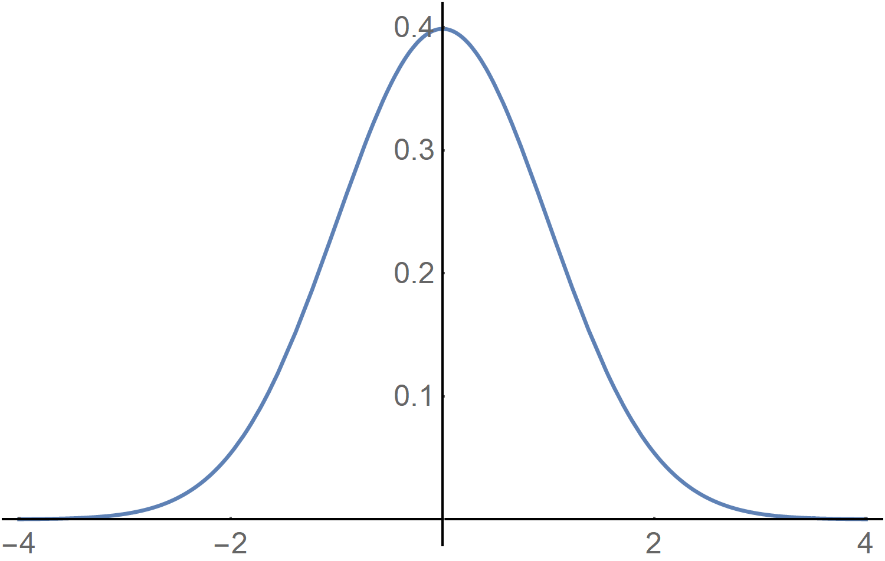

**Figure 1. Loi normale centrée réduite**

La loi normale (ici centrée et réduite) est représentée sous la forme d'une cloche (Fig. 1) que l'on appelle l'**ogive de Galton**[^16].

Sur une loi normale (ici centrée et réduite) (Fig. 1), la variable suit une répartition en fonction de sa moyenne $\mu$ et de son écart type $\sigma$.

- 68,3 % des valeurs de la distribution se trouve entre $\mu - \sigma$ et $\mu + \sigma$.

- 95,5 % des valeurs de la distribution se trouve entre $\mu - 2\sigma$ et $\mu + 2\sigma$.

- 99,7 % des valeurs de la distribution se trouve entre $\mu - 3\sigma$ et $\mu + 3\sigma$.

La largeur de l'intervalle a une très grande importance dans l'interprétation des incertitudes d'une mesure. Par exemple, $\mu \pm \sigma$ signifie que la valeur moyenne possède environ 68,3 % de chance de se trouver entre $\mu - \sigma$ et $\mu + \sigma$. De même, $\mu \pm 2\sigma$ signifie que la valeur moyenne possède environ 95,5 % de chance de se trouver entre $\mu - 2\sigma$ et $\mu + 2\sigma$. Et ainsi de suite\ldots{} Toutefois, il est important de noter, notamment pour construire un intervalle de confiance, que :

- $\Pr \left[ \left( X < \mu - 1,65\sigma \right) \textrm{ ou } \left( X > \mu + 1,65\sigma \right) \right] = 10$ %

- $\Pr \left[ \left( X < \mu - 1,96\sigma \right) \textrm{ ou } \left( X > \mu + 1,96\sigma \right) \right] = 5$ %

- $\Pr \left( \mu - \sigma < X < \mu + \sigma \right) = 68,3$ %

- $\Pr \left[ \left( X < \mu - \sigma \right) \textrm{ ou } \left( X > \mu + \sigma \right) \right] = 33,7$ %

- $\Pr \left( \mu - 2,58\sigma < X < \mu + 2,58\sigma \right) = 99$ %

La **largeur de la distribution à mi-hauteur**[^17] $w$, c'est-à-dire entre ses deux points d'inflexion, vaut :

$w = 2 \sigma \sqrt{2\ln{2}}$

La **hauteur maximale** $h$ de la distribution dépend de l'écart type :

$h = \frac{1}{\sigma \sqrt{2\pi}}$

La loi normale n'est pas tabulée puisqu'il faudrait autant de tables numériques que de valeurs possibles pour la moyenne $\mu$ et l'écart-type $\sigma$. C'est pourquoi, en opérant un changement de variable, la loi normale générale utilisée est la **loi normale centrée réduite**, qui, elle, est tabulée. On la note $N \left( 0, 1 \right)$.

$N \left( 0, 1 \right) = \Pr \left( u, 0, 1 \right) =\frac{1}{\sqrt{2\pi}} e^{-\frac{1}{2} u^2}$

La table donne les valeurs pour une probabilité $\alpha$ d'être inférieure à un certain quantile $\varepsilon$. La table fournit le quantile positif et donne la probabilité à gauche (Fig. 2).

$\alpha = \Pr \left( Z < \varepsilon \right) = F \left( z_{\alpha} \right)$

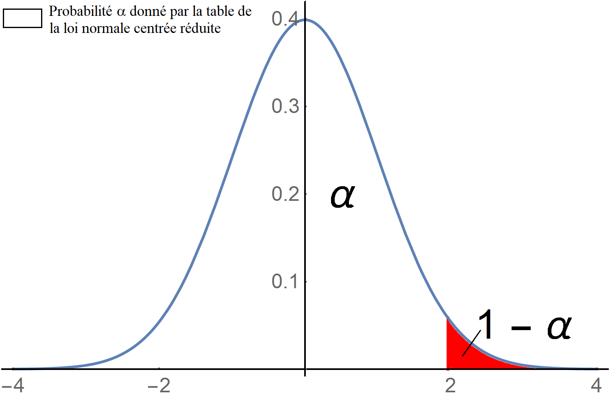

**Figure 2. Loi normale centrée réduite et probabilité critique $\alpha$**

Par exemple, on souhaite calculer la probabilité que la variable $z$ soit infériéure à 2,5 %. Comme vu dans la description de la loi normale, il faut prendre $z_{\alpha} = 1,96$. Pour lire la valeur dans la table de la loi normale centrée réduite, il faut décomposer la valeur en $1,96 = 1,90 + 0,06$. En colonne, on cherche $1,90$, et, en ligne, on cherche $0,06$. On trouve dans la table que ${\alpha} = 0,9750 = \Pr \left( Z < 1,96 \right)$. De fait, $1 - {\alpha} = 0,025 = \Pr \left( Z > 1,96 \right)$, qui correspond bien à la probabilité recherchée.

On travaille souvent sur les fréquences cumulées (donc la fonction de répartition) avec l'anamorphose galtonienne dans laquelle les fréquences cumulées forment une droite (ou droite de Henry[^18]).

#### Propriétés

D'après C. F. Gauss, la limite d'une somme de variables aléatoires tend vers une loi normale.

Les lois normales peuvent s'additionner. Soient $X \sim N \left( {\mu}_1, {\sigma}_1 \right)$ et $Y \sim N \left( {\mu}_2, {\sigma}_2 \right)$ avec $X$ et $Y$ indépendantes, alors :

$X + Y \sim N \left( {\mu}_1 + {\mu}_2, \sqrt{{\sigma}_1 + {\sigma}_2} \right)$

Ce résultat se généralise à la somme de $n$ variables aléatoires normales indépendantes.

Si les lois sont centrées réduites, alors on $X \sim N \left( 0, 1 \right)$ et $Y \sim N \left( 0, 1 \right)$ avec $X$ et $Y$ indépendantes. Le résultat se réduit à :

$X + Y \sim N \left( 0, \sqrt{2} \right)$

Pour un **mouvement brownien** (ou un mouvement gaussien), les accroissements $B \left( t_2 \right) - B \left( t_1 \right)$ et $B \left( t_4 \right) - B \left( t_3 \right)$ sont indépendants. Pour tout $t$, $B \left( t \right) - B \left( 0 \right)$ suit une loi normale de variance égale à $t$. Si cet accroissement a une espérance nulle, la distribution suit une loi d'échelle telle que :

$\frac{B \left( t + \Delta t\right) - B \left( t \right)}{\sqrt{\Delta t}}$

qui est indépendante de $t$ et de $\Delta t$

#### Théorème central limite de P.-S. de Laplace

La loi de la somme de $n$ variables aléatoires indépendantes et de variance finie tend vers une loi normale lorsque $n$ augmente.

#### Comparaison de deux distributions avec une loi normale

La probabilité d'un intervalle, par exemple, sur l'intervalle de données : $\left[ -1, 3 \right]$, est donnée par une loi normale $X \sim N \left( 1,18 ; 1,69 \right)$. 

On commence par centrer et réduire les valeurs bornant l'intervalle.

$X_1 = \frac{3 - 1,18}{1,69} = 1,08$

et 

$X_2 = \frac{-1 - 1,18}{1,69} =-1,29$

Dans la table de probabilité de la loi normale centrée réduite, on regarde les valeurs respectives $p_1$  et $p_2$ de $X_1$ et de $X_2$.

$X_1 - \left( 1 - X_2 \right) = n$

On transforme $n$ en un pourcentage. $n = 0,7615$, soit 76,15 %.

On peut alors comparer ce pourcentage avec la répartition étudiée. On pose $N = \frac{\textrm{effectif de l'intervalle}}{\textrm{effectif total}} \times 100$. Ici, $N =76$ %, donc la loi normale est bien sa distribution de probabilité. Par contre, si $N = 50$ % ou $N = 90$ %, alors la loi normale ne correspond pas à la distribution de probabilité.

#### Notes au sujet de la loi normale

Ce n'est pas parce que la loi est dite normale qu'elle est toujours valable. « Rappelons le vieux cliché de l'époque 1900 : on disait que les physiciens utilisaient la distribution gaussienne pour les « erreurs », parce qu'ils croyaient que les mathématiciens en avaient établi la nécessité, tandis que les mathématiciens étudiaient seulement la distribution gaussienne, parce qu'ils croyaient que les physiciens en avaient établi l'universelle applicabilité »[^19] (p. 88). Dès le début du XXe siècle, on savait que les variables aléatoires concernant la fréquence du dénombrement de certains objets géographiques (lacs, montagnes, *etc*.) ne suivait pas une loi normale[^20] [^21].

On qualifie souvent une variable suivant une loi normale de **« bruit blanc »**. Un « bruit » est une manière de désigner une variable aléatoire. Le terme « blanc » est utilisé pour une variable indépendante. Cela étant, il faut bien faire attention un « bruit blanc » peut de façon grossière être distribué par une autre loi que la loi normale, d'où la nécessité de connaître d'autres distributions.

### Loi log-normale

La loi log-normale s'appelle aussi : loi de Galton ou loi de Gibrat[^22].

Soit $Y$ une variable aléatoire suivant la loi normale $N \left( \mu, \sigma \right)$. La variable aléatoire $X$ définie par $X = e^Y$ suit, par définition, une loi log-normale. 

La densité de la loi de la variable $X$ se déduit de celle de la variable $Y$ par le changement de variable : $x \rightarrow e^y$ (Fig. 3).

$\left\lbrace  \begin{array}{lc} f \left( x \right) = \frac{1}{x{\sigma}\sqrt{2\pi}} e^{-\frac{1}{2} \left( \frac{\ln{x} - \mu}{\sigma} \right)^2} & \textrm{si } x \geq 0 \\ f \left( x \right) = 0  & \textrm{si } x < 0 \end{array} \right.$  

Le facteur $\frac{1}{x}$ dans l'expression de la densité est un **facteur de pondération**.

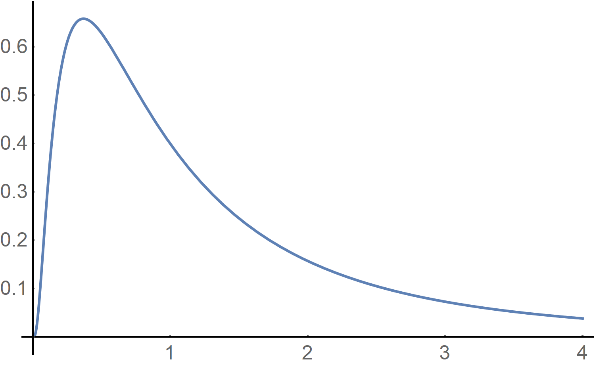

**Figure 3. Loi log-normale centrée réduite**

L'espérance de la loi log-normale vaut :

$\mathbb{E} \left( X \right) = e^{n + \frac{{\sigma}^2}{2}}$

La variance de la loi log-normale vaut :

$\mathbb{V} \left( X \right) = e^{{\sigma}^2 - 1} e^{2\mu + {\sigma}^2}$

> [!NOTE]
> Si l'écart type $\sigma$ est petit, alors la loi de la variable aléatoire $X$ est proche de la loi normale.

**Propriété.** Le produit de $n$ variables aléatoires indépendantes suivant une loi log-normale suit lui aussi une loi log-normale.

### Loi uniforme continue

Soient $a < b$, la fonction de distribution d'une loi uniforme continue est :

${\Pr}_{a, b} \left( x \right) = \frac{1}{b - a} **1**_{\left[ a, b \right]}$

avec $**1**_{\left[ a, b \right]}$ signifiant que, en dehors du domaine de définition $\left[ a, b\right]$ la fonction de distribution est nulle (Fig. 4). $**1**_{\left[ a, b \right]}$ est la **fonction caractéristique** de l'ensemble $\left[ a, b \right]$.

$**1**_{\left[ a, b \right]}$ correspond au cardinal d'un ensemble infini. Ce nombre est appelé **aleph**.

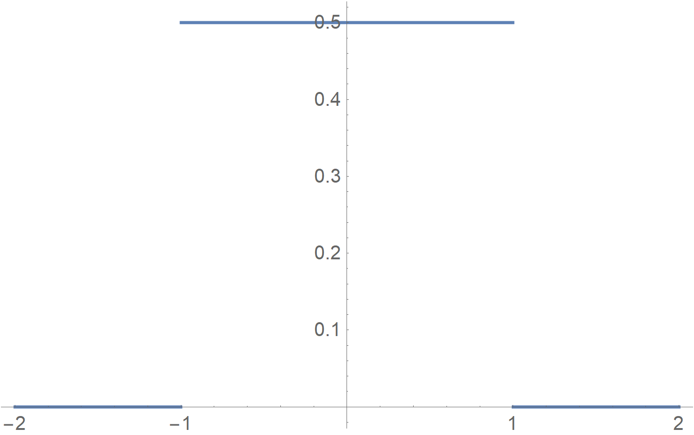

**Figure 4. Loi uniforme avec $a = -1$ et $b = 1$**

L'espérance de la fonction uniforme est :

$\mathbb{E} \left( X \right) = \int_{-\infty}^{+\infty} x f \left( x \right) \mathrm{d} x = \int_{a}^{b} x \frac{1}{b - a} \mathrm{d} x = \left[ \frac{1}{2 \left( b - a\right)} x^2 \right]_{a}^{b} = \frac{b - a}{2}$

La variance de la fonction uniforme est :

$\begin{array}{l} \mathbb{V} \left( X \right) = \int_{-\infty}^{+\infty} f \left( x \right) f \left( x  - \mathbb{E} \left( X \right) \right)^2 \mathrm{d} x = \int_{a}^{b} \frac{1}{b - a} \left( x - \frac{b - a}{2} \right)^2 \mathrm{d} x \\ \mathbb{V} \left( X \right) = \left[ \frac{1}{3 \left( b - a\right)} \left( x - \mathbb{E} \left( X \right) \right)^3 \right]_{a}^{b} \\ \mathbb{V} \left( X \right) = \frac{\frac{1}{4} \left( b - a \right)^3}{3 \left( b - a \right)} = \frac{\left( b - a \right)^2}{12} \end{array}$

- **Propriété 1.** La somme de deux variables aléatoires, indépendantes ou non, suivant une loi uniforme sur $\left[ a, b \right]$, ne suit pas une loi uniforme sur $\left[ a, b \right]$.

- **Propriété 2.** L'image, par sa fonction de répartition, de toute variable aléatoire réelle continue, est une variable aléatoire réelle suivant la loi uniforme sur $\left[ 0, 1 \right]$. Cette propriété est utilisée, pour simuler ou engendrer des échantillons de la loi de la variable aléatoire $X$.

- **Propriété 3.** La loi uniforme sur $\left[ a, b \right]$ traduit l'hypothèse d'équirépartition, ou répartition indifférente, sur $\left[ a, b \right]$.

- **Propriété 4.** La loi uniforme est utilisée en statistique bayésienne, pour déterminer les lois de probabilité *a priori*, dans le cas de l'ignorance totale, dans l'intervalle $\left[ 0, 1 \right]$ (elle est dite non informative), ou dans l'intervalle $\left[ a, b \right]$, en utilisant les résultats de l'expert (elle est dite informative).

### Loi triangulaire

Soient $a < c < b$, la fonction triangulaire est définie par une construction basée sur les deux fonctions de distributions suivantes :

${\Pr}_{a, c} \left( x \right) = \frac{2 \left( x - a \right)}{\left( b - a \right) \left( c - a \right)} {**1**}_{\left[ a, c \right]}$

et

${\Pr}_{c, b} \left( x \right) = \frac{2 \left( b - x \right)}{\left( b - a \right) \left( b - c \right)} {**1**}_{\left] c, b \right]}$

$a$ est assimilée à la **valeur optimiste**, $c$, la **valeur attendue** (c'est-à-dire le mode) et $b$, la **valeur pessimiste**.

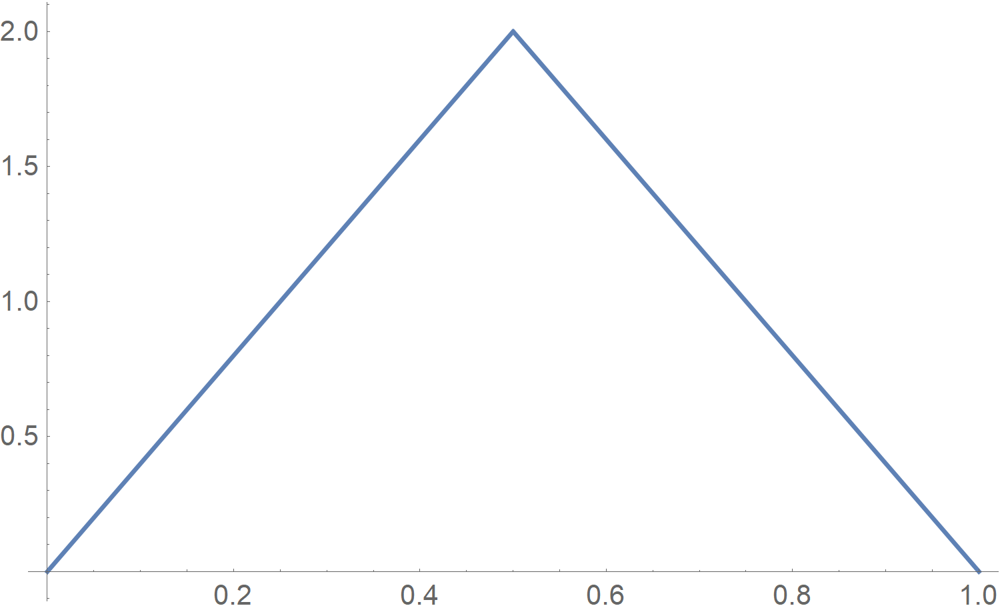

**Figure 5. Exemple de loi triangulaire**

Le triangle de base $\left( c - a \right)$ doit avoir une hauteur $h =\frac{2}{c - a}$ telle que sa surface totale soit égale à l'unité.

${\mathcal{A}}_{\Delta} = \frac{\left( c - a \right) \times h}{2} = \frac{c - a}{c - a} = 1$

La pente de la première droite (croissante à gauche) est :

${\Delta}_1 = \frac{2}{\left( b - a \right) \left( c - a \right)}$

et la pente de la seconde droite (décroissante à droite) est :

${\Delta}_2 = -\frac{2}{\left( b - a \right) \left( c - a \right)}$

La fonction triangulaire est une fonction de distribution si :

$\int_{-\infty}^{+\infty} \left[ {\Pr}_{a, c} \left( x \right) + {\Pr}_{c, b} \left( x \right) \right] \mathrm{d} x = 1 = {\mathcal{A}}_{\Delta}$

puisque l'intégrale correspond à l'aire du triangle.

L'espérance de la fonction triangulaire est :

$\mathbb{E} \left( X \right) = \frac{a + b + c}{3}$

Ce résultat se démontre en faisant une intégration directe :

$\int_{-\infty}^{+\infty} x f\left( x \right) \mathrm{d} x = \int_{a}^{c} x \frac{2 \left( x - a \right)}{\left( b - a \right) \left( c - a \right)} \mathrm{d} x + \int_{c}^{b} x \frac{2 \left( b - x \right)}{\left( b - a \right) \left( b - c \right)} \mathrm{d} x$

La variance de la fonction triangulaire est :

$\mathbb{V} \left( X \right) =\frac{a^2 + b^2 + c^2 - ab - ac - bc}{18}$

Ce résultat se démontre en intégrant directement :

$\begin{array}{l} \int_{-\infty}^{+\infty} \left( x - \mathbb{E} \left( X \right) \right)^2 f\left( x \right) \mathrm{d} x = \int_{a}^{c} \left( x - \mathbb{E} \left( X \right) \right)^2 \frac{2 \left( x - a \right)}{\left( b - a \right) \left( c - a \right)} \mathrm{d} x\\ + \int_{c}^{b} \left( x - \mathbb{E} \left( X \right) \right)^2 \frac{2 \left( b - x \right)}{\left( b - a \right) \left( b - c \right)} \mathrm{d} x \end{array}$

**Propriété.** Sous condition que leurs bornes soient identiques, la somme de deux variables aléatoires indépendantes chacune de loi uniforme $\left[ a, b \right]$ suit une loi triangulaire sur $\left[ 2a, 2b \right]$

### Loi exponentielle

Soit $\lambda > 0$, la fonction :

$\left\lbrace  \begin{array}{lc} \Pr \left( x \right) = \lambda e^{-\lambda x} {**1**}_{\left[ 0, +\infty \right[} & \textrm{si } x \geq 0 \\ \Pr \left( x \right) = 0 & \textrm{si } x < 0 \end{array} \right.$

est une fonction de distribution, car elle vérifie :

$\Pr \left( X < t \right) = \int_{-\infty}^{+\infty} {\Pr}_{\lambda} \left( X \right) \mathrm{d} x = \int_{-\infty}^{+\infty} \lambda e^{-\lambda x} \mathrm{d} x = \lim_{t \rightarrow +\infty} \left( - e^{-\lambda t} + 1 \right) = 1$

L'espérance de la fonction exponentielle est :

$\begin{array}{l} \mathbb{E} \left( X \right) = \int_{-\infty}^{+\infty} x  {\Pr}_{\lambda} \left( X \right) \mathrm{d} x = \int_{-\infty}^{+\infty} x \lambda e^{-\lambda x} \mathrm{d} x \\ \mathbb{E} \left( X \right) = \left[ -e^{-\lambda x} \right]_{a}^{b} - \int_{a}^{b} -e^{-\lambda x} \mathrm{d} x = \int_{0}^{+\infty} e^{-\lambda x} \mathrm{d} x \\ \mathbb{E} \left( X \right) = \left[ -\frac{1}{\lambda} e^{-\lambda x} \right]_{0}^{+\infty} = \frac{1}{\lambda} \end{array}$

La variance de la fonction exponentielle est :

$\mathbb{V} \left( X \right) = \mathbb{E} \left( X^2 \right) - \left[ \mathbb{E} \left( X \right) \right] ^2$

On calcule $\mathbb{E} \left( X^2 \right)$ :

$\mathbb{E} \left( X^2 \right) = \int_{0}^{+\infty} \lambda x^2 e^{-\lambda x} \mathrm{d} x$

On pose $y = \lambda x$.

$\mathbb{E} \left( X^2 \right) = \frac{1}{{\lambda}^2} \int_{0}^{+\infty} y^2 e^{-y} \mathrm{d} y$

Une double intégration par parties donne :

$\int_{0}^{+\infty} y^2 e^{-y} \mathbb{d} y = \left[ - y^2 e^{-y} \right]_{0}^{+\infty} + 2 \int_{0}^{+\infty} y e^{-y^2} \mathrm{d} y = 2 \left[ -y e^{-y} \right]_{0}^{+\infty} + 2 \int_{0}^{+\infty} e^{-y} \mathrm{d} y = 2$

d'où

$\mathbb{E} \left( X^2 \right) = \frac{2}{{\lambda}^2}$

Dit autrement,

$\mathbb{V} \left( X \right) = \mathbb{E} \left( X^2 \right) - \left[ \mathbb{E} \left( X \right) \right]^2 = \frac{2}{{\lambda}^2} - \left( \frac{1}{\lambda} \right)^2 = \frac{1}{{\lambda}^2}$

Le coefficient d'asymétrie de la loi exponentielle est :

${\gamma}_1 = 2$

Le coefficient d'aplatissement de la loi exponentielle est :

${\gamma}_2 = 9$

- **Propriété 1.** La somme de deux variables aléatoires indépendantes, suivant des lois exponentielles de paramètres respectifs ${\lambda}_1$  et ${\lambda}_2$, est une variable aléatoire suivant une loi exponentielle de paramètre ${\lambda}_1 + {\lambda}_2$.

- **Propriété 2.** La loi exponentielle est qualifiée de loi « sans mémoire ». Elle permet la modélisation du comportement des matériels fonctionnant avec un taux de défaillance constant.

- **Propriété 3.** On considère un matériel ayant fonctionné sans défaillance pendant le temps $x_1$ et on cherche la probabilité qu'il soit encore en état de marche au temps $x + x_1$. La définition de la probabilité conditionnelle donne :

$\Pr \left( X \geq x + x_1 \setminus X \geq x_1 \right) = \frac{\Pr \left( X \geq x + x_1 \textrm{ et } X \geq x_1 \right)}{\Pr \left( X \geq x_1 \right)} = \frac{e^{-\lambda \left( x + x_1 \right)}}{e^{-\lambda x_1}} = e^{-\lambda x}$

Le matériel a « oublié » qu'il avait déjà fonctionné pendant le temps $x_1$. Pour ce type de matériel, il est inutile de procéder à un remplacement préventif.

Les domaines d'utilisation de la loi exponentielle sont :

- pour la distribution exponentielle qui est associée aux processus de Poisson ;

- pour la loi exponentielle qui est utilisée en fiabilité. Le paramètre $\lambda$ représente le taux de défaillance alors que son inverse $\theta = \frac{1}{\lambda}$ est le temps moyen de bon fonctionnement[^23]. Avec le paramètre $\theta$, la densité de probabilité s'écrit :

$f \left( x \right) = \frac{1}{\theta} e^{-\frac{1}{\theta} x}$

et

$\mathbb{E} \left( X \right) = \theta \textrm{ et } \mathbb{V} \left( X \right) = {\theta}^2$
- pour la loi exponentielle qui s'applique aux matériels électroniques.	

### Loi de Cauchy[^24]

La fonction

$\Pr \left( x \right) = \frac{1}{\pi} \left( \frac{1}{1 + x^2} \right)$

est une fonction de distribution, car elle vérifie :

$\int_{-\infty}^{+\infty} \Pr \left( x \right) \mathrm{d} x = \frac{1}{\pi} \int_{-\infty}^{+\infty} \frac{1}{1 + x^2} \mathrm{d} x = \frac{1}{\pi} \left( \arctan \left( +\infty \right)  - \arctan \left( -\infty \right) \right) = 1$

La forme de la courbe est une ogive beaucoup plus pointue que la loi normale (Fig. 6).

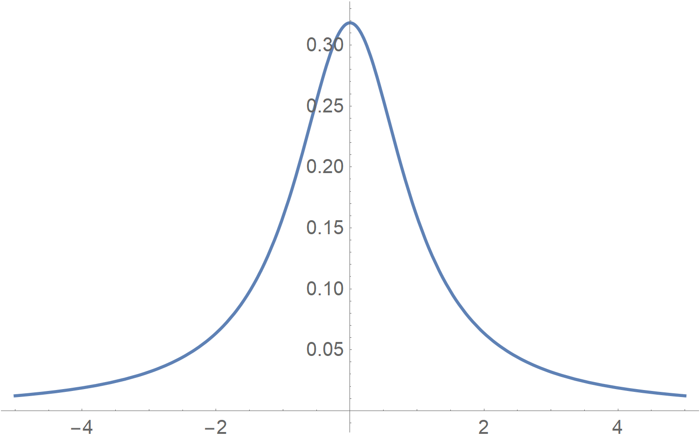

**Figure 6. Loi de Cauchy**

L'espérance de la fonction de Cauchy vaut :

$\begin{array}{l} \mathbb{E} \left( X \right) = \int_{-\infty}^{+\infty} x \Pr \left( x \right) \mathrm{d} x = \frac{1}{\pi} \left[ \int_{-\infty}^{0} \frac{x}{1 + x^2} + \int_{0}^{+\infty} \frac{x}{1 + x^2} \right] \\ \mathbb{E} \left( X \right) = \frac{1}{2\pi} \left( \left[ \ln \left( 1 + x^2 \right) \right]_{-\infty}^{0} + \left[ \ln \left( 1 + x^2 \right) \right]_{0}^{+\infty} \right) = \frac{1}{2\pi} \left[ \ln \left( 1 \right) - \ln \left( \infty \right) + \ln \left( 1 \right) - \ln \left( 1 \right) \right] = 0  \end{array}$

La variance de la fonction de Cauchy vaut :

$\begin{array}{l} \mathbb{V} \left( X \right) = \int_{-\infty}^{+\infty} \left( x - \mathbb{E} \left( X \right) \right)^2 f \left( x \right) \mathrm{d} x = \int_{-\infty}^{+\infty} x^2 \Pr \left( x \right) \mathrm{d} x \\ \mathbb{V} \left( X \right) = \frac{1}{\pi} \int_{-\infty}^{+\infty} \frac{x^2}{1 + x^2} \mathrm{d} x = \frac{1}{\pi} \int_{-\infty}^{+\infty} \left( 1 - \frac{1}{1 + x^2} \right) \mathrm{d} x \\ \mathbb{V} \left( X \right) = \frac{2}{\pi} \lim_{t \rightarrow +\infty} \int_{0}^{t} \left( 1 - \frac{1}{1 + x^2} \right) \mathrm{d} x = \frac{2}{\pi} \lim_{t \rightarrow +\infty} \int_{0}^{t} \left( t - \arctan{t} \right) \mathrm{d} x = +\infty \end{array}$

De manière plus générale, avec $a \in \mathbb{R}_{+}^{*}$ et $x \in \mathbb{R}$, la densité de probabilité est $\Pr \left( x \right) = \frac{1}{\pi} \left( \frac{a}{a^2 + x^2} \right)$. $-a$ et $+a$ correspond aux points d'inflexion de la densité. La fonction de répartition est $F \left( x \right) = \frac{1}{\pi} \arctan{\frac{x}{a}} + \frac{1}{2}$. La loi de Cauchy est centrée sur $\Pr \left( X = 0 \right) = \frac{1}{2}$, $\Pr \left( X = -a \right) = \frac{1}{4}$ et $\Pr \left( X = +a \right) = \frac{3}{4}$.

**Tous les moments de la loi de Cauchy générale divergent**. Pour $a > 0$, la moyenne n'existe pas ; elle est infinie. Il en va de même pour la variance.

$\mathbb{E} \left( X \right) = \frac{1}{\pi} \int_{-\infty}^{+\infty} \frac{x}{1 + x^2} \mathrm{d} x = +\infty$

et

$\mathbb{V} \left( X \right) = \frac{1}{\pi} \int_{-\infty}^{+\infty} \frac{x^2}{1 + x^2} \mathrm{d} x = +\infty$

- **Propriété 1.** Si la loi $X$ est la loi de Cauchy de paramètre 1, pour $a > 0$, la loi de $a X$ est la loi de Cauchy de paramètre $a$.

- **Propriété 2.** Si la loi $X$ est la loi de Cauchy de paramètre $a$, alors $\frac{1}{X}$ a pour loi la loi de Cauchy de paramètre $\frac{1}{a}$.

- **Propriété 3.** Le quotient de deux variables aléatoires $X$ et $Y$ de lois normales, de moyenne 0 et de variances respectives ${{\sigma}_X}^2 > 0$ et ${{\sigma}_Y}^2 > 0$. Le quotient $\frac{X}{Y}$ est presque sûrement bien défini. Sa loi est la loi de Cauchy de paramètre $a = \frac{{{\sigma}_Y}}{{{\sigma}_X}}$.

> [!NOTE]
> Il arrive souvent que l'on centre la loi de Cauchy en un réel $x_0 \neq 0$.
> $\Pr \left( x \right) = \frac{1}{\pi} \left( \frac{a}{a^2 + \left( x - x_0 \right)^2} \right)$
> $a \in \mathbb{R}_{+}^{*}$ et $x \in \mathbb{R}$.

Un **processus de Cauchy** (ou bruit de Cauchy blanc) est un processus à valeurs de Cauchy **indépendantes**. La moyenne est une variable réduite de Cauchy :

$\mu = \frac{1}{T} \sum_{t = 1}^{T} X \left( t \right)$

La moyenne est identique aux $X \left( t \right)$ en distribution. Prendre sa moyenne n'offre aucun effet sur la variabilité. La loi des grands nombres ne s'appliquent pas. C'est un bruit de Cauchy blanc non ergodique. La moyenne ne converge pas. Elle reste aléatoire et suit elle-même une loi de Cauchy.

Le **mouvement de Cauchy** est une fonction $C \left( t \right)$ dont les incréments $C \left( t + \Delta t \right) - C \left( t \right)$ sont des variables aléatoires indépendantes de Cauchy. La distribution

$\frac{C \left( t + \Delta t \right) - C \left( t \right)}{\Delta t}$

est indépendante de $t$ et de $\Delta t$.

La fonction caractéristique des moments est définie par la transformée de Fourier suivante :

$\varphi \left( \theta \right) = \int_{-\infty}^{+\infty} e^{i \theta x} \times \frac{1}{\pi} \left( \frac{a}{a^2 + x^2} \right) \mathrm{d} x = e^{- \left| a \theta \right|}$

### Loi bêta de types I et II

#### La fonction gamma d'Euler

On définit la fonction gamma d'Euler comme étant la relation :

$\Gamma \left( z \right) = \int_{0}^{+\infty} e^{-x} x^{z - 1} \mathrm{d} x$

avec $Z \in \mathbb{C}$.

On peut démontrer que cette fonction est bien définie, c'est-à-dire que l'intégrale existe pour $\Re \left( z \right) > 0$.

- **Propriété 1.** $\Gamma \left( z + 1 \right) = z \Gamma \left( z \right)$ (ce qui se démontre en intégrant par parties).

- **Propriété 2.** $\Gamma \left( a \right) \Gamma \left( b \right) = \lim_{R \rightarrow +\infty} \int_{A_R} \int e^{-x - y} x^{a - 1} y^{b - 1} \mathrm{d} x \mathrm{d} y$ \newline avec $A_R = \left\lbrace \left( x, y \right) \backslash x \geq 0, y \geq 0, x + y \geq R \right\rbrace$. On opère un changement de variable $\left( \begin{array}{c} x \\ y \end{array} \right) = \left( \begin{array}{c} u - v \\ v \end{array} \right)$ et on obtient

- $\Gamma \left( a \right) \Gamma \left( b \right) = \lim_{R \rightarrow +\infty} \int_{0}^{R} e^{-u} \left( \int_{0}^{u} \left( u - v \right)^{a - 1} v^{b - 1} \mathrm{d} v \right) \mathrm{d} u$

Pour l'intégrale interne, on utilise la substitution $v = ut$ avec $0 \leq t \leq 1$ et on trouve :

$\Gamma \left( a \right) \Gamma \left( b \right) = \lim_{R \rightarrow +\infty} \int_{0}^{R} e^{-u} u^{a + b + 1} \mathrm{d} u \int_{0}^{R} \left( 1 - t \right)^{a - 1} t^{b - 1} \mathrm{d} t$

On pose $B \left( a, b \right) = \int_{0}^{1} \left( 1 - t \right)^{a - 1} t^{b - 1} \mathrm{d} t$
 
 $\Gamma \left( a \right) \Gamma \left( b \right) =  B \left( a, b \right) \int_{0}^{+\infty} e^{-u} u^{a + b + 1} \mathrm{d} u = B \left( a, b \right) \Gamma \left( a + b \right)$

#### La fonction bêta de type I

La fonction $B$ qui apparaît dans $\Gamma \left( a \right) \Gamma \left( b \right) =  B \left( a, b \right) \Gamma \left( a + b \right)$ est la **fonction bêta**.

$B \left( a, b \right) = \int_{0}^{1} \left( 1 - t \right)^{a - 1} t^{b - 1} \mathrm{d} t = \frac{\Gamma \left( a \right) \Gamma \left( b \right)}{\Gamma \left( a + b \right)}$

Pour $a > 0$ et $b > 0$, on considère maintenant la fonction de distribution :

${\Pr}_{a, b} \left( x \right) = \frac{x^{a - 1} \left( 1 - x \right)^{b - 1}}{B \left( a, b \right)} {**1**}_{\left] 0, 1 \right[}$

avec $B \left( a, b \right) = \int_{0}^{+\infty} x^{a - 1} \left( 1 - x \right)^{b - 1} \mathrm{d} x$.

$\begin{array}{l} \int_{-\infty}^{+\infty} {\Pr}_{a, b} \left( x \right) \mathrm{d} x = \int_{-\infty}^{+\infty} \frac{x^{a - 1} \left( 1 - x \right)^{b - 1}}{B \left( a, b \right)} {**1**}_{\left] 0, 1 \right[} \mathrm{d} x = \int_{-\infty}^{+\infty} \frac{x^{a - 1} \left( 1 - x \right)^{b - 1}}{K} {**1**}_{\left] 0, 1 \right[} \mathrm{d} x \\ \int_{-\infty}^{+\infty} {\Pr}_{a, b} \left( x \right) \mathrm{d} x = \frac{1}{K}  \int_{-\infty}^{+\infty} x^{a - 1} \left( 1 - x \right)^{b - 1} \mathrm{d} x \end{array}$

$\int_{-\infty}^{+\infty} {\Pr}_{a, b} \left( x \right) \mathrm{d} x = \frac{1}{K} B \left( a, b \right) = \frac{1}{K} K = 1$

L'espérance de la fonction bêta de type I est :

$\begin{array}{l} \mathbb{E} \left( X \right) = \int_{-\infty}^{+\infty} x {\Pr}_{a, b} \left( x \right) \mathrm{d} x = \frac{1}{B \left( a, b \right)} \int_{0}^{1} x^{a - 1} \left( 1 - x \right)^{b - 1} \mathrm{d} x \\ \mathbb{E} \left( X \right) = \frac{B \left( a + 1, b \right)}{B \left( a, b \right)} = \frac{\Gamma \left( a \right) \Gamma \left( b \right)}{\Gamma \left( a + b + 1 \right)} = \frac{a}{a + b} \end{array}$

La variance de la fonction bêta de type I est :

$\begin{array}{l} \mathbb{V} \left( X \right) = \int_{-\infty}^{+\infty} \left( x - \mathbb{E} \left( X \right) \right)^2 f \left( x \right) \mathrm{d} x = \frac{1}{B \left( a, b \right)} \int_{0}^{1} \left( x - \mathbb{E} \left( X \right) \right)^2 x^{a - 1} \left( 1 - x \right)^{b - 1} \mathrm{d} x \\ \mathbb{V} \left( X \right) = \frac{1}{B \left( a, b \right)} \left( B \left( a + 2, b \right) - \left( \mathbb{E} \left( X \right) \right)^2 B \left( a, b \right) \right) \end{array}$

En sachant que $\Gamma \left( z + 1 \right) = z \Gamma \left( z \right)$ et que $B \left( a, b \right) = \frac{\Gamma \left( a \right) \Gamma \left( b \right)}{\Gamma \left( a + b \right)}$, on trouve :

$B \left( a + 2, b \right) = \frac{\mathbb{E} \left( X \right) \left( a + 1 \right)}{a + b + 1} B \left( a, b \right)$

donc

$\begin{array}{l} \mathbb{V} \left( X \right) = \frac{1}{B \left( a, b \right)} \left( \frac{\mathbb{E} \left( X \right) \left( a + b \right)}{a + b + 1} B \left( a, b \right) - \left( \mathbb{E} \left( X \right) \right)^2 B \left( a, b \right) \right) \\ \mathbb{V} \left( X \right) = \left( \frac{\mathbb{E} \left( X \right) \left( a + b \right)}{a + b + 1} - \left( \mathbb{E} \left( X \right) \right)^2 \right) = \frac{ab}{\left( a + b \right)^2 \left( a + b + 1 \right)} \end{array}$

#### La fonction bêta de type II

Soit $X$ une variable aléatoire suivant une loi bêta de type I, $B \left( n, p \right)$. La variable $Y$, positive ou nulle, définie par $Y = \frac{X}{1 - X}$, suit une loi bêta de type II dont la densité s'obtient facilement par le changement de variables :

$\left\lbrace  \begin{array}{lc} f \left( y \right) = \frac{1}{B \left( n, p \right)} \frac{y^{n - 1}}{\left( 1 + y \right)^{n + p}} & \textrm{si } y \geq 0 \\ f \left( y \right) = 0 & \textrm{si } y < 0 \end{array} \right.$

L'espérance de la fonction bêta de type II est :

$\mathbb{E} \left( X \right) = \frac{n}{p - 1}$

La variance de la fonction bêta de type II est :

$\mathbb{V} \left( X \right) = \frac{n \left( n + p - 1 \right)}{\left( p - 1 \right)^2 \left( p - 2 \right)^2}$

### Loi gamma

Pour $a > 0$ et $\lambda > 0$, on considère la fonction de distribution :

$\left\lbrace  \begin{array}{lc} {\Pr}_{a, \lambda} \left( x \right) = \frac{x^{a - 1} e^{-\lambda x}}{\int_{0}^{+\infty} x^{a - 1} e^{-\lambda x} \mathrm{d} x} {\mathbf{1}}_{\left] 0, +\infty \right[} & \textrm{si } x \geq 0 \\ {\Pr}_{a, \lambda} \left( x \right) = 0 & \textrm{si } x < 0 \end{array} \right.$

On effectue un changement de variable $t = \lambda x$ avec $\lambda \neq 1$, et on obtient :

$\gamma \left( a \right) = \int_{0}^{+\infty} x^{a - 1} e^{-\lambda x} \mathrm{d} x = \frac{\Gamma \left( a \right)}{{\lambda}^a}$

donc

${\Pr}_{a, \lambda} \left( x \right) = \frac{x^{a - 1} e^{-\lambda x}}{\Gamma \left( a \right)} {\lambda}^a {\mathbf{1}}_{\left] 0, +\infty\right[ }$

$\Gamma$ est la **fonction eulérienne** définie par l’intégrale pour $t > 0$.

$\Gamma \left( a \right) = \int_{0}^{+\infty} e^{-y} y^{a - 1} \mathrm{d} x$

avec $t$ le paramètre de forme et $\frac{1}{\lambda}$ le paramètre d'échelle. Il est à noter que si $a = 1$, on trouve la loi exponentielle.

Par un raisonnement similaire en tout point à celui de la fonction bêta, on montre que :

$\int_{-\infty}^{+\infty} {\Pr}_{a, \lambda} \left( x \right) \mathrm{d} x = 1$

**Figure 7. Loi gamma avec $a = 2$ et $\lambda = 5$**

L'espérance de la fonction gamma est :

$\begin{array}{l} \mathbb{E} \left( X \right) = \int_{-\infty}^{+\infty} x f \left( x \right) \mathrm{d} x = \frac{{\lambda}^a}{\Gamma \left( a \right)} \int_{0}^{+\infty} x^a e^{-\lambda t} \mathrm{d} x \\ \mathbb{E} \left( X \right) = \frac{{\lambda}^a}{\Gamma \left( a \right)} \frac{a \Gamma \left( a \right)}{{\lambda}^{a + 1}} = \frac{{\lambda}^a}{\Gamma \left( a \right)} \frac{a \Gamma \left( a \right)}{{\lambda}^{a + 1}} \\ \mathbb{E} \left( X \right) = \frac{a}{\lambda} \end{array}$

La variance de la fonction gamma est :

$\mathbb{V} \left( X \right) = \int_{-\infty}^{+\infty} \left( x - \mathbb{E} \left( X \right) \right)^2 f \left( x \right) \mathrm{d} x = \frac{{\lambda}^a}{\Gamma \left( a \right)} \int_{-\infty}^{+\infty} \left( x - \mathbb{E} \left( X \right) \right)^2 x^{a - 1} e^{-\lambda x} \mathrm{d} x = \frac{a}{{\lambda}^2}$

- **Propriété 1.** Selon les valeurs des paramètres, la loi gamma s'identifie à d'autres lois :

    1. Si $t = 1$, alors on la loi exponentielle.

    2. Si $t = n$, avec $n \in \mathbb{N} \backslash n > 1$ alors sa densité est :

$\left\lbrace  \begin{array}{lc} f \left( x \right) = \frac{\lambda e^{-\lambda x} \left( \lambda x \right)^{n - 1}}{\left( n - 1 \right)!} & \textrm{si } x \geq 0 \\ f \left( x \right) = 0 & \textrm{si } x < 0 \end{array} \right.$

avec $\Gamma \left( n \right) = \left( n - 1 \right)!$. Sa fonction de répartition, qui correspond à l'apparition de $n$ événements en un temps inférieur à $x$, est donnée par l'expression :

$\left\lbrace  \begin{array}{lc} F \left( x \right) = 1 - e^{-\lambda x} \sum_{i = 1}^{n} \left[ \frac{\left( \lambda x \right)^{i - 1}}{\left( i - 1 \right)!} \right]  & \textrm{si } x \geq 0 \\ F \left( x \right) = 0 & \textrm{si } x < 0 \end{array} \right.$

On obtient la loi de A. K. Erlang[^25].
    3. La loi de la variable ${\chi}^2$ à $n$ degrés de liberté, ${\chi}^2 \left( n \right)$ est obtenu si $\lambda = \frac{1}{2}$ et $t = \frac{n}{2}$ où $n \in \mathbb{N}$.

- **Propriété 2.** La somme de deux variables aléatoires indépendantes, suivant des lois gamma $\gamma \left( t, \lambda \right)$ et $\gamma \left( u, \lambda \right)$, suit une loi gamma $\gamma \left( t + u, \lambda \right)$.

Les domaines d'utilisation de la fonction gamma sont :

- la théorie des files d'attentes ;

- la fiabilité.

### Loi de ${\chi}^2$

La distribution du ${\chi}^2$ fut introduite par K. Pearson[^26] en 1900.

On considère la fonction de distribution gamma dans le cas particulier $a = \frac{k}{2}$ avec $\lambda = \frac{1}{2}$ et $k \in \mathbb{N}$ :

${\Pr}_k \left( x \right) = \frac{1}{2^{\frac{k}{2}} \Gamma \left( \frac{k}{2} \right)} x^{\frac{k}{2} - 1} e^{-\frac{x}{2}} {**1**}_{\left[ 0, +\infty \right[}$

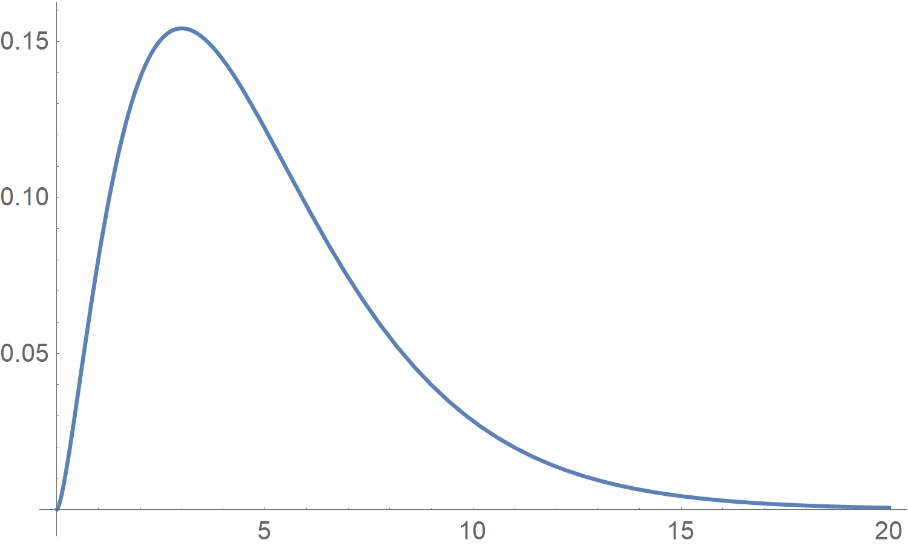

**Figure 8. Loi du ${\chi}^{2}$ avec $k = 5$ pour une variable centrée réduite**

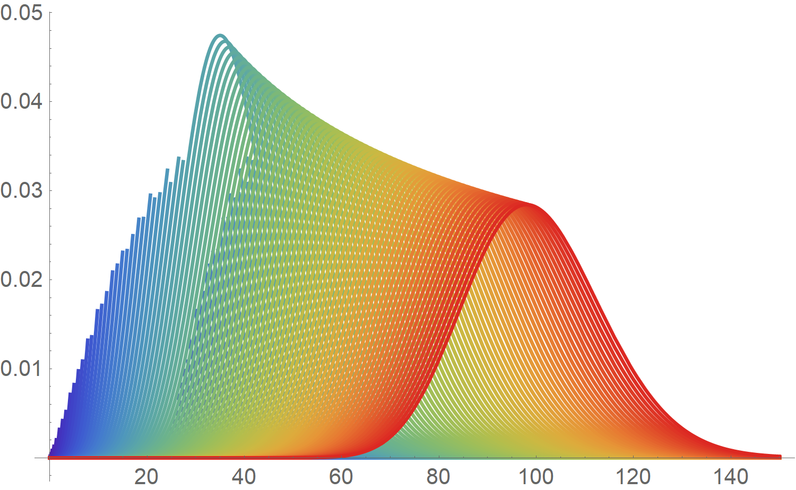

**Figure 9. Loi du ${\chi}^{2}$ de $k = 1$ à $k = 100$ pour une variable centrée réduite : la trajectoire vers une courbe en cloche**

Tous les calculs faits auparavant s'appliquent :

$\left\lbrace  \begin{array}{c} \mathbb{E} \left( X \right) = k \\ \mathbb{V} \left( X \right) = 2k \end{array} \right.$

###### Variable du ${\chi}^2$

La variable aléatoire $U$ valant la somme des carrés de $\upsilon$ variables aléatoires indépendantes, centrées, réduites, suivant la loi normale, suit la loi du ${\chi}^2$, à $\upsilon$ degrés de liberté :

${\chi}^2 \left( \upsilon \right) = \sum_{i = 1}^{\upsilon} {U_i}^2$

avec $U_i = \frac{X_i - \mu}{\sigma}$.

###### Propriété de la variable du ${\chi}^2$

- La variable aléatoire ${\chi}^2 \left( \upsilon \right)$ varie de 0 à $+ \infty$.

- Le paramètre $\upsilon$ est le nombre de degrés de liberté de la variable. Il représente la dimension de l'espace dans lequel se trouve le point représentatif de l'échantillon. Si les variables aléatoires $X_i$ vérifient $k$ relations linéaires, le nombre de degrés de liberté diminue de $k$.

- La loi suivie par la somme de variables aléatoires indépendantes, suivant chacune des lois du ${\chi}^2$, est une loi du ${\chi}^2$ dont le degré de liberté est la somme des degrés de liberté de chacune des lois.

- Les moments de la variable aléatoire du ${\chi}^2$ sont :

$\mathbb{E} \left( {\chi}^2 \left( \upsilon \right) \right) = \upsilon$

$\mathbb{V} \left( {\chi}^2 \left( \upsilon \right) \right) = 2\upsilon$

- Le mode $M_0$ vaut :

$M_0 = \upsilon - 2 \textrm{ si } \upsilon > 2$

- Selon les valeurs de $\upsilon$, la distribution du ${\chi}^2$ possède différentes formes, mais la distribution de la variable du ${\chi}^2$ tend à se rapprocher d'une distribution normale lorsque $\upsilon$ augmente (Fig. 9).

- La densité de probabilité de la variable aléatoire ${\chi}^2 \left( \upsilon \right)$ a une expression mathématique compliquée et peu maniable.

$f \left( {\chi}^2 \left( \upsilon \right) \right) = \frac{1}{2^{\frac{\upsilon}{2}} \Gamma \left( \frac{\upsilon}{2} \right)} e^{-\frac{{\chi}^2 \left( \upsilon \right)}{2}} \left( {\chi}^2 \left( \upsilon \right) \right)^{\frac{\upsilon}{2} - 1}$

avec $\Gamma$ la fonction eulérienne.

- Les tables donnent les fractiles d'ordre $\alpha$ :

$\alpha = \Pr \left( {\chi}^2 \left( \upsilon \right) \leq {{\chi}_{\alpha}}^2 \left( \upsilon \right) \right) = \int^{{x}_{{\alpha}^2}} {\chi}^2 \left( \upsilon \right) \mathrm{d} {\chi}^2 \left( \upsilon \right)$

- La fonction caractéristique de la variable aléatoire ${\chi}^2 \left( \upsilon \right)$ a pour expression :

${\varphi}_{{\chi}^2 \left( \upsilon \right)} \left( t \right)  = \frac{1}{\left( 1 - 2it \right)^{\frac{\upsilon}{2}}}$

avec $i^2 = - 1$.

- Pour les grandes valeurs de $\upsilon$, il existe plusieurs formes limites.
    
    1. Une première forme est obtenue en appliquant le théorème central limite. La loi de la variable aléatoire $\frac{{\chi}^2 \left( \upsilon \right) - \upsilon}{\sqrt{2\upsilon}}$ converge, lorsque $\upsilon$ tend vers l'infini, vers la loi normale centrée réduite.
    
    2. La deuxième forme est due à R. A. Fisher. Pour $\upsilon \geq 30$, la loi de la variable aléatoire $\sqrt{2 {\chi}^2 \left( \upsilon \right)} - \sqrt{2 \upsilon - 1}$ est la loi normale centrée réduite.
    
    3. La formule d'approximation de Wilson[^27]-Hilferty[^28], pour $\upsilon \geq 30$, ${{\chi}_{\alpha}}^2 \left( \upsilon \right) \cong \upsilon \left( 1 - \frac{2}{9\upsilon} + U_{\alpha} \sqrt{\frac{2}{9\upsilon}} \right)^3$ avec $U_{\alpha}$ le fractile d'ordre $\alpha$ de la loi normale centrée réduite.

- **Relation entre la loi du ${\chi}^2$ et les lois gamma**. Si la variable aléatoire $U$ est une variable centrée réduite et suivant une loi normale, la densité de la variable ${\chi}^2 \left( 1 \right)$ définie par $T = U^2$ est :

$g \left( t \right) = \frac{1}{\sqrt{2\pi}} e^{-\frac{t}{2}} t^{-\frac{1}{2}}$

On en déduit que la variable aléatoire $\frac{U^2}{2} = \frac{{\chi}^2 \left( 1 \right)}{2}$ suit une loi $\gamma \left( \frac{1}{2}, 1 \right)$. La variable $\frac{{\chi}^2 \left( n \right)}{2}$ suit alors une loi $\gamma \left( \frac{n}{2}, 1 \right)$. Cette propriété permet de retrouver la densité de la variable ${\chi}^2 \left( n \right)$, ainsi que les différents moments. Si $X$ est une variable aléatoire suivant la loi $\gamma \left( \frac{n}{2}, 1\right)$, la variable aléatoire $2X$ suit la loi ${\chi}^2 \left( n \right)$.

### Loi de Fisher-Snedecor

Cette distribution fut étudiée en 1924 par le statisticien anglais R. A. Fisher [^29] et calculée en 1934 par G. Snedecor[^30]. On appelle aussi cette distribution la **distribution $F$ de Fisher**. Elle joue un rôle dans l'analyse de la variance et dans la régression.

La loi de Fisher-Snedecor se définit par deux paramètres $k$ et $l$ qui caractérisent la relation suivante :

$f \left( x \right) = \frac{\Gamma \left( \frac{k + l}{2} \right) \left( \frac{k}{l} \right)^{\frac{k}{2}}}{\Gamma \left( \frac{k}{2} \right) \Gamma \left( \frac{l}{2} \right)} x^{\frac{k}{2} - l} \left( 1 + \frac{k}{l} x \right)^{-\frac{k + l}{2}}$

avec $x \geq 0$, $k \in \mathbb{N}$ et $l \in \mathbb{N}$.

Les paramètres $k$ et $l$ correspondent aux **degrés de liberté** des deux lois du ${\chi}^2$ sous-jacentes. Cette distribution est souvent notée $F_{k, l}$ ou $F \left( k, l \right)$.

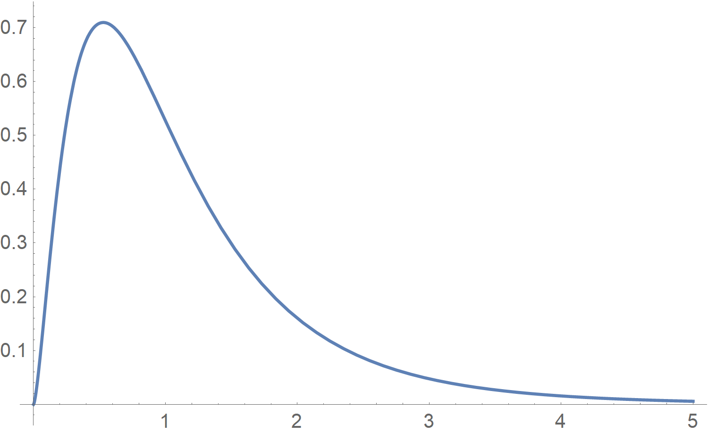

**Figure 10. Loi du ${\chi}^{2}$ pour $k = 1$ à $l = 2$ pour une variable centrée réduite**

Il est facile de démontre qu'il s'agit bien d'une fonction de distribution. En effet, le produit de deux fonctions de distribution (ici celle du ${\chi}^2$) est une fonction de distribution.

$\int_{-\infty}^{+\infty} F_{k, l} \left( x \right) \mathrm{d} x = 1$

Une démonstration plus longue peut être proposée :

1. La loi du ${{\chi}_n}^2$ est donnée par :

$f \left( y \right) = \frac{1}{2^{\frac{n}{2}} \Gamma \left( \frac{n}{2} \right)} e^{-\frac{y}{2}} y^{\frac{n}{2} - 1}$

avec $y \geq 0$ et $n \geq 1$.

2. La fonction $\Gamma$ est définie pour tout $\alpha > 0$ par :

$\Gamma \left( \alpha \right) = \int_{0}^{+\infty} e^{-x} x^{\alpha - 1} \mathrm{d} x$

Soient $X$ et $Y$ deux variables aléatoires indépendantes suivant respectivement les lois ${{\chi}_n}^2$ et ${{\chi}_m}^2$. On considère la variable aléatoire :

$F = \frac{\frac{X}{n}}{\frac{Y}{m}}$

On note $F$ et $f$ les fonctions de répartition et de densité de $T$. $f_X$ et $f_Y$ sont respectivement les fonctions de densité de $X$ et $Y$. $f$ est la fonction de densité du couple $\left( X, Y \right)$.

Pour tout $t \in \mathbb{R}$,

$F \left( t \right) =\Pr \left( T \leq t \right) = \Pr \left( \frac{\frac{X}{n}}{\frac{Y}{m}} \right) = \int \int_{D} f \left( x, y \right) \mathrm{d} x \mathrm{d} y = \int \int_{D} f_X \left( x \right) f_Y \left( y \right) \mathrm{d} x \mathrm{d} y$

avec $D = \left\lbrace \left( x, y \right) \in \mathbb{R}^{+} \times \mathbb{R}^{+} \backslash x \leq \frac{nt}{m} y \right\rbrace$ dans ce domaine de définition les valeurs positives imposées proviennent à l'origine d'une loi du ${\chi}^2$ pour $x$ et $y$

$F \left( t \right) = \int \int_{D} f_X \left( x \right) f_Y \left( y \right) \mathrm{d} x \mathrm{d} y = \int_{0}^{+\infty} f_Y \left( y \right) \int_{0}^{\frac{nt}{m} y} f_X \left( x \right) \mathrm{d} x \mathrm{d} y$

On obtient la fonction de densité de $T$ en dérivant $F$ :

$f \left( t \right) = F' \left( t \right)  = \frac{n}{m} \int_{0}^{+\infty} f_Y \left( y \right) f_X \left( \frac{nt}{m} y \right) y \mathrm{d} y$

or $f$ est une loi du ${\chi}^2$ :

$\left\lbrace  \begin{array}{l} f \left( y \right) = \frac{1}{2^{\frac{m}{2}} \Gamma \left( \frac{m}{2} \right)} e^{-\frac{y}{2}} y^{\frac{m}{2} - 1} \\ f \left( \frac{nt}{m} y \right) = \frac{1}{2^{\frac{m}{2}} \Gamma \left( \frac{m}{2} \right)} e^{-\frac{nt}{2m} y} \left( \frac{nt}{m} y \right)^{\frac{n}{2} - 1} \end{array} \right.$

Il ne reste plus qu'à remplacer $f_Y \left( y \right)$ et $f_X \left( \frac{nt}{m} y \right)$ par leurs expressions dans $f \left( t \right)$.

$\begin{array}{l} f \left( t \right) = \frac{n}{m} \int_{0}^{+\infty} \frac{1}{2^{\frac{m}{2}} \Gamma \left( \frac{m}{2} \right)} e^{-\frac{y}{2}} y^{\frac{m}{2} - 1} \frac{1}{2^{\frac{n}{2}} \Gamma \left( \frac{n}{2} \right)} \left( \frac{nt}{m} y \right)^{\frac{n}{2} - 1} e^{-\frac{nt}{2m} y} \\ f \left( t \right) = \frac{1}{2^{\frac{n}{2}} \Gamma \left( \frac{n}{2} \right) 2^{\frac{m}{2}} \Gamma \left( \frac{m}{2} \right)} \frac{n}{m} \int_{0}^{+\infty} e^{-\frac{y}{2} y^{\frac{m}{2} - 1}} e^{-\frac{nt}{2m} y} \left( \frac{nt}{m} \right)^{\frac{n}{2} - 1} y^{\frac{n}{2} - 1} y \mathrm{d} y \\ f \left( t \right) = \frac{\frac{n}{m}}{2^{\frac{n + m}{2}} \Gamma \left( \frac{m}{2} \right) \Gamma \left( \frac{m}{2} \right)} \left( \frac{nt}{m} \right)^{\frac{n}{2} - 1} \int_{0}^{+\infty} y^{\frac{n + m}{2} - 1} e^{-\frac{y}{2} \left( 1 + \frac{nt}{m} \right)} \mathrm{d} y \end{array}$

L'intégrale se résout par un changement de variable.

$u = \frac{y}{2} \left( 1 + \frac{nt}{m} \right)$

d'où

$\begin{array}{l} y = u \frac{2}{1 + \frac{n}{m} t} \\ \mathrm{d} y = \mathrm{d} u \frac{2}{1 + \frac{n}{m} t} \end{array}$

Cela permet d'obtenir :

$f \left( t \right) = \frac{\frac{n}{m}}{2^{\frac{n + m}{2}} \Gamma \left( \frac{m}{2} \right) \Gamma \left( \frac{m}{2} \right)} \left( \frac{nt}{m} \right)^{\frac{n}{2} - 1} \frac{2^{\frac{n + m}{2}}}{\left( 1 + \frac{n}{m} t \right)^{\frac{n + m}{2}}} \int_{0}^{+\infty} u^{\frac{n + m}{2} - 1} e^{-u} \mathrm{d} u$

mais $\int_{0}^{+\infty} u^{\frac{n + m}{2} - 1} e^{-u} \mathrm{d} u = \Gamma \left( \frac{n + m}{2} \right)$, donc

$\begin{array}{l} f \left( t \right) = \frac{\frac{n}{m} \Gamma \left( \frac{n + m}{2} \right)}{\Gamma \left( \frac{m}{2} \right) \Gamma \left( \frac{m}{2} \right)} \left( \frac{nt}{m} \right)^{\frac{n}{2} - 1} \left( 1 + \frac{n}{m} t \right)^{-\frac{n + m}{2}} \\ f \left( t \right) = \frac{\Gamma \left( \frac{n + m}{2} \right) \left( \frac{n}{m} \right)^{\frac{n}{2}}}{\Gamma \left( \frac{m}{2} \right) \Gamma \left( \frac{m}{2} \right)} t^{\frac{n}{2} - 1} \left( 1 + \frac{n}{m} t \right)^{-\frac{n + m}{2}} \end{array}$

Pour $m > 2$, l'espérance de la loi de Fisher vaut  $\mathbb{E} \left( X \right) =  \frac{m}{m - 2}$.

Pour $m > 4$, la variance de la loi de Fisher vaut  $\mathbb{V} \left( X \right) = \frac{2 m^2 \left( n + m - 2 \right)}{n \left( m - 2 \right)^2 \left( m - 4 \right)}$.

Pour $m > 6$, le coefficient d'asymétrie vaut  ${\gamma}_1 = \frac{\left( 2n + m - 2 \right) \sqrt{8 \left( m - 4 \right)}}{\left( m - 6 \right) \sqrt{n \left( n + m - 2 \right)}}$.

Pour $m > 8$, le coefficient d'aplatissement vaut  ${\gamma}_2 = 12 \frac{n \left( 5m - 22 \right) \left( n + m - 2 \right) + \left( m - 4 \right) \left( m - 2 \right)^2}{n \left( m - 6 \right) \left( m - 8 \right) \left( n + m - 2 \right)}$.

###### Variable aléatoire de Fisher

On considère deux variables aléatoires indépendantes suivant des lois du ${\chi}^2$ à ${\upsilon}_1$ et ${\upsilon}_2$ degrés de liberté respectivement. La variable aléatoire $F$ de Fisher est définie par :

$F = \frac{\frac{{\chi}^2 \left( {\upsilon}_1 \right)}{{\upsilon}_1}}{\frac{{\chi}^2 \left( {\upsilon}_2 \right)}{{\upsilon}_2}}$

###### Propriétés de la variable aléatoire de Fisher

1. $F \left( {\upsilon}_1, {\upsilon}_2 \right) = \frac{1}{F \left( {\upsilon}_1, {\upsilon}_2 \right)}$

2. La variable $F \left( {\upsilon}_1, {\upsilon}_2 \right)$ varie de 0 à $+\infty$.

3. La loi de probabilité de la variable $F$ ne dépend que deux paramètres : les degrés de liberté, ${\upsilon}_1$ et ${\upsilon}_2$.

4. Les moments de la variable $F$ de Fisher sont :

$\mathbb{E} \left( F \right) = \frac{{\upsilon}_2}{{\upsilon}_2 - 2} \textrm{ si } {\upsilon}_2 > 2 \\$

et

$\mathbb{V} \left( F \right) = \left( \frac{{\upsilon}_2}{{\upsilon}_2 - 2} \right)^2 \frac{2 \left( {\upsilon}_1 + {\upsilon}_2 - 2 \right)}{{\upsilon}_1 \left( {\upsilon}_2 - 4 \right)} \textrm{ si } {\upsilon}_2 > 4$

5. Le mode $M_0$ vaut :

$M_0 = \frac{{\upsilon}_2 \left( {\upsilon}_1 - 2\right)}{{\upsilon}_1 \left( {\upsilon}_2 + 2\right)} \textrm{ si } {\upsilon}_2 > 2$

6. La densité a pour forme algébrique :

$\left\lbrace  \begin{array}{l} f \leq 0, g \left( f \right) = 0 \\ f > 0, g \left( f \right)  = \frac{\left( \frac{{\upsilon}_1}{{\upsilon}_2} \right)^{\frac{{\upsilon}_1}{2}}}{B \left( \frac{{\upsilon}_1}{2}, \frac{{\upsilon}_2}{2} \right)} f^{\frac{{\upsilon}_1}{2} - 1} \frac{1}{\left( 1 + \frac{{\upsilon}_1}{{\upsilon}_2} f \right)^{\frac{{\upsilon}_1 + {\upsilon}_2}{2}}} \end{array} \right.$

avec $B$ la fonction eulérienne. 

7. Les tables donnent les fractiles d'ordre $\alpha$ :

$\alpha = \Pr \left( F \left( {\upsilon}_1, {\upsilon}_2 \right) \leq F_{\alpha} \left( {\upsilon}_1, {\upsilon}_2 \right) \right) = \int_{0}^{F_{\alpha}} g \left( f \right)  \mathrm{d} f$

8. $F_{\alpha} \left( {\upsilon}_1, {\upsilon}_2 \right) = \frac{1}{F_{1 - \alpha} \left( {\upsilon}_1, {\upsilon}_2 \right)}$

9. **Relation entre la loi de Fisher et les lois bêta.**

    1. Si une variable aléatoire $X$ suit une loi bêta de type I, la variable $\frac{{\upsilon}_1}{{\upsilon}_2} \frac{X}{1 - X}$ est une variable de Fisher $F \left( 2 {\upsilon}_1, 2 {\upsilon}_2 \right)$.

    2. Si une variable aléatoire $Y$ suit une loi bêta de type II, la variable $\frac{{\upsilon}_1}{{\upsilon}_2} Y$ est une variable de Fisher $F \left( 2 {\upsilon}_1, 2 {\upsilon}_2 \right)$.
 
### Loi de Student

La distribution $T$ de Student[^31] joue un rôle important dans l'étude de la statistique d'un échantillon pour une distribution normale dont on ne connaît pas la variance.

La loi de Student se définit par :

${\Pr}_k \left( x \right) = \frac{\Gamma \left( \frac{k + 1}{2} \right)}{\Gamma \left( \frac{k}{2} \right) \sqrt{k\pi}} \left( 1 + \frac{x^2}{k} \right)^{-\frac{k + 1}{2}}$

Il s'agit d'une fonction de distribution, car elle vérifie :

$\int_{-\infty}^{+\infty} {\Pr}_k \left( x \right) \mathrm{d} x = 1$

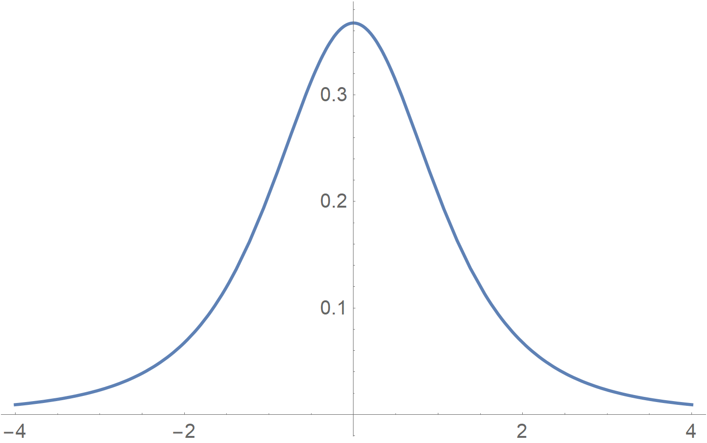

**Figure 11. Loi de Student avec $k = 1$ pour une variable centrée réduite**

L'espérance de la loi de Student est :

$\mathbb{E} \left( X \right) = 0$

La variance de la loi de Student est :

$\mathbb{V} \left( X \right) = \frac{k}{k - 2}$

###### Variable $T$ de Student

Soit une variable centrée et réduite $U$ suivant une loi normale, la **variable aléatoire $T$ de Student** est définie par :

$T^{2} \left( \upsilon \right) = \frac{U^2}{\frac{{\chi}^{2} \left( \upsilon \right)}{\upsilon}} = F \left( 1, \upsilon \right)$

avec $F$ la variable de Fisher, ou

$T \left( \upsilon \right) = \frac{U}{\sqrt{\frac{{\chi}^{2} \left( \upsilon \right)}{\upsilon}}}$

###### Propriétés de variable $T$ de Student

- La variable $T \left( \upsilon \right)$ varie de $-\infty$ à $+\infty$.

- La loi de probabilité de la variable $T \left( \upsilon \right)$ dépend d'un seul paramètre, $\upsilon$, appelé le degré de liberté de la variable ${\chi}^{2} \left( \upsilon \right)$.

- Les moments de la variable $T$ sont :

$\mathbb{E} \left( T \left( \upsilon \right) \right) = 0$

et

$\mathbb{V} \left( T \left( \upsilon \right) \right) = \frac{\upsilon}{\upsilon - 2} \textrm{ si } \upsilon > 2$

- Le mode $M_0$ de la variable $T$ est nul.

$M_0 = 0$

- La densité de probabilité de variable $T$ a une expression mathématique compliquée et peu utilisée.

$f \left( t \right) = \frac{1}{\sqrt{\upsilon}} \frac{1}{B \left( \frac{1}{2}, \frac{\upsilon}{2} \right)} \left( 1 + \frac{t^2}{\upsilon} \right)^{-\frac{\upsilon + 1}{2}}$

avec $B$ la fonction eulérienne.

- La table de la variable $T$ donne les fractiles d'ordre $\alpha$ de la loi de Student :

$\alpha = \Pr \left( T \left( \upsilon \right) \leq T_{\alpha} \left( \upsilon \right) \right) = \int_{-\infty}^{t_{\alpha} \left( \upsilon \right)} f \left( t \left( \upsilon \right) \right) \mathrm{d} t$

Comme la fonction est symétrique, il suffit de prendre $\alpha > 50$.

- Selon les valeurs de $\upsilon$, la distribution $T$ de Student possède des formes différentes. La courbe admet un axe de symétrie et ressemble à la « courbe en cloche ».

- Pour les grandes valeurs de $\upsilon$ ($\upsilon > 100$), la loi de Student peut être remplacée par la loi normale réduite.

- **Relation entre la loi de Student et la loi de Cauchy.** Pour $\upsilon = 1$, la densité de la variable $T \left( 1 \right)$

$f \left( t \right) = \frac{1}{\pi} \frac{1}{1 + t^2}$

est celle d'une variable suivant la loi de Cauchy.

### Loi de Benford

En 1938, F. Benford[^32] découvrit expérimentalement que la probabilité nulle qu'un nombre commence par le chiffre $n$, excepté 0, est :

$\Pr \left( n \right) = \log_{10} \left( 1 + \frac{1}{n} \right)$

S'il existe une distribution de probabilité universelle $\Pr \left( n \right)$ sur de tels nombres, ils doivent être invariants sous un changement d'échelle tel que :

$\Pr \left( kn \right) = f \left( k \right) \Pr \left( n \right)$

Si $\int_{-\infty}^{+\infty} \Pr \left( n \right) \mathrm{d} n = 1$, alors $\int_{-\infty}^{+\infty} \Pr \left( kn \right) \mathrm{d} n = \frac{1}{k}$

La normalisation de la distribution donne :

$f \left( k \right) = \frac{1}{k}$

si on dérive $\Pr \left( kn \right) = f \left( k \right) \Pr \left( n \right)$ par rapport à $k$ et que l'on pose $k = 1$, on obtient :

$\frac{\mathrm{d} \Pr \left( kn \right)}{\mathrm{d} k} = \frac{\mathrm{d} \left( \frac{1}{k} \right)}{\mathrm{d} k} \Pr \left( n \right) = - \frac{1}{k^2} \Pr \left( n \right)$

$n  {\Pr}' \left( kn \right) = - \frac{1}{k^2} \Pr \left( n \right)$

En posant $k = 1$, on a :

$n  {\Pr}' \left( n \right) = - \Pr \left( n \right)$

Cette équation différentielle a pour solution :

$\Pr \left( n \right) = \frac{1}{n}$

> [!NOTE]
> Cette fonction n'est pas à proprement parler une fonction de distribution de probabilité, car elle diverge.

> [!NOTE]
> Les lois de la physique et humaine imposent des limites.
\end{description}

La loi de Benford fut testée :

- sur la longueur des fleuves du globe ;

- sur la superficie des pays ;

- sur le résultat des élections.

### Loi de Weibull[^33]

La fonction de répartition vaut :

$\left\lbrace  \begin{array}{lc} F \left( t \right) = 0 & \forall t < \gamma \\ F \left( t \right) = 1 - e^{\left( - \frac{t - \gamma}{\eta} \right)^{\beta}} & \forall t \geq \gamma  \end{array} \right.$

La densité de probabilité vaut :

$\left\lbrace  \begin{array}{lc} f \left( t \right) = 0 & \forall t < \gamma \\ f \left( t \right) = \frac{\beta}{\eta} \left( \frac{t - \gamma}{\eta} \right)^{\beta - 1} e^{\left( - \frac{t - \gamma}{\eta} \right)^{\beta}} & \forall t \geq \gamma  \end{array} \right.$

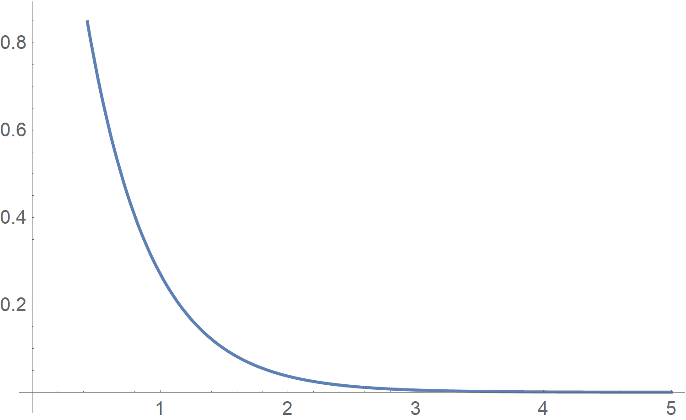

**Figure 12. Loi de Weibull avec $\beta = 1$ et $\eta = 0,5$**

### Loi de Gumbel[^34] ou loi des valeurs extrêmes

La fonction de répartition est :

$F \left( x \right) = e^{-e^{-\frac{x - x_0}{a}}}$

avec $a \neq 0$

La densité de probabilité est :

$f \left( x \right) = \frac{1}{a} e^{-\frac{x - x_0}{a}} e^{-e^{-\frac{x - x_0}{a}}}$

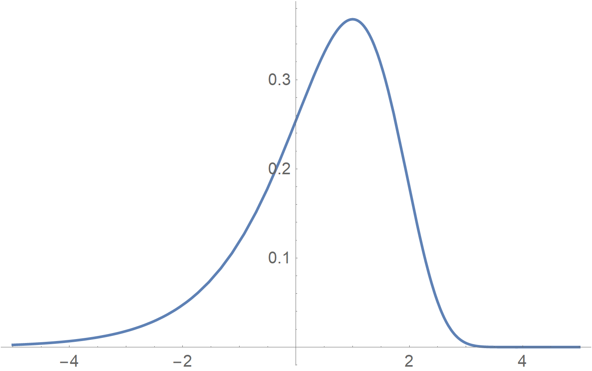

**Figure 13. Loi de Gumbel avec $x_0 = 1$ et $a = 1$**

L'espérance mathématique de la loi de Gumbel vaut :

$\mathbb{E} \left( X \right) = x_0 + \gamma a \approx x_0 + 0,577216 a$

où $\gamma$ est la constante d'Euler-Mascheroni.

La variance mathématique de la loi de Gumbel vaut :

$\mathbb{V} \left( X \right) = \frac{{\pi}^2}{6} a^2$

Les probabilités correspondant à la moyenne ont pour valeurs :

$F \left( \mu \right) = F \left( x_0 + \gamma a \right) = \left\lbrace \begin{array}{c} 0,570 \textrm{ si } a > 0 \\ 0,430 \textrm{ si } a < 0 \end{array} \right.$

La médiane vaut :

$F \left( M_e \right) = \frac{1}{2} \Rightarrow M_e = x_0 + 0,366513 a$

Le mode vaut :

$F \left( x_0 \right) = \left\lbrace \begin{array}{c} 0,368 \textrm{ si } a > 0 \\ 0,632 \textrm{ si } a < 0 \end{array} \right.$

> [!NOTE]
> On peut réécrire toutes les formules précédentes en posant une variable centrée réduite : $u = \frac{x - x_0}{a}$.
>
> $\begin{array}{l} F \left( u \right) = e^{-e^{-u}} \\ f \left( u \right) = e^{-u} e^{-e^{-u}} \\ \mathbb{E} \left( X \right) = \gamma \approx 0,577216 \\ \mathbb{V} \left( X \right) = \frac{{\pi}^2}{6} \end{array}$

### Loi de Fréchet[^35]

La fonction de répartition vaut :

$F \left( x \right) = e^{-e^{-\frac{\ln \left( x - x_0 \right)}{a}}}$

La densité de probabilité vaut :

$f \left( x \right) = \frac{1}{ax} e^{-\frac{\ln \left( x - x_0 \right)}{a}} e^{-e^{-\frac{\ln \left( x - x_0 \right)}{a}}}$

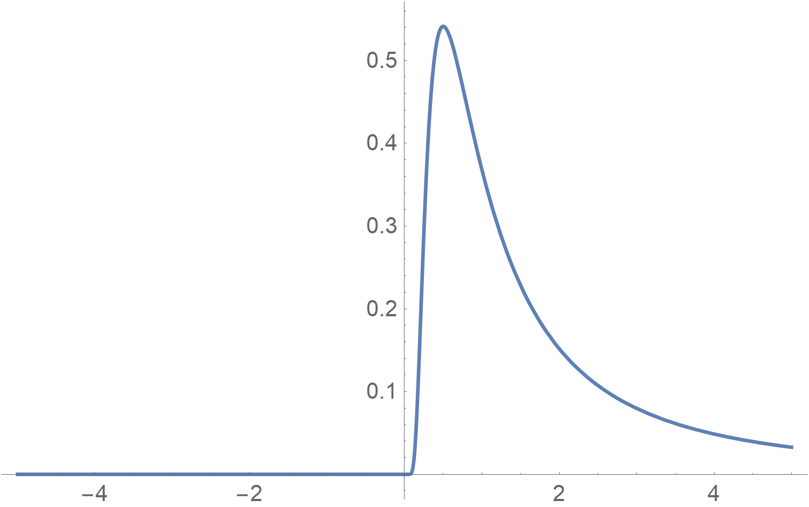

**Figure 14. Loi de Fréchet avec $x_0 = 0$ et $a = 1$**

### Loi de Pareto[^36]

La fonction de répartition vaut :

$\Pr \left( X \leq x \right) = 1 - C \left( \frac{x}{x_0} \right)^{-\alpha} = 1 - C \left( \frac{x_0}{x} \right)^{\alpha}$

avec $x \geq x_0$ et $C$ un paramètre d'échelle.

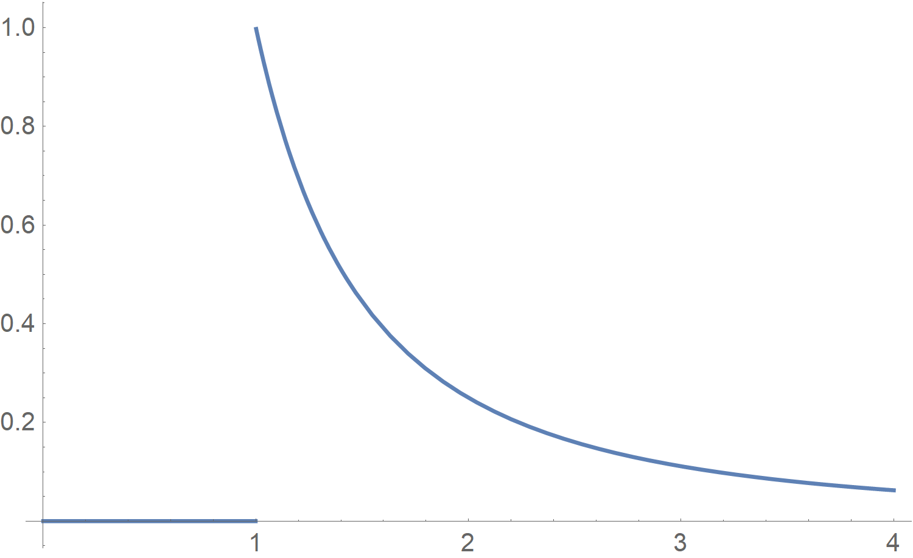

**Figure 15. Loi de Pareto avec $x_0 = 1$ et $\alpha = 1$**

Pour $C = 1$, la densité de probabilité vaut :

$\left\lbrace  \begin{array}{l} \Pr \left( X = x \right) = \frac{\mathrm{d}}{\mathrm{d} x} \left[ 1 - \left( \frac{x_0}{x} \right)^{\alpha} \right] = \alpha \frac{{x_0}^{\alpha}}{{x}^{\alpha + 1}} \textrm{ avec } x \geq x_0 \\ \Pr \left( X = x \right) = 0 \textrm{ avec } x < x_0 \end{array} \right.$

La distribution de Pareto est définie par deux paramètres $x_0$ et $\alpha$. La constante $\alpha$ est nommée **index de Pareto**.

**Propriété importante.** Soit $a$ une constante.

$\begin{array}{l} f \left( ax \right) = \alpha {x_0}^{\alpha} \left( ax \right)^{-\alpha - 1} \\ f \left( ax \right) = a^{-\alpha - 1} \alpha {x_0}^{\alpha} x^{-\alpha - 1} \\ f \left( ax \right) = a^{-\alpha -1} \alpha \frac{{x_0}^{\alpha}}{x^{\alpha + 1}} \\ f \left( ax \right) = a^{-\alpha - 1} f \left( x \right) \propto f \left( x \right)  \end{array}$

La loi de Pareto vérifie la définition d'une fonction de distribution.

$\begin{array}{l} \int_{0}^{+\infty} f \left( x \right) \mathrm{d} x = \left[ 1 - \left( \frac{x_0}{x} \right)^{\alpha} \right]_{x_0}^{+\infty} \\ \int_{0}^{+\infty} f \left( x \right) \mathrm{d} x = \left[ 1 - \left( \frac{x_0}{+\infty} \right)^{\alpha} \right] - \left[ 1 - \left( \frac{x_0}{x_0} \right)^{\alpha} \right] \\ \int_{0}^{+\infty} f \left( x \right) \mathrm{d} x = 1 - 0 - \left( 1 - 1^k \right) \\ \int_{0}^{+\infty} f \left( x \right) \mathrm{d} x = 1  \end{array}$

Les caractéristiques de la loi de Pareto sont peu nombreuses.

- Il s'agit d'une loi extrêmement dissymétrique.

- Lorsque $\alpha \leq 1$, la moyenne n'existe pas. Dit autrement, les valeurs extrêmes ont une probabilité plus élevée de se réaliser par rapport à la loi normale. L'espérance de la fonction de Pareto est :

$\mathbb{E} \left( X \right) = \frac{\alpha x_0}{\alpha - 1}$

Ce résultat s'obtient en intégrant directement la définition de l'espérance[^37].

- Lorsque $\alpha \leq 2$, la variance n'existe pas[^38]. La variance de la fonction de Pareto est :

$\mathbb{V} \left( X \right) = \frac{\alpha {x_0}^2}{\left( \alpha - 1 \right)^2 \left( \alpha - 2 \right)}$

> [!NOTE]
> Lorsque $\alpha \rightarrow +\infty$, la distribution de Pareto s'approche de $\delta \left( x - x_0 \right)$ avec $\delta$ la fonction de Dirac.

Il existe deux lois de Pareto :

1. la loi forte de Vilfredo Pareto (1897) ;

2. la loi faible de Benoît Mandelbrot (1963).

Soit $x_s$ un seuil au-delà duquel on calcule l'espérance de la quantité examinée, et $\mathbb{E} \left( Y \right)$ l'espérance au-delà de ce seuil $x_s$ tel qu'il soit proportionnel au seuil choisi :

$\mathbb{E} \left( Y \right) = a x_s + b$

Dans ce cadre, la moyenne **conditionnelle** au-delà du seuil $x_s$ est un multiple de ce seuil à une constante près, c'est-à-dire une fonction linéaire de ce seuil. Si elle existe et elle est vérifiée, on dit que la distribution de probabilité obéit à une **forme de Pareto généralisée**. De fait, la loi de Pareto définit comme $\Pr \left( X \leq x \right) = 1 - \left( \frac{x_0}{x} \right)^{\alpha}$ est appelée **loi de Pareto de type I**.

La loi de Pareto de type II fait intervenir un paramètre supplémentaire $\mu$ tel que :

$\Pr \left( X \leq x \right) = 1 + \left( \frac{x_0}{x - \mu} \right)^{\alpha}$

La loi de Pareto de type III fait intervenir deux paramètres supplémentaires $\mu$ et $\gamma$ tels que :

$\Pr \left( X \leq x \right) = \left[ 1 + \left( \frac{x - \mu}{x_0} \right)^{\frac{1}{\gamma}} \right]^{-1}$

La loi de Pareto de type IV généralise le type III tel que :

$\Pr \left( X \leq x \right) = \left[ 1 + \left( \frac{x - \mu}{x_0} \right)^{\frac{1}{\gamma}} \right]^{-\alpha}$

Une autre façon d'obtenir une loi de Pareto est de reprendre les travaux de B. Mandelbrot[^19]. Il rapproche cette distribution de la notion de fractale. Pour lui, il s'agit d'une **distribution scalante** définie telle que :

$\Pr \left( U > u \right) = u^{-\alpha}$

avec $\alpha = \frac{A}{A - 1}$. Ce type de lois a été utilisé dès le début du XXe siècle [^39] [^21].

Lorsque tout ce que l'on sait de $U$ est que $U \geq h$, on obtient la probabilité conditionnelle suivante :

$\Pr \left( U \geq u \setminus U \geq h \right) = \left( \frac{U}{k} \right)^{\alpha} = h^{\alpha} U^{-\alpha}$

On pose $C = h^{\alpha}$.

En conséquence, 

$\Pr \left( U - h \right) = \frac{h}{\alpha - 1}$

« La distribution scalante n'a pas d'échelle propre, mais emprunte toujours celle de l'observateur »[^19] (p. 79).

## Liens

- [Topo en format P.D.F.](./PDF/Seance-04.pdf)

- [Exercice](./Exercice/Seance-4.pdf)

## Notes de bas de page

[^1]: Boris Vladimirovitch Gnedenko (1912-1995)

[^2]: Gnedenko, Boris Vladimirovitch & Kolmogorov, Andreï,Nikolaïevitch, 1954, *Limit Distributions for Sums of Independent Random Variable*, K. L. Chung	Cambridge, Addisson-Wesley, X-264 p.

[^3]: Paul Dirac (1937-1984)

[^4]: Jacques Bernoulli (1654-1705)

[^5]: Siméon Denis Poisson (1781-1840)

[^6]: George Kingsley Zipf (1902-1950)

[^7]: Benoît Mandelbrot (1924-2010)

[^8]: Leonhard Euler (1707-1783)

[^9]: Lorenzo Mascheroni (1750-1800)

[^10]: La constante d'Euler-Mascheroni est définie de la manière suivante : $\gamma = \lim_{n \rightarrow +\infty} \left( 1 + \frac{1}{2} + \frac{1}{3} + \frac{1}{4} + \ldots{} + \frac{1}{n} - \ln n \right)$ ou $\gamma = \lim_{n \rightarrow +\infty} \left( \left( \sum_{k = 1}^{n} \frac{1}{k} \right) - \ln n \right)$.

[^11]: Pierre-Simon de Laplace (1746-1827)

[^12]: Carl Friedrich Gauss (1777-1855)

[^13]: Abraham de Moivre (1667-1774)

[^14]: Formule de l'intégration par parties : $\int_{a}^{b} f \left( t \right) g'\left( t \right) \mathrm{d} t = \left[ f \left( t \right) g \left( t \right) \right]_{a}^{b} - \int_{a}^{b} f' \left( t \right) g \left( t \right) \mathrm{d} t$

[^15]: Cela se lit : $X$  suit une loi normale de paramètres $\mu$ et $\sigma$.

[^16]: Francis Galton (1822-1911)

[^17]: *Full Width at Half Maximum* (F.W.H.M.)

[^18]: Pierre Jean Paul Henry (1848-1907)

[^19]: Mandelbrot, Benoît, 1997, *Fractales, hasard et finances (1959-1997)*, Paris, Flammarion, 246 p.

[^20]: Fréchet, Maurice, 1941, « Sur la loi de répartition de certaines grandeurs géographiques », *Journal de la société statistique de Paris*, n°82, p. 114-122

[^21]: Korčák, Jaromír, 1940	« Deux types fondamentaux de distribution statistique », *Bulletin de l'Institut international de statistique*, vol. 30	n°3, p. 295-299 [Rapports et communications présentés à la XXIVe session de l'Institut international de statistique, Prague, 1938, 2e partie]

[^22]: Robert Gibrat (1904-1980)

[^23]: *Mean Time Between Failure* (M.T.B.F.)

[^24]: Augustin Cauchy (1789-1857)

[^25]: Agner Krarup Erlang (1878-1929)

[^26]: Karl Pearson (1857-1936)

[^27]: Edwin Bidwell Wilson (1879-1964)

[^28]: Margaret M. Hilferty (?-?)

[^29]: Ronald Aylmer Fisher (1890-1962)

[^30]: George Snedecor (1881-1974)

[^31]: Student est le pseudonyme du statisticien William Sealy Gosset (1876-1937).

[^32]: Frank Benford (1883-1948)

[^33]: Ernst Hjalmar Waloddi Weibull (1887-1979)

[^34]: Emil Julius Gumbel (1891-1966)

[^35]: René Maurice Fréchet (1878-1973)

[^36]: Vilfredo Pareto (1848-1923)

[^37]: $\begin{array}{l} \mathbb{E} \left( X \right) = \int_{x_0}^{+\infty} x f \left( x \right) \mathrm{d} x \\ \mathbb{E} \left( X \right) = \int_{x_0}^{+\infty} x \alpha \frac{{x_0}^{\alpha}}{{x}^{\alpha + 1}} \mathrm{d} x \\ \mathbb{E} \left( X \right) = \alpha {x_0}^{\alpha} \int_{x_0}^{+\infty} \frac{1}{{x}^{\alpha}} \mathrm{d} x \\ \mathbb{E} \left( X \right) = \left[ -\frac{\alpha {x_0}^{\alpha}}{\alpha - 1} \frac{1}{x^{\alpha - 1}} \right]_{x_0}^{+\infty} \\ \mathbb{E} \left( X \right) = \frac{\alpha x_0}{\alpha - 1} \end{array}$

[^38]: $\begin{array}{l} \mathbb{V} \left( X \right) = \mathbb{E} \left( X^2 \right) - \left[ \mathbb{E} \left( X \right) \right]^2 \\ \\ \mathbb{E} \left( X^2 \right) = \int_{x_0}^{+\infty} x^2 f \left( x \right) \mathrm{d} x \\ \mathbb{E} \left( X^2 \right) = \alpha {x_0}^{\alpha} \int_{x_0}^{+\infty} \frac{1}{x^{\alpha - 1}} \mathrm{d} x \\ \mathbb{E} \left( X^2 \right) = \alpha {x_0}^{\alpha} \left[ -\frac{1}{\alpha - 2} \frac{1}{x^{\alpha - 2}} \right]_{x_0}^{+\infty} \\ \mathbb{E} \left( X^2 \right) = \frac{\alpha {x_0}^2}{\alpha - 2} \\ \\ \mathbb{V} \left( X \right) = \frac{\alpha {x_0}^2}{\alpha - 2} - \left( \frac{\alpha x_0}{\alpha - 1} \right)^2 \end{array}$

[^39]: Lotka, Alfred J., 1925, « Frequency distribution of scientific productivity », *Journal of the Washington Academy of Science*, n°16, p. 317-323
