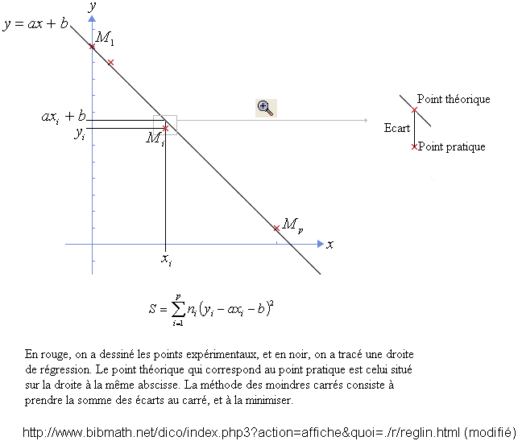
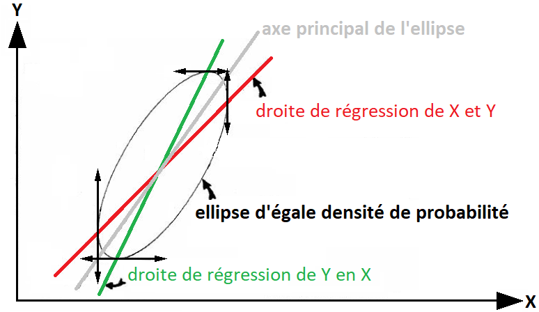
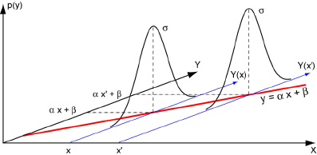
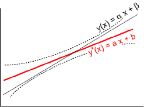

# Régression linéaire entre deux variables aléatoires : étude détaillée

Souvent, en se fondant sur des données d'un échantillon, on souhaite estimer la valeur d'une variable aléatoire $Y$ en fonction d'une seconde variable $X$. La mise en relation des deux variables quantitatives (ou semi-quantitatives) s’effectue par l'intermédiaire de la méthode des moindres carrés. On obtient une **courbe** dite **de régression** ajustant au mieux les données de l'échantillon. Dans ce cas, le résultat obtenu est une courbe de régression de $Y$ en $X$, puisque l'on estime les valeurs de $Y$ à partir des valeurs de $X$. Toutefois, il est important de souligner qu'il est possible d'inverser le choix est de proposer une courbe de régression de $X$ en $Y$, et, de manière générale, les deux courbes obtenues seront différentes. Parmi toutes les courbes possibles, le cas d'une droite est le plus simple et le plus étudié. Dans ce cas, il s'agit d'une **régression linéaire**.

> [!NOTE]
> Contrairement à une idée trop répandue, il n'existe aucune relation forte entre régression linéaire et méthode des moindres carrés. Il ne faut pas confondre les deux notions. La régression linéaire peut être ajustable par d'autres méthodes, comme celle sous contrainte des multiplicateurs de Lagrange. Par ailleurs, la méthode des moindres carrés permet d'ajuster d'autres types de courbes que les droites – des paraboles par exemple. De fait, la méthode des moindres carrés permet seulement de calculer une forme de régression linéaire.

La régression linéaire sert à :

1. contrôler ;

2. prévoir ;

3. décider.

Toutefois, il existe cinq conditions d'application.

1. La variable explicative $X$ est considérée sans erreur.

2. L'erreur $\xi$ ne porte que sur la variable à expliquer $Y$.

3. L'erreur $\xi$ est indépendante de la variable explicative $X$, ce qui signifie que $\mathbb{V} \left( \xi \right) = \textrm{constante}$.

4. La relation est en moyenne linéaire, ce qui signifie que $\mathbb{E} \left( Y \setminus X = x \right) = f \left( x \right) = \alpha x + \beta$. L'espérance de $Y$ est liée à celle de $X$.

5. La distribution de $Y$ est supposée normale.

Pour toutes ces raisons, la régression linéaire mérite que lui consacre un chapitre entier.

## Fonction linéaire

On appelle **fonction linéaire** une fonction dont la dérivée est soit une constante, soit nulle. Graphiquement, une fonction linéaire est représentée par une droite. À l'opposé, on appelle **fonction non linéaire** toute fonction qui n'est pas linéaire. Comme vu dans le chapitre sur la méthode des moindres carrés, il existe toujours des moyens de se ramener à une fonction linéaire, ce qui étend de la technique de la régression linéaire à plusieurs cas qui, à la base, sont non linéaires.

La projection graphique du nuage de points de $X$ et de $Y$ permet d'éliminer rapidement le choix de la régression linéaire.

- On observe un « effet tromblon » si le nuage de points forme un « triangle équilatéral ». Cela signifie que la variance de $X$ est liée à la variance de $Y$. 

- On peut observer une relation clairement non linéaire en projetant le nuage de points.

- Dans un nuage de points formant un cercle avec deux points à l'intérieur de celui-ci, ces deux points tirent la courbe vers eux pour générer une régression linéaire.

- Dans le cas d'un nuage de points présentant deux « paquets circulaires », la relation linéaire éventuelle est tirée par leur existence même. Cela signifie qu'il existe de populations distinctes.

- Il se peut que le nuage de points projette deux ou plusieurs alignements linéaires. Dans ce cas, il faut partitionner la population pour isoler les cas de régression linéaire possibles.

- Dans un nuage de points formant un « paquet », il se peut qu'un point exceptionnel en sorte, et tire la régression linéaire vers lui.

- Il peut exister un défaut d'alignement, représenté par un point clairement en dehors de l'alignement.

## Méthode des moindres carrés et régression linéaire

En raison des erreurs de mesure, les $n$ points $\left( x, y \right)$ ne sont pas alignés, mais le sont « presque » sur une même droite $y = ax + b$. Il faut alors choisir $a$ et $b$ de sorte que la droite soit la meilleure possible. Dit autrement, cela revient à choisir une mesure de l'écart entre cette droite et le nuage de points expérimental $\left( x, y \right)$. Pour ce, en règle générale, on choisit le carré de la différence entre le point théorique et le point expérimental :

${\Delta}_i = \left( y_i - a x_i - b \right)^2$

avec $i = \left\lbrace 1, 2, \ldots{}, n \right\rbrace$. L'écart total vaut alors :

$J \left( a, b \right) = \sum_{i = 1}^{n} \left( y_i - a x_i - b \right)^2$

**Effectuer une régression linéaire par la méthode des moindres carrés, c'est trouver la droite qui minimise l'écart total**, c'est-à-dire la somme des carrés des différences. Dans la figure 1, on étudie la droite de régression de $Y$ rapport à $X$.

**Figure 1. Méthode des moindres carrés et régression linéaire**

Il faut bien comprendre que le nuage de point est le résultat d'une double estimation ponctuelle. $x$ est une estimation de la variable aléatoire $X$ et $y$ est une estimation de la variable aléatoire $Y$. De fait, les coefficients $a$ et $b$ recherchés peuvent être considérés eux-mêmes comme une estimation des estimateurs $A$ et $B$, réalisations des coefficients $\alpha$ et $\beta$ de la population mère.

On note $\bar{x}$ la moyenne estimée de l'abscisse $x$, $\bar{y}$ la moyenne estimée de l'abscisse $y$. Le couple $\left( \bar{x}, \bar{y} \right)$ correspond au **point moyen** (estimé) du nuage de points. On note $s_x$ l'écart type estimé de la variable $X$, et $s_y$ l'écart type estimé de la variable $Y$. La covariance de $x$ et de $y$ est notée $\mathrm{cov} \left( x, y \right)$.

L'étude mathématique s'effectue grâce à l'étude de la fonction de plusieurs variables $J$. Par définition, un minimum d'une fonction à plusieurs variables ne peut se produire qu'en un point où les dérivées partielles s'annulent c'est-à-dire :

$\left\lbrace  \begin{array}{l} \frac{\partial J}{\partial a} = -2 \sum_{i = 1}^{n} \left[ x_i \left( y_i - a x_i - b \right) \right] = 0 \\ \frac{\partial J}{\partial b} = -2 \sum_{i = 1}^{n} \left( y_i - a x_i - b \right) = 0 \end{array} \right.$

On obtient un système linéaire d'ordre 2 en $a$ et $b$, dont les solutions sont :

$a = \frac{n \sum_{i = 1}^{n} x_i y_i - \sum_{i = 1}^{n} x_i \sum_{i = 1}^{n} y_i}{n \sum_{i = 1}^{n} {x_i}^2 - \left( \sum_{i = 1}^{n} x_i \right)^2} = \frac{\mathrm{cov} \left( x, y \right)}{{s_x}^2}$

et

$b = \frac{\sum_{i = 1}^{n} y_i \sum_{i = 1}^{n} {x_i}^2 - \sum_{i = 1}^{n} x_i \sum_{i = 1}^{n} x_i y_i}{n \sum_{i = 1}^{n} {x_i}^2 - \left( \sum_{i = 1}^{n} x_i\right)^2} = \bar{y} - a \bar{x}$

La simplification de la solution de $b$ en utilisant les paramètres estimés montre que la droite estimée passe par le point moyen.

> [!NOTE]
> Ce sont les deux formules préprogrammées dans la quasi-totalité des tableurs comme Excel®, des calculatrices et des calculateurs du type MathLab®, Mathematica® ou Maple®. Retenir ces formules peu commodes est par conséquent peu utile. Il faut se concentrer sur la méthode pour les obtenir et retenir les propriétés associées.

## Décomposition de la variance

On note ${y_i}^{*}$ la valeur théorique obtenue pour $x_i$ *via* la droite de régression estimée, c'est-à-dire ${y_i}^{*} = a x_i + b$. On appelle le résidu (ou l'erreur de prédiction), $e_i$, l'écart entre la valeur théorique et la valeur observée, $e_i = y_i - {y_i}^{*}$. Il est possible de réécrire $e_i$ en introduisant la moyenne estimée $\bar{y}$ :

$y_i = {y_i}^{*} + e_i = \left( y_i - \bar{y} \right) = \left( {y_i}^{*} - \bar{y} \right) + e_i$

On note que ${y_i}^{*} - \bar{y} = a \left( x_i - \bar{x} \right)$.

Si l'on centre $y_i$ sur sa moyenne $\bar{y}$, on obtient une mesure de l'écart à la moyenne :

$\underbrace{y_i - \bar{y}}_{\textrm{écart total}} = \underbrace{\left( {y_i}^{*} - \bar{y} \right)}_{\textrm{écart expliqué}} + \underbrace{\left( y_i - {y_i}^{*} \right)}_{\textrm{écart non expliqué}}$

Lorsque l'on cherche une droite de régression de $Y$ par rapport à $X$, les variables $X$ et $Y$ ne jouent pas le même rôle. $Y$ est la variable à expliquer, et $X$ est la variable potentiellement explicative. Il est possible de décomposer la variance en une partie expliquée (la variance expliquée) et un partie non expliquée, résiduelle (la variance résiduelle) (Fig. 2).

")

**Figure 2. Variance expliquée et variance résiduelle[^1] (p. 549)**

Après obtention de la droite de régression de $Y$ par rapport à $X$, on peut écrire la variance totale ${s_y}^2$ :

$\underbrace{{s_y}^2}_{\textrm{variance totale}} = {s_{ax + b}}^2 + \frac{1}{n} \sum_{i = 1}^{n} n_i \left( y_i - a x_i - b \right)^2 = \underbrace{a^2 {s_x}^2}_{\textrm{variance expliquée}} + \underbrace{{s_e}^2}_{\textrm{variance résiduelle}}$

La variance totale de $Y$ est égale à la somme de la variance expliquée par l'ajustement affine, c'est-à-dire par la variable $X$, et la variance résiduelle (Fig. 3) :

$\underbrace{\sum_{i = 1}^{n} \left( y_i - \bar{y} \right)^2}_{\textrm{variance totale}} = \underbrace{\sum_{i = 1}^{n} \left( {y_i}^{*} - \bar{y} \right)^2}_{\textrm{variance expliquée}} + \underbrace{\sum_{i = 1}^{n} \left( y_i - {y_i}^{*} \right)^2}_{\textrm{variance résiduelle}}$

avec $\sum_{i = 1}^{n} \left( {y_i}^{*} - \bar{y} \right)^2 = \sum_{i = 1}^{n} \left( {y_i}^{*} - \bar{y} \right)^2$

")

**Figure 3. La réduction de la variance[^1] (p. 549)**

Il est à noter qu'ici le terme « variance » est abusif, car la variance totale vaut exactement :

$\begin{array}{l} \sum_{i = 1}^{n} \left( y_i - \bar{y} \right)^2 = \frac{1}{n} \sum_{i = 1}^{n} \left( y_i - \bar{y} \right)^2 = \frac{1}{n} \sum_{i = 1}^{n} \left[ \left( {y_i}^{*} - \bar{y} \right) + \left( y_i - {y_i}^{*} \right) \right]^2 \\ \sum_{i = 1}^{n} \left( y_i - \bar{y} \right)^2 = \sum_{i = 1}^{n} \left( {y_i}^{*} - \bar{y} \right)^2 + \sum_{i = 1}^{n} \left( y - {y_i}^{*} \right)^2 + 2\sum_{i = 1}^{n} \left[ \left( {y_i}^{*} - \bar{y} \right) \left( y - {y_i}^{*} \right) \right]  \end{array}$

mais $2\sum_{i = 1}^{n} \left[ \left( {y_i}^{*} - \bar{y} \right) \left( y - {y_i}^{*} \right) \right]$ comporte un terme nul, car $2\sum_{i = 1}^{n} \left( y - {y_i}^{*} \right) =  2\sum_{i = 1}^{n} \left( y - a x_i - b \right) = 0$ par définition de la méthode des moindres carrés.

### Coefficient de détermination

Si l'on prend le rapport entre la variance expliquée de $Y$ et la variance totale de $Y$, on obtient le **coefficient de détermination** qui mesure la qualité de l'ajustement linéaire. :

$\frac{\textrm{variance expliquée}}{\textrm{variance totale}} = \frac{{s_{aX + b}}^2}{{s_{Y}}^2} = a^2 \frac{{s_X}^2}{{s_Y}^2} = \frac{\left[ \mathrm{cov} \left( x, y \right) \right]}{{s_X}^2 {s_Y}^2} = \left[ \frac{\mathrm{cov} \left( x, y \right)}{s_X s_Y} \right]^2 = r^2$

Par définition, le coefficient de détermination correspond au carré du coefficient de corrélation. Le coefficient de détermination mesure la contribution d'une des variables à l'explication de la seconde.

$r^2$ est également lié à la variance résiduelle par une relation approximative :

${s_e}^2 \approx \left( 1 - r^2 \right) {s_y}^2$

Dit autrement dit, la variance résiduelle ${s_e}^2$ n'est qu'une fraction de la variance totale ${s_y}^2$. Cette fraction correspond au **coefficient d'indétermination** $\left( 1 - r^2 \right)$. Si, par exemple, on écrit ${s_e}^2 \approx 0,60 {s_y}^2$, cela signifie que 60 % de la variance totale de $Y$ reste inexpliquée. L'approximation vient du fait que la variance résiduelle s'exprime de la manière suivante : ${s_e}^2 = \frac{1}{n - 2} \sum_{i = 1}^{n} \left( y_i - {y_i}^2 \right)^2$.

Le rapport entre la variance expliquée de $Y$ et la variance résiduelle de $Y$ est une variable $F$ de Fisher. La variance totale possède $n - 1$ degré de liberté, la variance expliquée $1$, et la variance résiduelle $n - 2$.

$F = \frac{\textrm{variance expliquée}}{\textrm{variance résiduelle}} = \frac{\sum_{i = 1}^{n} \left( {y_i}^{*} - \bar{y} \right)^2}{\frac{1}{n - 2} \sum_{i = 1}^{n} \left( y_i - {y_i}^{*} \right)^2} = \frac{a^2 {s_x}^2}{{s_e}^2}$

Le test de Fisher teste l'absence de corrélation entre $X$ et $Y$. Si $F > F_{\alpha} \left( 1, n - 2 \right)$ alors $X$ et $Y$ sont corrélées. Cela permet de répondre à la question suivante : « La liaison linéaire est-elle significative ? ».

### Coefficient de corrélation linéaire

$r$ est une estimation ponctuelle de la variable aléatoire $R$, réalisation du coefficient de corrélation $\rho$ de la population mère. $y$ est tout à fait symétrique par rapport à $x$. Dit autrement, $r$ ne distingue pas la variable expliquée $y$ et le régresseur $x$.

Le coefficient de corrélation $r$ mesure le degré de liaison linéaire entre $X$ et $Y$. Lorsque $r = 0$, le nuage de point est symétrique. De fait, $r$ indique dans ce cas l'absence de relation linéaire. Plus $\left| r \right| \rightarrow 1$, plus la liaison linéaire est forte. Toutefois, à lui seul, il n'est pas possible de conclure sur cet aspect. En effet, lorsque la population n'est pas normale bivariée, de telles inférences peuvent s'avérer risquées, voire impossibles. Elles ne sont pas « robustes ». De plus, il dépend du nombre de points : lorsqu'il y a peu de points, $r$ est peu significatif.

Il faut noter que le coefficient de corrélation est une mesure invariante d'échelle.

On suppose que la population soit normale bivariée, ce qui signifie que les valeurs $X$ suivent une distribution normale, de même que les valeurs $Y$. Le nuage de points peut être représenté de façon satisfaisante par une ellipse qui englobe la plupart des points (environ 85 %) et qui est appelée **ellipse de concentration** (Fig. 4).

")

**Figure 4. Nuage de point et ellipse de concentration[^1] (p. 544)**

Il est possible d'écrire $r$ en fonction de la variance résiduelle *via* la formule du coefficient d'indétermination, ce qui donne :

$r \approx \sqrt{1 - \frac{{s_e}^2}{{s_y}^2}}$

Cela revient à effectuer une étude de la dispersion résiduelle qui montre si l'on a réussi à réduire les données de manière significative.

### Conséquence du centrage sur la moyenne

Lorsque l'on centre les variables $X$ et $Y$, $x - \bar{x}$ et $y - \bar{y}$, cela revient à changer l'origine du repère. Le point moyen devient le centre du repère (Fig. 5).

")

**Figure 5. Nuage de points et changement de repère[^1] (p. 541)**

D'après la figure 5, les domaines I et III  vérifient $\sum_{i = 1}^{n} x_i y_i > 0$, tandis que les domaines II et IV vérifient $\sum_{i = 1}^{n} x_i y_i < 0$. De plus, il n'existe pas de liaison entre $X$ et $Y$ avec des points d'observation répartis de manière « homogène » : $\sum_{i = 1}^{n} x_i y_i = 0$.

## Régression et corrélation

### Relation entre l'ordonnée à l'origine $a$ et la pente de la régression et $r$ le coefficient de corrélation

$a$ et $r$ se ressemblent beaucoup :

$a = \frac{\mathrm{cov} \left( x, y \right)}{{s_x}^2}$

et

$r = \frac{\mathrm{cov} \left( x, y \right)}{s_x s_y}$

De fait, pour rapprocher $a$ et $r$, il suffit d'écrire

$a s_x = \frac{\mathrm{cov} \left( x, y \right)}{s_x}$

puis d'introduire $s_y$ ;

$a \frac{s_x}{s_y} = \frac{\mathrm{cov} \left( x, y \right)}{s_x s_y} = r$

donc :

$a = \frac{s_y}{s_x} r$

De fait, si $a = 0$, alors $r = 0$, et, réciproquement, si $r = 0$, alors $a = 0$.

### Tester l'hypothèse d'un coefficient directeur nul

Le coefficient directeur $a$ peut être vu comme la réalisation de la variable aléatoire $A$ estimant la valeur $\alpha$, c'est-à-dire :

$\mathbb{E} \left( A \right) = \alpha$

et

$\mathbb{V} \left( A \right) = \frac{{\sigma}^2}{\sum_{i =1}^{n} \left( x_i - \bar{x} \right)^2}$

On calcule la variable $U$ telle que $U = \frac{A - \alpha}{\frac{{\sigma}}{\sqrt{\sum_{i =1}^{n} \left( x_i - \bar{x} \right)^2}}}$. Avec un écart type observé de ${\sigma}^{*}$, on obtient une loi $t$ de Student à $n - 2$ degré de liberté, dont la valeur vaut : $t = \frac{A - \alpha}{\frac{{\sigma}^{*}}{\sqrt{\sum_{i =1}^{n} \left( x_i - \bar{x} \right)^2}}}$.

Pour l'hypothèse nulle $H_0$, on suppose que $\alpha = 0$, ce qui signifie que $-t_{\frac{\alpha}{2}} < \frac{a}{\frac{{\sigma}^{*}}{\sqrt{\sum_{i =1}^{n} \left( x_i - \bar{x} \right)^2}}} < t_{\frac{\alpha}{2}}$. Dans ce cas, il n'existe aucune relation linéaire entre $X$ et $Y$.

Pour l'hypothèse alternative $H_1$, on suppose que $\alpha \neq 0$. Dit autrement, $t$ est en dehors de l'intervalle $\left[ -t_{\frac{\alpha}{2}}, t_{\frac{\alpha}{2}}\right]$. La pente n'est pas nulle.

## Étude des deux droites de régression possibles

Jusqu'à présent, le texte a étudié la régression de $Y$ en $X$ (Fig. 6), mais, si elle n'est pas convaincante, il est tout à fait possible d'effectuer la régression de $X$ en $Y$ (Fig. 7).

")

**Figure 6. La régression de $Y$ en $X$ [^1] (p. 556)**

")

**Figure 7. La régression de $X$ en $Y$[^1] (p. 557)**

Dans les deux cas, une **ellipse de concentration** englobe la plupart des observations possibles (Fig. 8). Pourquoi la droite de régression ne correspond-t-elle pas à l'axe principal de cette ellipse ? Simplement, parce que choisir cet axe serait un choix trop « optimiste ». C'est pour cela que la méthode s'appelle « régression ». Une « régression à la moyenne » n'a par conséquent aucun sens. La régression de $Y$ en $X$ permet, en connaissant $X_1$ de proposer la meilleure prédiction possible pour $Y$. Il s'agit de $P_1$ qui est situé au milieu du segment $\left[ AB \right]$ et sur la droite de régression ${Y}^{*}$. La régression de $X$ en $Y$ permet, en connaissant $Y_1$ de proposer la meilleure prédiction possible pour $X$. Il s'agit de $P_2$ qui est situé au milieu du segment $\left[ CD \right]$ et sur la droite de régression ${X}^{*}$. L'axe principal est un axe de symétrie entre les deux droites de régression.

Il est possible d'écrire l'équation de la droite des moindres carrés $Y = a_0 + a_1 X$, c'est-à-dire la droite de régression de $Y$ en $X$ :

$Y - \bar{Y} = r \frac{s_Y}{s_X} \left( X - \bar{X} \right)$

De la même façon, la droite de régression de $X$ en $Y$ peut s'écrire :

$X - \bar{X} = \frac{1}{r} \frac{s_X}{s_Y} \left( Y - \bar{Y} \right)$

Dans le deux cas, le coefficient de corrélation $r$ intervient, ce qui permet de préciser quatre propriétés.

- **Propriété 1.** Les pentes des deux droites sont égales si et seulement si $r = \pm 1$, si et seulement si les deux droites sont identiques, si et seulement s'l existe une corrélation linéaire parfaite entre les variables $X$ et $Y$.

- **Propriété 2.** Si $r = 0$, les droites sont perpendiculaires. Il n'existe pas de corrélation linéaire entre $X$ et $Y$.

- **Propriété 3.** Le coefficient de corrélation linéaire mesure l'écart entre deux droites de régression (Fig. 8).

- **Propriété 4.** Si $Y = a_0 + a_1 X$ et $X = b_0 + b_1 Y$, alors $r^2 = a_1 b_1$. Cette propriété correspond à la dissymétrie des deux droites de moindres carrés. Cela se démontre facilement. Lors de la régression linéaire de $Y$ en $X$, on sait que $a_1 = \frac{\mathrm{cov} \left( X, Y \right)}{s^2 \left( X \right)}$. Lors de la régression linéaire de $X$ en $Y$, on sait que $b_1 = \frac{\mathrm{cov} \left( X, Y \right)}{s^2 \left( Y \right)}$. La combinaison des deux informations permet de montrer que le produit entre $a_1$ et $b_1$ correspond au carré du coeffcient de corrélation.

**Figure 8. Combinaison des deux régressions de $Y$ en $X$ et de $X$ en $Y$**

## Régression d'échantillonnage

L{'équation de droite $Y = b + aX$ s'obtient à partir des données de l'échantillon. On s'intéresse souvent à l'équation de régression de la population mère d'où l'on a tiré l'échantillon. Les deux tests suivants permettent d'estimer les coefficients de la droite de régression pour la population donnée pour laquelle $Y = \beta + \alpha X$.

### Test sur l'hypothèse $a = \alpha$

Pour tester l'hypothèse que le coefficient de régression $a$ est égal à une valeur particulière $\alpha$, on utilise le fait que la statistique $t = \frac{a - \alpha}{\frac{\mathrm{cov} \left( X, Y \right)}{s_X}} \sqrt{n - 2} = \frac{a - \alpha}{\sqrt{1 - r^2}} \sqrt{n - 2}$ suit une distribution de Student à $\upsilon = n - 2$ degrés de liberté. On peut également utiliser cette statistique pour trouver des intervalles de confiance pour les coefficients de régression de la population à partir des valeurs d'échantillonnage.

### Test d'hypothèse sur les valeurs estimées

Soit $Y_0$ la valeur prévue pour $Y$ correspondant à la valeur $X = X_0$, estimée par l'équation de régression d'échantillonnage, unies par la relation $Y_0 = b + a X_0$. Soit $X_p$ la valeur prévue pour $Y$ correspondant à $X = X_0$ pour la population mère. Alors la statistique $t = \frac{Y_0 - Y_p}{\mathrm{cov} \left( X, Y \right) \sqrt{n + 1 + \frac{\left( X_0 - \bar{X} \right)^2}{{s_X}^2}}} \sqrt{n - 2}$ suit une distribution de Student à $\upsilon = n - 2$ degrés de liberté. À partir de la formule précédente, on peut également trouver les limites de confiance de valeurs prévues pour la population.

### Test d'hypothèse sur les valeurs moyennes estimées

Soit $Y_0$ la valeur prévue pour $Y$ correspondant à $X = X_0$, estimée par l'équation de régression empirique, à savoir $Y_0 = b + a X_0$. Soit $Y_p$ la valeur prévue dans la population $Y$ correspondant à $X = X_0$ pour la population mère. Alors la statistique $t = \frac{Y_0 - Y_p}{\mathrm{cov} \left( X, Y \right) \sqrt{1 - \frac{\left( X_0 - \bar{X} \right)^2}{{s_X}^2}}} \sqrt{n - 2}$ suit une loi de Student à $\upsilon = n - 2$ degrés de liberté. On peut en déduire les limites de confiance de valeurs moyennes prévues pour la population.

## Intervalles de confiance de la droite de régression

La construction d'intervalles de confiance de la droite de régression permet de répondre à la question suivante : « Existe-t-il des observations excentriques ? ».

On sait que :

$\mathbb{E} \left( Ax + B \right) = \alpha x + \beta$

avec $A$ et $B$ deux variables aléatoires estimées par $a$ et $b$ représentant respectivement le coefficient directeur et l'ordonné à l'origine. $\alpha$ et $\beta$ sont les valeurs réelles de ces variables. Il est alors possible de proposer un intervalle de confiance pour cette estimation (Fig. \ref{fig44}) telle que :

$-u_{\frac{\alpha}{2}} < \frac{ax + b - \left( \alpha x + \beta \right) }{{\sigma}_{Ax + B}} < u_{\frac{\alpha}{2}}$

donc

$ax + b - u_{\frac{\alpha}{2}} {{\sigma}_{Ax + B}} < \alpha x + \beta < ax + b + u_{\frac{\alpha}{2}} {{\sigma}_{Ax + B}}$

**Figure 9. Illustration de la notion d'intervalle de confiance de l'estimation d'une droite**

En réalité, il existe deux intervalles de confiance :

- l'intervalle de confiance de la droite de régression même (Fig. \ref{fig45}) : ${\sigma}^2 \left( \frac{1}{n} + \frac{\left( x_j - \bar{x} \right)^2}{\sum_{i = 1}^{n} \left( x_i - \bar{x} \right)^2} \right)$ ;

- l'intervalle de confiance de l'espérance de $Y$ pour une valeur $X$ donnée : ${\sigma}^2 \left( 1 + \frac{1}{n} + \frac{\left( x_j - \bar{x} \right)^2}{\sum_{i = 1}^{n} \left( x_i - \bar{x} \right)^2} \right)$.

**Figure 10. Estimation de la notion d'intervalle de confiance d'une droite**

## Comparaison de deux droites de régression estimées

Soit une droite de régression issue d'un échantillon de taille $n_1$ ayant un coefficient directeur $a_1$ et une variance résiduelle ${\sigma}_{R_1}$. Soit une droite de régression issue d'un échantillon de taille $n_2$ ayant un coefficient directeur $a_2$ et une variance résiduelle ${\sigma}_{R_2}$. 

En première étape, on compare les variances par un test de Fisher-Snedecor avec la variable $F = \frac{\frac{{\sigma}_{R_1}}{n_1 - 2}}{\frac{{\sigma}_{R_2}}{n_2 - 2}}$. Si le test est positif, on peut calculer une variance commune valant :

${{\sigma}^{*}}^2 = \frac{{\sigma}_{R_1} + {\sigma}_{R_2}}{n_1 + n_2 - 4}$

La seconde étape consiste à comparer les pentes estimées entre elles. On pose $\mathbb{E} \left( A_1 \right)  = \alpha$, $\mathbb{V} \left( A_1 \right) = \frac{{\sigma}^2}{\sum_{i = 1}^{n_1} \left( x_i - {\bar{x}}_1 \right)^2}$, $\mathbb{E} \left( A_2 \right) = \alpha$, $\mathbb{V} \left( A_2 \right) = \frac{{\sigma}^2}{\sum_{i = 1}^{n_2} \left( x_i - {\bar{x}}_2 \right)^2}$. On en déduit que :

$\mathbb{E} \left( A_1 - A_2 \right) = 0$

et

$\mathbb{V} \left( A_1 - A_2 \right) = {{\sigma}^2} \left( \frac{1}{\sum_{i = 1}^{n_1} \left( x_i - {\bar{x}}_1 \right)^2} + \frac{1}{\sum_{i = 1}^{n_2} \left( x_i - {\bar{x}}_1 \right)^2} \right)$

Le test $u = \frac{A_1 - A_2}{\frac{\sigma}{\sqrt{\frac{1}{\sum_{i = 1}^{n_1} \left( x_i - {\bar{x}}_1 \right)^2} + \frac{1}{\sum_{i = 1}^{n_2} \left( x_i - {\bar{x}}_1 \right)^2}}}}$ suit une loi normale, donc $t = \frac{A_1 - A_2}{\frac{{\sigma}^{*}}{\sqrt{\frac{1}{\sum_{i = 1}^{n_1} \left( x_i - {\bar{x}}_1 \right)^2} + \frac{1}{\sum_{i = 1}^{n_2} \left( x_i - {\bar{x}}_1 \right)^2}}}}$ suit une loi de Student à $n_1 + n_2 - 4$ degrés de liberté.

## Autres méthodes de régression linéaire

### Ajustement affine graphique

La méthode graphique consiste à tracer à l'oeil à l'aide d'une règle transparente une droite $y = ax + b$ s'ajustant le mieux possible sur le nuage de points. Les coefficients $a$ et $b$ sont estimés après avoir tracé la droite.

### Droite de Mayer[^2]

On découpe le nuage de points en deux sous-ensembles de même effectif. Pour chacun des deux sous-ensembles, on calcule la moyennes des $x_i$ et la moyenne des $y_i$. On obtient ainsi deux points moyens $\left( \bar{x_1}, \bar{y_1} \right)$ et $\left( \bar{x_2}, \bar{y_2} \right)$. Il reste à tracer la droite passant par ces deux points.

## Liens

- [Topo en format P.D.F.](./PDF/Seance-07-Chapitre-10.pdf)

## Notes de bas de page

[^1]: Wonnacott, Thomas H. & Wonnacott, Ronald J., 1995, *Statistique. Économie – Gestion – Sciences – Médecine*, trad. Patrick Cohendet, Maurice Lethielleux, Mohammed Lyazid, Anne-Marie Richardot & Gérard Schade, Paris, Économica, 920 p.

[^2]: Tobias Mayer (1723-1762)
