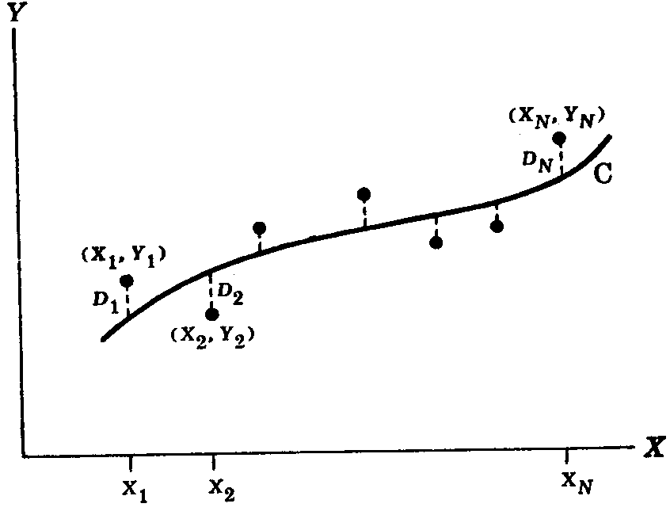

# Méthode des moindres carrés

Lorsque l'on lie plusieurs variables, il en existe deux types : les **variables explicatives $X$** et les **variables expliquées $Y$**.

Il existe plusieurs types d'ajustement (Tab. 1).

| **Nom du modèle** | **Équation associée** |
| :-: | :-: |
| L'ajustement linéaire | $Y = a_1 X$ |
| L'ajustement quadratique | $Y = a_2 X^2 + a_1 X + a_0$ |
| L'ajustement cubique | $Y = a_3 X^3 + a_2 X^2 + a_1 X + a_0$ |
| L'ajustement du quatrième degré | $Y = a_4 X^4 + a_3 X^3 + a_2 X^2 + a_1 X + a_0$ |
| L'ajustement du énième degré | $Y = \sum_{i = 0}^{n} a_i X^i$ |
| L'hyperbole | $Y = \frac{1}{a_0 + a_1 X}$ ou $\frac{1}{Y} = a_0 + a_1 X$ |
| La fonction exponentielle | $Y = a b^X$ ou $\ln Y = \ln a + \left( \ln b \right) X = a_1 X + a_0$ |
| La fonction puissance | $Y = a X^b$  ou $\ln Y = \ln a + bX$ |
| La fonction exponentielle modifiée | $Y = a b^X + g$ |
| La fonction puissance modifiée | $Y = a X^b + g$ |
| La fonction de Gompertz | $Y = p q^{b^X}$ ou $\ln Y = \ln p + b^X \ln q = ab^X + g$ |
| La fonction de Gompertz modifiée | $Y = p q^{b^X} + h$ |
| La fonction logistique | $Y = \frac{1}{ab^X + g}$ ou $\frac{1}{Y} = ab^X + g $ ou  $ Y = a_0 + a_1 \ln X + a_2 {\ln}^2 X$ |

**Tableau 1. Les différents types d'ajustement avec la méthode des moindres carrés**

## Méthode graphique d'ajustement d'une courbe

Un jugement personnel permet d'obtenir rapidement l'ajustement d'un ensemble de données. On dit que l'on a **esquissé une courbe ajustement**.

Si on connaît la forme de l'équation de la courbe, on peut obtenir les constantes qui figurent dans l'équation en choisissant autant de points sur la courbe qu'il y a de constantes.

- Si la courbe est une droite, deux points sont nécessaires.

- Si la courbe est une parabole, trois points sont nécessaires.

Toutefois, chaque observateur obtiendra une courbe différente. C'est pour contrer ce phénomène qu'une méthode analytique d'ajustement fut mise au point : la méthode des moindres carrés.

## Méthode des moindres carrés

**Figure 1. Illustration de la méthode des moindres carrés**

La figure n°1 illustre l'ensemble de points $\left( X_1, Y_1 \right), \left( X_2, Y_2 \right), \ldots{}, \left( X_N, Y_N \right)$. Pour une valeur donnée de $X$, soit $X_1$, il y aura une différence entre la valeur $Y_1$ et la valeur correspondante déterminée à partir de la courbe. On appelle cette différence $D_1$ ; $D_1$ est quelquefois appelée l'**écart**, l'**erreur** ou le **résidu**. Elle peut être positive, négative ou nulle. De la même façon, on obtient pour $X_2, X_3, \ldots{}, X_N$ des écarts $D_2, D_3, \ldots{}, D_N$.

La somme ${D_1}^2 + {D_2}^2 + \ldots{}, {D_N}^2$ mesure « l'efficacité de l'ajustement » de la courbe $C$ pour les données étudiées.

- Si elle est petite, l'ajustement est bon.
- Si elle est grande, l'ajustement est mauvais.

De fait, parmi toutes les courbes qui approchent un ensemble de données, celle qui donne le meilleur ajustement est celle qui vérifie la propriété suivante : la somme ${D_1}^2 + {D_2}^2 + \ldots{} + {D_N}^2$ doit être minimale. Pour ce, on pose :

$J = {D_1}^2 + {D_2}^2 + \ldots{} + {D_N}^2 = \sum_{i = 1}^{N} {D_i}^2$

Dans le cas d'une droite, on aura $J = \sum_{i = 1}^{N} \left[ Y_i - \left( a_0 - a_1 X_i \right) \right]^2$. La méthode des moindres carrés généralisée fut inventée par A.-M. Legendre[^1] en 1806. Lorsque la dépendance entre $Y$ et $X$ est régie par une fonction $f$, avec $f$ dépendant de certains paramètres, la méthode des moindres carrés consiste à trouver les paramètres pour : $J = \sum_{i = 1}^{N} \left[ Y_i - f \left( X_i \right) \right]^2$ avec $\left( X_i, Y_i \right)$ sont les points observés.

Pour obtenir un minimum, il faut dériver partiellement $J$ en fonction des coefficients recherchés en supposant que chaque dérivée partielle est nulle pour que l'erreur sur $J$ soit minimale pour chaque coefficient $a_i$.

$\left\lbrace  \begin{array}{l} \frac{\partial J}{\partial a_0} = 0 \\ \frac{\partial J}{\partial a_1} = 0 \\ \ldots{} \\ \frac{\partial J}{\partial a_i} = 0 \\ \ldots{} \\ \frac{\partial J}{\partial a_N} = 0 \end{array} \right.$

Dans le cas linéaire, les deux dérivées partielles valent :

$\left\lbrace  \begin{array}{l} \frac{\partial J}{\partial a_0} = -2\sum_{i = 1}^{N} \left[ Y_i - \left( a_0 + a_1 X_i \right) \right] \\ \frac{\partial J}{\partial a_1} = -2\sum_{i = 1}^{N} \left[ Y_i - \left( a_0 + a_1 X_i \right) \right] X_i \end{array} \right.$

$\Leftrightarrow  \left\lbrace  \begin{array}{l} \sum_{i = 1}^{N} Y_i - \sum_{i = 1}^{N} \left( a_0 + a_1 X_i \right) = 0 \\ \sum_{i = 1}^{N} X_i Y_i - \sum_{i = 1}^{N} \left( a_0 + a_1 X_i \right) X_i = 0 \end{array} \right.$

$\Leftrightarrow  \left\lbrace  \begin{array}{l} \sum_{i = 1}^{N} Y_i = a_0 N + a_1 \sum_{i = 1}^{N} X_i \\ \sum_{i = 1}^{N} X_i Y_i = a_0 \sum_{i = 1}^{N} X_i + a_1 \sum_{i = 1}^{N} {X_i}^2 \end{array} \right.$

Lorsqu'une courbe vérifie cette propriété, on dit qu'**elle ajuste les données au sens des moindres carrés**.

- Si l'ajustement est une droite, elle est appelée la **droite des moindres carrés**.

- Si l'ajustement est une parabole, elle est appelée la **parabole des moindres carrés**.

> [!NOTE]
> On peut définir un autre type de courbe d'ajustement en considérant les projections orthogonales des points sur la courbe, au lieu des projections verticales ou horizontales, mais cela est assez rarement utilisé. En revanche, cet autre choix sert lors des analyses multivariées dites factorielles

## Exemple de quelques ajustements

### La droite des moindres carrés

Soit un nuage de points $\left( X_1, Y_1 \right), \left( X_2, Y_2 \right), \ldots{}, \left( X_N, Y_N \right)$, alors on peut ajuster l'équation $Y = a_0 + a_1 X$ avec $a_0$ et $a_1$ déterminés en résolvant simultanément les équations suivantes :

$\left\lbrace  \begin{array}{l} \sum_{i = 1}^{N} Y_i = a_0 N + a_1 \sum_{i = 1}^{N} X_i \\ \sum_{i = 1}^{N} X_i Y_i = a_0 \sum_{i = 1}^{N} X_i + a_1 \sum_{i = 1}^{N} {X_i}^2 \end{array} \right.$

Le système précédent est souvent appelé **équations normales de la droite des moindres carrés**.

On peut calculer $a_0$ et $a_1$ de la manière suivante :

$\left\lbrace  \begin{array}{l} a_0 = \frac{\left( \sum_{i = 1}^{N} Y_i \right) \left( \sum_{i = 1}^{N} {X_i}^2 \right) - \left( \sum_{i = 1}^{N} X_i \right) \left( \sum_{i = 1}^{N} X_i Y_i \right)}{N \left( \sum_{i = 1}^{N} {X_i}^2 \right) - \left( \sum_{i = 1}^{N} X_i \right)^2} \\ a_1 = \frac{N \left( \sum_{i = 1}^{N} X_i Y_i \right) - \left( \sum_{i = 1}^{N} X_i \right) \left( \sum_{i = 1}^{N} Y_i \right)}{N \left( \sum_{i = 1}^{N} {X_i}^2 \right) - \left( \sum_{i = 1}^{N} X_i \right)^2} \end{array} \right.$

Pour obtenir une droite des moindres carrés, on peut raccourcir les calculs en centrant les données sur les moyennes de chacune des coordonnées, $\bar{X}$ et $\bar{Y}$, par le changement de variables suivant :

$\left\lbrace  \begin{array}{l} X' = X - \bar{X} \\ Y' = Y - \bar{Y} \end{array} \right.$

car il est clair que la droite des moindres carrés passe par le point $\left( \bar{X}, \bar{Y} \right)$ que l’on appelle barycentre ou centre de gravité du nuage de points.

### La parabole des moindres carrés

Soit un nuage de points $\left( X_1, Y_1 \right), \left( X_2, Y_2 \right), \ldots{}, \left( X_N, Y_N \right)$, alors on peut ajuster l'équation $Y = a_0 + a_1 X + a_2 X^2$ avec $a_0$, $a_1$ et $a_2$ déterminées en résolvant simultanément les équations suivantes :

$\left\lbrace  \begin{array}{l} \sum_{i = 1}^{N} Y_i = a_0 N + a_1 \sum_{i = 1}^{N} X_i + a_2 \sum_{i = 1}^{N} {X_i}^2 \\ \sum_{i = 1}^{N} X_i Y_i = a_0 \sum_{i = 1}^{N} X_i + a_1 \sum_{i = 1}^{N} {X_i}^2 + a_2 \sum_{i = 1}^{N} {X_i}^3 \\ \sum_{i = 1}^{N} {X_i}^2 Y_i = a_0 \sum_{i = 1}^{N} {X_i}^2 + a_1 \sum_{i = 1}^{N} {X_i}^3 + a_2 \sum_{i = 1}^{N} {X_i}^4 \end{array} \right.$

## Problèmes mettant en jeu plus de deux variables

La méthode d'ajustement par les moindres carrés se généralise facilement avec plusieurs de deux variables. Par exemple, on peut considérer qu'il existe une relation fonctionnelle entre les trois variables $X$, $Y$ et $Z$ et qu'elle est exprimée par l'équation linéaire : $Z = a_0 + a_1 X + a_2 Y$.

Par extension de la méthode des moindres carrés, on parle de l'approximation de données par un **plan des moindres carrés**. Si l'on veut estimer $Z$ à partir de valeurs données pour $X$ et $Y$, on appellera ce plan : **plan de régression de $Z$ en $X$ et $Y$**. Les équations normales correspondant au plan des moindres carrés sont données par :

$\left\lbrace  \begin{array}{l} \sum_{i = 1}^{N} Z_i = a_0 N + a_1 \sum_{i = 1}^{N} X_i + a_2 \sum_{i = 1}^{N} Y_i \\ \sum_{i = 1}^{N} X_i Z_i = a_0 \sum_{i = 1}^{N} X_i + a_1 \sum_{i = 1}^{N} {X_i}^2 + a_2 \sum_{i = 1}^{N} X_i Y_i \\ \sum_{i = 1}^{N} Y_i Z_i = a_0 \sum_{i = 1}^{N} Y_i + a_1 \sum_{i = 1}^{N} X_i Y_i + a_2 \sum_{i = 1}^{N} {Y_i}^2 \end{array} \right.$

On peut considérer des équations plus compliquées que l'équation linéaire. De telles équations correspondent à des surfaces dites **surfaces de régression**. Si le nombre de variables excède trois, on parle d'**hyperplans de régression**.

## Liens

- [Topo en format P.D.F.](./PDF/Seance-07-Chapitre-08.pdf)

## Notes de bas de page

[^1]: Adrien-Marie Legendre (1752-1833)
