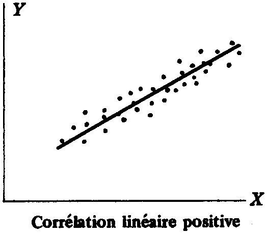
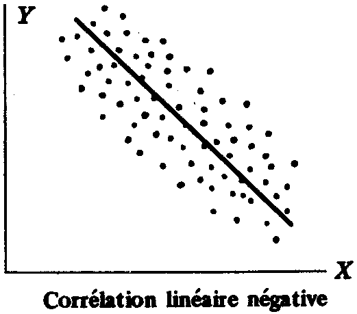
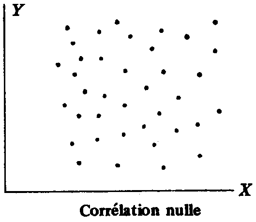

# Théorie de la corrélation. Corrélation simple

L'analyse de corrélation indique le degré de linéarité entre les variables. Dans l'analyse de régression, on estime une fonction entière (l'équation de la régression), mais, avec l'analyse de corrélation, un nombre est recherché. Il s'agit d'un indice conçu pour donner une photographie instantanée de l'intensité avec laquelle deux variables évoluent ensemble. Toutefois, la corrélation reste un outil moins puissant que la régression, mais elle intervient de manière à aider son interprétation.

La **corrélation** cherche à déterminer de quelle façon une relation, linéaire ou non, peut décrire ou expliquer la relation qu'il existe entre plusieurs variables.

Lorsque de telles variables satisfont toutes une relation quelconque, on dit qu'elles sont **complètement corrélées**, ou qu'il existe une **corrélation totale** entre elles.

Lorsque il n'y a que deux variables qui interviennent, on dit que la corrélation et la régression sont **simples**. Dans le cas contraire, on dit que la corrélation et la régression sont **multiples**.

Si $Y$ croît en même temps que $X$, la corrélation est **positive** ou **directe** (Fig. 1).

**Figure 1. Corrélation linéaire positive**

Si $Y$ décroît lorsque $X$ croît, la corrélation est **négative** ou **indirecte** (Fig. 2).

**Figure 2. Corrélation linéaire négative**

S'il n'existe aucune relation entre les variables, on dit qu'il n'existe pas de corrélation entre les variables, ou qu'**elles ne sont pas corrélées** (Fig. 3).

**Figure 3. Corrélation linéaire nulle**

Lorsque tous les points ont tendance à se rapprocher d'une même courbe, la corrélation est **non linéaire**. Une relation non linéaire est nécessaire pour exprimer la régression et l'estimation. Il est clair que la corrélation non linéaire peut être positive ou négative.

Par observation directe du diagramme de dispersion, on peut déterminer **qualitativement** si une droite ou une courbe donnée représente bien la relation qui existe entre plusieurs variables. Pour traiter **quantitativement** le problème de la dispersion des données autour d'une droite ou d'une courbe, il est indispensable de définir une **mesure de la corrélation**.

## Erreur quadratique moyenne d'un estimateur (ou écart type lié)

Soit $\hat{Y}$ la valeur estimée. Soit $Y$ la valeur observée. On appelle l'écart type de $Y$ lié par $X$ la quantité $s_{Y, X}$ :

$s_{Y, X} = \sqrt{\frac{\sum_{i = 1}^{n} \left( Y_i - {\hat{Y}_i} \right)^2}{n}}$

De même, on appelle l'écart type de $X$ lié par $Y$ la quantité $s_{X, Y}$ :

$s_{X, Y} = \sqrt{\frac{\sum_{i = 1}^{n} \left( X_i - {\hat{X}_i} \right)^2}{n}}$

Pour une droite, les écarts types liés sont :

$\left\lbrace  \begin{array}{l} s_{Y, X} = \sqrt{\frac{\sum_{i = 1}^{n} {Y_i}^2 - a_0 \sum_{i = 1}^{n} Y_i - a_1 \sum_{i = 1}^{n} X_i Y_i}{n}} \\ s_{X, Y} = \sqrt{\frac{\sum_{i = 1}^{n} {X_i}^2 - b_0 \sum_{i = 1}^{n} X_i - b_1 \sum_{i = 1}^{n} X_i Y_i}{n}} \end{array} \right.$

Pour $n$ grand, l'erreur suit une loi normale, donc :

$\left\lbrace  \begin{array}{l} s_{Y, X} = 68 \% \\ 2 s_{Y, X} = 95 \% \\ 3 s_{Y, X} = 97,5 \%  \end{array} \right.$

## Variations expliquée et résiduelle

La **variation totale** de $Y$ est $\sum_{i = 1}^{n} \left( Y_i - \bar{Y} \right)^2$, c'est-à-dire la somme des carrés des écarts des valeurs de $Y$ par rapport à la moyenne $\bar{Y}$.

$\underbrace{\sum_{i = 1}^{n} \left( Y_i - \bar{Y} \right)^2}_{\textrm{variation totale}} = \underbrace{\sum_{i = 1}^{n} \left( Y_i - {\hat{Y}}_i \right)^2}_{\textrm{variation résiduelle}} - \underbrace{\sum_{i = 1}^{n} \left( {\hat{Y}}_i - \bar{Y} \right)^2}_{\textrm{variation expliquée}}$

## Coefficient de corrélation

On appelle **coefficient de détermination** le rapport de la variation expliquée et de la variation totale. Ce rapport est nul si la variation expliquée est nulle, c'est-à-dire si la variation totale est totalement résiduelle. Par contre, il est égal à 1 si la variation résiduelle est nulle, c'est-à-dire si la variation totale peut être complètement expliquée. Dit autrement, le rapport varie entre 0 et 1. Puisqu'il est toujours positif ou nul, on peut le désigner par $r^2$.

$r^2 = \frac{\sum_{i = 1}^{n} \left( {\hat{Y}}_i - \bar{Y} \right)^2}{\sum_{i = 1}^{n} \left( Y_i - \bar{Y} \right)^2}$

La quantité $r$ est appelée **coefficient de corrélation** :

$r = \pm \sqrt{\frac{\sum_{i = 1}^{n} \left( {\hat{Y}}_i - \bar{Y} \right)^2}{\sum_{i = 1}^{n} \left( Y_i - \bar{Y} \right)^2}}$

> [!NOTE]
> Les signes $+$ et $-$ correspondent respectivement aux valeurs positive et négative de la corrélation.

> [!NOTE]
>  $r$ est une quantité sans dimension et ne dépend pas des unités considérées.

Il existe une relation entre $r$, $s_Y$ et $s_{Y, X}$. L'écart type de $Y$ vaut :

$s_Y = \sqrt{\frac{\sum_{i = 1}^{n} \left( Y_i - \bar{Y} \right)^2 }{n}}$

À partir de là, il est facile de prouver que le coefficient de corrélation $r$ vaut :

$r = \sqrt{1 - \frac{{s_{Y, X}}^2}{{s_Y}^2}}$

Il faut bien remarquer que l'on ne tient pas compte du signe pour le cas général, ce qui permet d'écrire :

$s_{Y, X} = s_Y \sqrt{1 - r^2}$

## Remarques fondamentales sur le coefficient de corrélation

Les deux définitions du coefficient de corrélation sont très générales et peuvent servir tout aussi bien pour des relations non linéaires, la seule différence réside dans le fait que $\hat{Y}$ est calculé à partir d'une équation de régression non linéaire au lieu d'une équation linéaire et que l'on supprime les signes $+$ ou $-$. Dans un tel cas, l'équation de l'écart type lié est parfaitement générale.

Par exemple, si l'équation d'estimation est un polynôme quelconque : $Y = a_0 + a_1 X + a_2 X^2 + \ldots{} + a_{p - 1} X^{p - 1}$. L'écart type lié d'un polynôme est alors :

${s_{Y, X}} = \sqrt{\frac{\sum_{i = 1}^{n} {Y_i}^2 - a_0 \sum_{i = 1}^{n} Y_i - a_1 \sum_{i = 1}^{n} X_i Y_i - \ldots{} - a_{p - 1} \sum_{i = 1}^{n} {X_i}^{p - 1} Y_i}{n}}$

Pour les petits échantillons, l'écart type lié modifié de l'estimation vaut alors :

${{\hat{s}}_{Y, X}} = {s_{Y, X}} \sqrt{\frac{n}{n - p}}$

avec $n - p$ le nombre de degrés de liberté. Dans le cas d'une droite, on a  : $n - 2$ degrés de liberté.

> [!NOTE]
>  La valeur de $r$ calculée dans tous les cas mesure le degré de liaison propre au type d'équation considérée.
> - Si l'on suppose que l'équation est linéaire et si $r \approx 0$, on peut dire qu'il n'y a pas de corrélation linéaire entre les variables, mais cela ne signifie pas qu'il n'y ait pas de corrélation puisqu'il peut y avoir une forte corrélation non linéaire entre les variables.
> - Le coefficient de corrélation mesure l'**efficacité de l'ajustement** des données par les courbes considérées.

> [!NOTE]
>  Un fort coefficient de corrélation (proche de $-1$ ou $+1$) n'indique pas nécessairement une dépendance directe des variables. Par exemple, il peut se faire qu'il existe une forte corrélation entre le nombre de livres publiés chaque année et le nombre de parties de base-ball jouées pendant la même période. Pourtant, il est évident qu'il n'existe aucun lien entre ces deux faits. On appelle de tels cas des **corrélations fausses** ou **trompeuses**.

## Expression du coefficient de corrélation linéaire

Si les variances des variables aléatoires $X$ et $Y$ sont non nulles, en centrant les coordonnées sur leurs moyennes respectives, $\bar{X}$ et $\bar{Y}$, il est facile de montrer que le **coefficient de corrélation linéaire** de $X$ et de $Y$ le réel $r$ défini par :

$r = \frac{\mathrm{cov} \left( X, Y \right)}{\sigma \left( X \right) \sigma \left( Y \right)}$

avec $\mathrm{cov} \left( X, Y \right) = s_{Y, X} = s_{X, Y}$. Il mesure la dépendance symétrique entre $X$ et $Y$. Cette nouvelle formule présente l'avantage de donner automatiquement le signe de $r$.

- **Propriété 1.** Le nombre $r$ est invariant pour tout changement d'origine et d'échelle.

- **Propriété 2.** Le nombre $r$ est indépendant du choix de l'origine.

- **Propriété 3.** $r$ est toujours compris entre $-1$ et $+1$. C'est l'**inégalité de Cauchy-Schwarz**\footnote{Lors des analyses multivariées, il sera expliqué que $r$ correspond à un cosinus, ce qui justifie d'autant plus l'encadrement entre $- 1$ et $+ 1$}.

- **Propriété 4.** Si $X$ et $Y$ sont indépendants, alors $r = 0$. Par contre, la réciproque est fausse, car $r = 0$ signifie qu'il n'existe aucune relation linéaire entre $X$ et $Y$.

- **Propriété 5.** Le nuage de points est une droite si et seulement si $r = 1$ (qui est une droite de pente positive) ou $r = -1$ (qui est une droite de pente négative). Si $r$ est voisin de 1, on dit qu'il existe une forte corrélation linéaire entre $X$ et $Y$.

De fait, le coefficient de corrélation est un nombre sans unité, toujours compris entre $-1$ et $+1$. Il traduit la plus ou moins grande dépendance linéaire de $X$ et $Y$, ou, géométriquement, le plus ou moins grand aplatissement. Un coefficient de corrélation nul (ou proche de zéro) signifie qu'il n'existe pas de relation linéaire entre les caractères. Lorsque le coefficient de corrélation est proche de $-1$ ou de $+1$, les caractères sont dits **fortement corrélés**.

> [!WARNING]
> La corrélation n'établit pas une cause, mais elle aide à en trouver une. Deux phénomènes corrélés n'entraînent pas que l'un soit la cause de l'autre. Corrélation et causalité sont deux notions différentes.

On peut déterminer quatre cas.

1. Si $r = -1$, alors il s'agit d'une **corrélation négative parfaite**. Tous les points de mesures sont situés sur une droite de régression de pente négative (Fig. 2).

2. Si $r = +1$, alors il s'agit d'une **corrélation positive parfaite**. Tous les points de mesures sont situés sur une droite de régression de pente positive (Fig. 1).

3. Si $r = 0$, alors il s'agit d'une **corrélation nulle** (Fig. 3).

4. Si $-1 \leq r \leq +1$, il s'agit d'une corrélation négative ou positive dite **corrélation imparfaite**.

### La matrice de covariance

Il est pratique de construire une **matrice de covariance**. Il s'agit d'une matrice carrée, souvent notée $\sigma$ permettant, grâce à trois variables, de **mesurer l'erreur statistique**.

$\sigma = \left[  \begin{array}{cc} \sigma \left( X \right) & \mathrm{cov} \left( X, Y \right) \\ \mathrm{cov} \left( X, Y \right) & \sigma \left( Y \right) \end{array} \right]$

avec $\mathrm{cov} \left( X, Y \right)$ la covariance de $X$ et de $Y$, $\sigma \left( X \right)$ et $\sigma \left( Y \right)$ sont les écarts types des variables $X$ et $Y$.

> [!NOTE]
> La matrice de covariance est symétrique.

> [!NOTE]
> La matrice de covariance obtenue avec deux variables se généralise très facilement à $n$ variables aléatoires.

###### Matrice de covariance et inégalité de Cauchy-Schwarz

La matrice de covariance permet de démontrer l'inégalité de Cauchy-Schwarz. Grâce à la définition du produit scalaire, on sait que :

$\left( \mathrm{cov} \left( X, Y \right) \right)^2 \leq \left( \sigma \left( X \right) \right)^2 \left( \sigma \left( Y \right) \right)^2$

ce qui peut s'écrire :

$\frac{\left( \mathrm{cov} \left( X, Y \right) \right)^2}{\left( \sigma \left( X \right) \right)^2 \left( \sigma \left( Y \right) \right)^2} \leq 1$

or la fonction carrée admet deux antécédents symétriques : $-1$ et $+1$, donc la relation est bornée telle que :

$-1 \leq \frac{\left( \mathrm{cov} \left( X, Y \right) \right)}{\sigma \left( X \right) \sigma \left( Y \right)} \leq +1$

or $r = \frac{\left( \mathrm{cov} \left( X, Y \right) \right)}{\sigma \left( X \right) \sigma \left( Y \right)}$, donc :

$-1 \leq r \leq +1$

### Le test d'indépendance pour deux variables quantitatives

Soient $X$ et $Y$ deux variables aléatoires quantitatives de densités respectives $h$ et $g$ ; $f$ est la densité du couple $\left( X, Y \right)$. Si les variables aléatoires sont indépendantes, les densités doivent vérifier la propriété : $f \left( x, y \right) = h \left( x \right) g \left( y \right)$. Cette propriété est l'hypothèse $H_0$ qu'il faut tester. Afin de la vérifier, les propriétés du coefficient de corrélation $r$ pour des populations normales, puis pour des populations quelconques.

#### Échantillons normaux

Dans le cadre d'un échantillon, le coefficient de corrélation de la population mère $\rho$ est estimé par $r$. Une condition nécessaire et suffisante d'indépendance entre deux variables aléatoires normales est un coefficient de corrélation $r = 0$. Il est alors simple de formuler le test d'indépendance :

$\left\lbrace  \begin{array}{l} H_0 : \rho = 0 \\ H_1 : \rho \neq 0 \end{array} \right.$

Il est à noter que ce test est robuste.

Le coefficient $r$ peut être considéré comme la réalisation d'une variable aléatoire $R$. Il existe des tables donnant les valeurs de la densité de la variable $R$. Les propriétés de cette variable dépendent des valeurs du coefficient $\rho$.

##### Cas où $\rho = 0$

Si $\rho = 0$, la distribution de $R$ est alors symétrique. De fait, la variable aléatoire $t = \frac{R \sqrt{n - 2}}{\sqrt{1 - R^2}}$ est une variable aléatoire de Student à $\upsilon = \left( n - 2 \right)$ degrés de liberté. On en déduit la densité de la variable $R$ :

$f \left( r \right) = \frac{1}{\beta \left( \frac{1}{2}, \frac{n - 2}{2} \right)} \left( 1 - r^2 \right)^{\frac{n - 4}{2}}$

avec $B$ la fonction bêta ainsi que ses moments :

$\mathbb{E} \left( R \right) = 0$

et

$\mathbb{V} \left( R \right) = \frac{1}{n - 1}$

On en déduit les propriétés de $\rho$. Pour un test d'indépendance, on est amené à rejeter les grandes valeurs de $\left| r \right|$. La région critique est alors de la forme $\left| R \right| > k$.

> [!NOTE]
>  Si $n = 4$, la loi de la variable $R$ est une loi uniforme sur $\left[ -1, +1 \right]$.

> [!NOTE]
>  Si $n > 100$, la loi de $R$ peut être approchée par la loi normale $R \sim N \left( 0, \sqrt{\frac{1}{n - 1}} \right)$ 

##### Cas où $\rho \neq 0$

Pour $\rho \neq 0$, la loi de la variable $R$ est connue mais difficile à utiliser. Ses moments sont :

$\mathbb{E} \left( R \right) = \rho - \frac{\rho \left( 1 - {\rho}^2 \right)}{2n}$

et

$\mathbb{V} \left( R \right) = \frac{\left( 1 - {\rho}^2 \right)^2}{n - 1}$

On considère la transformée $Z$ de Fisher de $R$ :

$Z = \frac{1}{2} \ln \left( \frac{1 + R}{1 - R} \right) = \frac{\ln 10}{2} \log \left( \frac{1 + R}{1 - R} \right) \approx 1,15129 \log \left( \frac{1 + R}{1 - R} \right)$

Lorsque $n \geq 25$, la loi de $Z$ tend vers une loi normale : $Z \sim N \left( Z, \frac{1}{\sqrt{n - 3}} \right)$.

Ce test permet de déterminer les intervalles de confiance des coefficients de corrélation.

#### Échantillons quelconques

Le test précédent est encore valable si $n > 25$. Toutefois, dans le cas des échantillons non normaux, on ne teste plus l'indépendance, mais seulement la **« non-corrélation linéaire »**.

## Signification de la différence entre deux coefficients de corrélation

Pour savoir si deux coefficients de corrélation $r_1$ et $r_2$ obtenus à partir d'échantillons de tailles respectives $n_1$ et $n_2$, diffèrent l'un de l'autre de façon significative, on calcule la transformée de Fisher $Z_1$ et $Z_2$ correspondant à $r_1$ et $r_2$ :

$Z_1 = \frac{1}{2} \ln \left( \frac{1 + r_1}{1 - r_1} \right)$

et

$Z_2 = \frac{1}{2} \ln \left( \frac{1 + r_2}{1 - r_2} \right)$

On peut alors utiliser la statistique $z = \frac{\left( Z_1 - Z_2 \right) - \left( \bar{Z_1} - \bar{Z_2} \right)}{\sqrt{\frac{1}{n_1 - 3} + \frac{1}{n_2 - 3}}}$.

### Problème 1.

La valeur d'un coefficient de corrélation, calculé à partir d'un échantillon de taille 18, est égale à 0,32. Peut-on en conclure au seuil de signification $\alpha = 0,05$ et $\alpha = 0,01$ que le coefficient de corrélation $\rho$ de la population n'est pas nul ?

$n = 18$, donc il s'agit d'un petit échantillon. Il faut tester avec une variable $t$ de Student.

Les deux hypothèses sont :

$\left\lbrace  \begin{array}{l} H_0 : \rho = 0 \\ H_1 : \rho \neq 0  \end{array} \right.$

La valeur du $t$ de Student est :

$t = \frac{r\sqrt{n - 2}}{\sqrt{1 -r^2}} \approx \frac{0,32\sqrt{18 - 2}}{\sqrt{1 -0,32^2}} \approx 1,35$

Avec $\alpha = 0,05$, $H_0$ est rejetée si $t > t_{0,95}$ avec $t_{0,95} \approx 1,75$ pour $\upsilon = 16$ degrés de liberté, puisque $t < t_{0,95}$ il est impossible de conclure.

Avec $\alpha = 0,01$, $H_0$ est rejetée si $t > t_{0,99}$ avec $t_{0,99} \approx 2,58$ pour $\upsilon = 16$ degrés de liberté, puisque $t < t_{0,99}$ il est impossible de conclure.

### Problème 2.

Quelle serait la taille minimale nécessaire d'un échantillon pour pouvoir conclure que le coefficient de corrélation 0,32 diffère significativement de zéro au seuil de $\alpha = 0,05$ ?

Pour $n -2$ degrés de liberté, on pose que $t_{0,95}$ doit être égale à :

$t_{0,95} \approx \frac{0,32\sqrt{n - 2}}{\sqrt{1 -0,32^2}}$

Pour un nombre de degrés de liberté infini, on sait que $t_{0,95} \approx 1,64$, donc $n = 25,60$. Dit autrement, il suffit de tester les valeurs de $n \geq 26$ pour trouver rapidement la valeur de $n$.

- Pour $n = 26$, le degré de liberté $\upsilon = 24$ et le $t$ de Student calculé vaut : $t \approx 1,65$.

- Pour $n = 27$, le degré de liberté $\upsilon = 25$ et le $t$ de Student calculé vaut : $t \approx 1,69$.

- Pour $n = 28$, le degré de liberté $\upsilon = 26$ et le $t$ de Student calculé vaut : $t \approx 1,72$.

- Pour $n = 29$, le degré de liberté $\upsilon = 27$ et le $t$ de Student calculé vaut : $t \approx 1,76$.

On en conclut que la taille minimale pour avoir un seuil significatif $\alpha = 0,05$ est $n = 28$.

### Problème 3.

On a calculé un coefficient de corrélation sur un échantillon de taille 24 et l'on a trouvé $r = 0,75$. Peut-on rejeter l'hypothèse que le coefficient de corrélation de la population soit aussi faible que $\rho = 0,60$ et $\rho = 0,50$ au seuil de signification $\alpha = 0,05$.

Les deux hypothèses sont :

$\left\lbrace  \begin{array}{l} H_0 : \rho \neq 0 \\ H_1 : \rho = 0  \end{array} \right.$

Pour le mener à bien, on utilise la transformation $Z$ de Fisher sur le coefficient de corrélation : $Z \approx \frac{1}{2} \ln \left( \frac{1 + 0,75}{1 - 0,75} \right) \approx 0,9730$.

- Pour $\rho = 0,60$, $\bar{Z} \approx \frac{1}{2} \ln \left( \frac{1 + 0,60}{1 - 0,60} \right) \approx 0,6932$, $s_Z \approx \sqrt{\frac{1}{24 - 3}} \approx 0,2182$ et $z = \frac{Z - \bar{Z}}{s_Z} \approx \frac{0,9730 - 0,6932}{0,2132} \approx 1,28$. Au seuil $\alpha = 0,05$, à partir d'un test unilatéral de la distribution normale, on ne pourra rejeter l'hypothèse uniquement si $z \geq 1,64$. Pour notre cas, on ne peut pas rejeter l'hypothèse que le coefficient de corrélation de la population vaut $0,60$ au seuil de signification $\alpha = 0,05$.

- Pour $\rho = 0,50$, $\bar{Z} \approx \frac{1}{2} \ln \left( \frac{1 + 0,50}{1 - 0,50} \right) \approx 0,5493$, $s_Z \approx \sqrt{\frac{1}{24 - 3}} \approx 0,2182$ et $z = \frac{Z - \bar{Z}}{s_Z} \approx \frac{0,9730 - 0,5494}{0,2132} \approx 1,94$. Au seuil $\alpha = 0,05$, à partir d'un test unilatéral de la distribution normale, on ne pourra rejeter l'hypothèse uniquement si $z \geq 1,64$. Pour notre cas, on peut rejeter l'hypothèse que le coefficient de corrélation de la population vaut $0,50$ au seuil de signification $\alpha = 0,05$.

### Problème 4.

Le coefficient de corrélation entre les notes de mathématiques et de physique d'un groupe de 21 étudiants est de $r = 0,80$. Calculer les limites de confiance à 95 % de ce coefficient.

Puisque $r = 0,80$ et $n = 21$, les limites de confiance à 95 % de $\bar{Z}$ sont données par $Z \pm 1,96 s_Z \approx \frac{1}{2} \ln \left( \frac{1 + 0,80}{1 - 0,80} \right) \pm 1,96 \frac{1}{21 - 3} \approx 1,0986 \pm 0,4620$. De fait, $0,5366 \leq \bar{Z} \leq 1,5606$. Aux bornes, si $\bar{Z} = 0,5366$ alors $\rho = 0,4904$, et si $\bar{Z} = 1,5606$, alors $\rho = 0,9155$. Cela permet d'encadrer la valeur de $\rho$ : $0,4904 \leq \rho \leq 0,9155$ au seuil de confiance de 95 %.

### Problème 5.

On a calculé les coefficients de corrélation pour deux échantillons de taille $n_1 = 28$ et $n_2 = 35$ et l'on a trouvé respectivement $r_1 = 0,50$ et $r_2 = 0,30$. Y a-t-il une différence significative entre les deux coefficients au seuil de $\alpha = 0,05$ ?

On calcule les variables $Z_i$ de Fisher correspondantes :

$Z_1 \approx \frac{1}{2} \ln \left( \frac{1 + 0,50}{1 - 0,50} \right)  \approx 0,5493$

et

$Z_2 \approx \frac{1}{2} \ln \left( \frac{1 + 0,30}{1 - 0,30} \right)  \approx 0,3095$

avec

$m_{Z_1 - Z_2} = \bar{Z_1} - \bar{Z_2} = 0$

et

$s_{Z_1 - Z_2} \approx \sqrt{\frac{1}{28 - 3} + \frac{1}{35 - 3}} \approx 0,2669$

On peut alors utiliser la statistique $z = \frac{\left( Z_1 - Z_2 - m_{Z_1 - Z_2} \right)}{s_{Z_1 - Z_2}} \approx \frac{0,5493 - 0,3095}{0,8985} \approx 0,8983$. On rejettera $H_0$ si $z > 1,96$ ou $z < -1,96$. Ici, on ne peut pas rejeter $H_0$, on en conclut que les résultats ne diffèrent pas de façon significative au seuil $\alpha = 0,05$.

## Corrélation des séries chronologiques et spatiales

Pour finir, il faut faire quelques remarques sur les séries chronologiques et spatiales.

1. Si chacune des variables $X$ et $Y$ dépend du temps y avoir une liaison entre elles qui ne soit pas nécessairement une relation « cause à effet », et qui conduise à des **corrélations trompeuses**. On obtient le coefficient de corrélation en faisant correspond à chaque instant $t$ un couple de $\left( X, Y \right)$ et en utilisant les formules précédentes.

2. On peut essayer de corréler une variable $x$ prise à un certain instant avec une valeur $X$ correspondant à un instant antérieur. On appelle une telle corrélation : **autocorrélation**. Cette remarque s'applique également pour les variables spatiales de position.

## Liens

- [Topo en format P.D.F.](./PDF/Seance-07-Chapitre-09.pdf)
